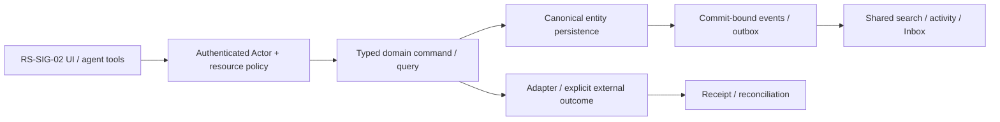

# RS-SIG-02: Document signing: immutable sessions, signer intent и evidence lifecycle

## Цель и граница

Отправитель запрашивает подпись конкретного document version/hash; signer явно подтверждает intent, provider evidence сохраняется и проверяется, а signature statusнеподменяется read/approve/typedname.

Статус: implementation issue, **PROPOSED_NOT_IMPLEMENTED**. Screenshot reference не является доказательством текущего backend. Screenshots6/7 визуально просмотрены; используются только структура/interaction inspiration, без logos/assets/source-code copying и без лицензионного предположения. Во всех examples только synthetic data; private organization ID/имена из изображений не переносятся.

**Visual evidence:** Image7 даёт Docs/Approval placement. Ни Image6, ни Image7 не показывают signing lifecycle; это NEW domain capability, без утверждения о production parity Lark/ROX.

**Dependency IDs:** RS-SIG-01, RS-APR-02.
**Related service issues:** RS-MCP-01, RS-ADM-01.
**Architecture prerequisites:** WP-02/03/04/07/35/36/47/52; independent signingprovider conformance and supported evidence scope before liveenablement.

## Проверенный текущий ROX

- [packages/ui/src/components/overlay/PDFPreviewOverlay.tsx#L30–L62](https://github.com/rox-one/rox-one/blob/249b3b44220bcfbd7d467de9cfc18f76e1c37807/packages/ui/src/components/overlay/PDFPreviewOverlay.tsx#L30-L62) — `PDFPreviewOverlay`, repository `rox-one/rox-one`, SHA `249b3b44220bcfbd7d467de9cfc18f76e1c37807`: ExistingPDF UI/renderloader seam; readingisnotsigning.
- [apps/electron/src/renderer/components/pages/SharePageDialog.tsx#L92–L159](https://github.com/rox-one/rox-one/blob/249b3b44220bcfbd7d467de9cfc18f76e1c37807/apps/electron/src/renderer/components/pages/SharePageDialog.tsx#L92-L159) — `SharePageDialog`, repository `rox-one/rox-one`, SHA `249b3b44220bcfbd7d467de9cfc18f76e1c37807`: ExistingPagepublication semantics differfromdocument signing/evidence.
- [apps/electron/src/renderer/components/app-shell/input/structured/PermissionRequest.tsx#L28–L45](https://github.com/rox-one/rox-one/blob/249b3b44220bcfbd7d467de9cfc18f76e1c37807/apps/electron/src/renderer/components/app-shell/input/structured/PermissionRequest.tsx#L28-L45) — `PermissionRequest`, repository `rox-one/rox-one`, SHA `249b3b44220bcfbd7d467de9cfc18f76e1c37807`: Toolexecutionapproval cannotbe reusedas signerintent.
- [packages/core/src/conation/dss/types.ts#L1–L30](https://github.com/rox-one/rox-one/blob/249b3b44220bcfbd7d467de9cfc18f76e1c37807/packages/core/src/conation/dss/types.ts#L1-L30) — `DssEntry / read-only DSS contract`, repository `rox-one/rox-one`, SHA `249b3b44220bcfbd7d467de9cfc18f76e1c37807`: DSS contract read-only; comment signingBLOCKED refersAppleFileProvider, not evidenceofa document e-signatureservice.

В inspected seamsнет evidence cryptographicdocument signingpipeline. NEW SignSession/provideradapter required; don'tdeclaretypedname, approvecallback, screenshotorPDFviewas verifiedsignature. Provider capabilities/assurance and supported verification explicitly versioned.

Все ссылки immutable; поведение проверено чтением source, не live deployment. Путь, отмеченный NEW ниже, отсутствует как готовая feature и не должен считаться implemented из-за наличия entry/component.

## Экран, routing и layout

SecureDocumentViewer → «Запросить подпись / Подписать / Проверить»; Inbox → signingrequest; Company/Project/Ticket/Approval evidencechip. Sameversionref everywhere; NEW signing session typedroute parser/deeplink, no separate signeruserdatabase.

Header: document version/hash/state/provider. Слева recipient order и identity assurance; центр immutable PDF с signature field placement; справа intent/consent/audience/evidence timeline. Sticky Review/Sign; на узкой ширине один panel и keyboard field list вместо drag-only.

UI расширяет текущую React shell/settings/panels. Typography, theme и semantic tokens наследуются из ROX selected preferences; Lark layout не вводит второй UI framework/skin. Русские labels; знакомые native controls; no global font reset. At390px /200% zoom доступен один main drilldown и sheets; horizontal scroll допустим внутри table/PDF, не всего shell. Reduced motion выключает spatial transitions; stable keys сохраняют selection/scroll.

## Inputs → outputs и control contracts

| Control | Input | Output / command result | Click / keyboard | Help meaning / permission |
|---|---|---|---|---|
| Create session | `versionRef/hash, recipients, fields, order, expiry, provider capability` | review preview → session receipt | Tab fields; keyboard placement; explicit Send | Supported provider/identity assurance/evidence outputs объясняются; source version нельзя менять молча. |
| Signer identity | `Principal или guest binding/challenge` | verified identity binding либо pending | Enter challenge | Email/contact не равен authenticated principal; challenge audience/expiry проверяет сервер. |
| Review intent | `immutable manifest, intent text, policy version` | intent record с signer/version/hash | Явное подтверждение + Sign | Read/scroll/read receipt никогда не создаёт intent/signature. |
| Sign | `session/step refs, nonce, contentHash, intentDigest, commandId` | provider receipt → artifact/evidence или unknown | Explicit Sign после review | Agent не impersonates signer; private key не передаётся renderer/MCP. |
| Verify / download | `artifact/evidence refs, hash` | verification result, artifact receipt | Enter Verify; details; guarded Download | Signed, identity verified, provider accepted и cryptographically verified различаются. |
| Cancel / expire | `sessionRef, baseRevision` | cancel receipt, token/challenge revoke | Summary → Cancel | Late callback reconciled и audited; unknown provider stop не объявляется confirmed cancel. |

**Hover/focus/click help:** каждый non-obvious control показывает краткую definition на hover после500ms и keyboard focus; focus ring видим. Соседняя кнопка «Что это?» открывает подробный popover: meaning, units/formula либо «не применяется», source, freshness/asOf, synthetic example, role/policy и disabled reason. Tooltip не заменяет обязательные instructions. Escape закрывает popup и возвращает focus к trigger; Tab/ShiftTab проходят controls, roving arrows только внутри tablist/menu. Click help не вызывает основной mutation.

**Input preservation:** textarea/form drafts сохраняются при failed query, permission conflict, provider timeout и navigation; не ставить success toast до command receipt. Sensitive draft retention ограничен workspace/purpose и current grants; offline запрещённая mutation показывает reason, а queued разрешённая mutation проходит current policy при replay.

## Domain, persistence и архитектура

**Entities:** NEW SignSession, SignerStep, SignerIdentityBinding(existing Principal/guest), SignatureField, SigningIntent, SignedArtifactRef(FileVersion), SignatureEvidenceBundle, VerificationRecord. Approval может разрешить приглашение, но не заменяет signer intent. EntityRefs и identity общие.

**API / commands / queries (NEW target):** NEW signing.capabilities/sessionCreate/read/send/recordIntent/sign/verify/cancel и providerWebhook adapter. Sign: stepRef, sessionRevision, nonce, contentHash, intentDigest, idempotencyKey; actor/challenge identity берутся из authenticated transport. Result содержит provider receipt и pending/unknown/signed; verification record отдельно. Crypto provider-specific за headless adapter.

**DB / migrations:** NEW sign_sessions(sourceVersion/hash, providerPolicy, expiry, revision), signer_steps(identity/order/state), immutable intent records(actor/time/consent version/digest), provider command/event aliases с unique event ID и evidence bundles(artifactHash, certificate/timestamp/verificationPolicy refs). Source version не изменяется; signed output — новая FileVersion. Private keys остаются защищённой provider/HSM capability, без plaintext app DB.

**Events (NEW names, не claims existing dispatcher):** NEW signing.requested, intent_recorded, provider_accepted, artifact_ready, verified, declined, cancelled, expired, unknown. Intent+command outbox фиксируются до external call. Callback duplicates/order и late completion сохраняются в immutable history; distributed DB/provider transaction не предполагается.

Не переносить экран без model/persistence/API. Common EntityRef/link/mention/grant/attachment/message/event/search/notification primitives используются всеми representations; external effect не включается в фиктивную distributed DB transaction. Provenance/revision/idempotencyKey обязательны; service/provider-specific constraints headless behind adapters.

## Permissions, sharing и agent access

document.read/export, signing.request и eligible signer identity проверяются вместе. Guest не получает общий workspace access. Nonce/version/digest/audience/expiry связаны; revoke/changed content запрещают stale signing. Agent может prepare/request/read по scopes, но не фабрикует human intent или signature. Evidence export требует отдельного разрешения.

Search индексирует разрешённые metadata/evidence status; OCR сохраняет source ACL. Общие Inbox reminders/step notifications/activity с dedup. Agent читает allowed status/citations и предлагает workflow; memory сохраняет допустимые refs/hash/provenance, не private keys и личные certificate данные без purpose.

Read query, human command, background job, IPC/RPC и MCP проходят одинаковый gateway. Capability-advertisement, client disabled button, role label и notification read не являются authorization. Cross-entity link не расширяет grant. Revoke во время открытого экрана и replay после reconnect повторно проверяет current policy; denied title/count/body не попадают в projections, push или agent memory.

## Реализационные paths и ownership

**EXTEND существующие файлы** (точный scope уточняется owner после чтения):
- `packages/ui/src/components/overlay/PDFPreviewOverlay.tsx`
- `apps/electron/src/renderer/pages/InboxPage.tsx`
- `apps/electron/src/shared/routes.ts`
- `packages/core/src/rox2/platform-contract.ts`

**NEW предлагаемые файлы** — это target paths, не source evidence:
- `apps/electron/src/renderer/components/signing/SigningSessionDetail.tsx` — NEW
- `packages/shared/src/workspace-domain/signing/contracts.ts` — NEW
- `apps/workspace-service/src/modules/signing/session-commands.ts` — NEW
- `apps/workspace-service/src/modules/signing/provider-adapter.ts` — NEW
- `apps/workspace-service/src/modules/signing/evidence-verifier.ts` — NEW
- `apps/workspace-service/migrations/document-signing.sql` — NEW
- `tests/rox-suite/document-signing.spec.ts` — NEW

Typed route builder/parser/navigation state, IPC/preload или authenticated generated API client расширяются согласованно. Shared registry/contracts/migrations/transport/lockfile/i18n имеют одного owner; overlapping edits сериализуются. Source UI assets Lark не копировать. NEW workspace service module потребляет существующие Revision2 authority contracts; foundation implementation не входит в этот issue повторно.

## States, failure и observability

Доменные states: **draft / sent / identity_pending / intent_pending / signing_pending / provider_accepted / signed_artifact_ready / verified / declined / expired / cancelled / unknown**.

Общие states: loading, genuine empty, filtered_empty, forbidden, unsupported, degraded, stale_revision, retryable_error, conflict, offline_cached/queued (только если capability разрешает), cancelled и unknown. Missing backend/provider/telemetry отличается от empty/zero/verified. Outcome local_durable/provider_accepted/readback — отдельный domain result; canonical Rox2Status executionMode/lifecycle/verification не получает новых придуманных enum значений.

Correlate workspace/entity/command/receipt/event/policy revision без secret/body в logs; metrics command latency/retries/denied/reconcile и projected lag с denominator/source. Failure сохраняет actionable code и recovery, не неограниченный auto retry. Документировать on-call reconciliation и stale permission/search/cache cleanup.

## Tests и independently verifiable acceptance

1. Synthetic PDF v1 → invite → identity challenge → explicit intent → provider artifact → independent verify/readback; exact hash/provenance сохраняются после reload.
2. Read/approval decision/typed name без signing intent дают ноль provider operations.
3. Changed source hash, stale intent/nonce, wrong recipient, expired challenge, revoked access отклоняются.
4. Duplicate/reordered callback и lost send response дают один effective provider operation и immutable audit.
5. Corrupt artifact/digest/certificate/time verification проваливается; signed badge не заменяет verified.
6. Agent impersonation и request actor spoof не обходят policy. Provider-live dedicated tenant; fixture не закрывает crypto proof.

**Пользовательский acceptance scenario:** Synthetic PDF подписывается через explicit signer review/intent и supported provider; сохраняются verification record/evidence bundle. Links из CRM/Ticket/Project указывают ту же version с общей ACL. Failed/unknown/expired не показываются verified complete.

Каждый сценарий проверяет inputs/actions → actual persisted/reloaded output, API/tool equivalent, permission denied path и соседний existing flow. Baseline failures отделены от environment failures; seeded mutant должен падать intended assertion при green baseline. Не считать planning schema validator E2E feature proof.

## Definition of Done

- [ ] UI и typed routes/history/contextual deep links работают в существующем ROX.
- [ ] Entity model, persistence/migration aliases, queries/commands/receipts и required background processing реализованы.
- [ ] Source/entity links и mentions используют общие IDs; source audience не расширяется автоматически.
- [ ] Shared authorization/sharing/revoke покрывают UI/API/MCP/jobs/offline replay.
- [ ] Search/notification/activity/agent/memory projections сохраняют policy и provenance; dedup/retraction проверены.
- [ ] Required realtime/reconnect/persistence concurrency сценарии из tests пройдены; unavailable capability честно disabled.
- [ ] Hover/focus/click help, keyboard, loading/empty/error/offline, narrow390px, zoom200%, reduced-motion verified.
- [ ] Linux domain/renderer lane; source-pinned macOS native для IPC/font/device; provider-live где actual adapter действует. Pending required lane оставляет feature incomplete.
- [ ] Screenshots/ARIA и logs/hash/expected-observed предоставлены с synthetic data и exact tested commit.
- [ ] Independent review, meaningful negative controls, runbook, source licensing/dependencies и user docs готовы.
- [ ] GitHub completion связывает implementation commit/PR и доказательства, а не только rendered screen.

## Complexity и риски

XL, identity/immutableintent→providercommandreconcile→evidenceverification+UI. Риски: intentspoofing, unknownexternaleffect, invalidcryptoassertions, longtermverifiability; chosenprovidercapability gate required.

Декомпозиция обязательна на vertical slices, каждый заканчивается working scenario с permissions/search/agents. Крупная surface остаётся открыта до всех её gates; issue не закрывать по одному mock screen.

## GitHub dependency links (нормативный handoff)

- Требуется [RS-SIG-01 — #1119](https://github.com/rox-one/rox-one/issues/1119)
- Требуется [RS-APR-02 — #1118](https://github.com/rox-one/rox-one/issues/1118)
- Связанная новая задача: [RS-MCP-01 — #1113](https://github.com/rox-one/rox-one/issues/1113)
- Связанная новая задача: [RS-ADM-01 — #1114](https://github.com/rox-one/rox-one/issues/1114)

Specification ID: RS-SIG-02. Снимок исходного ROX: 249b3b44220bcfbd7d467de9cfc18f76e1c37807. Эти ссылки задают зависимости, а не статус выполненной реализации.
