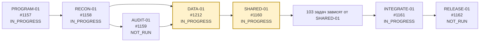
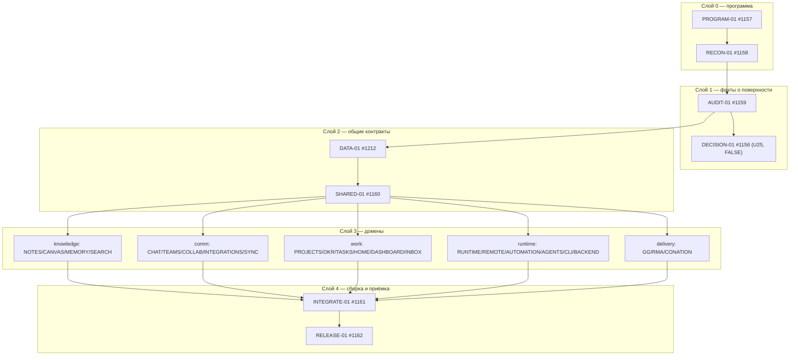
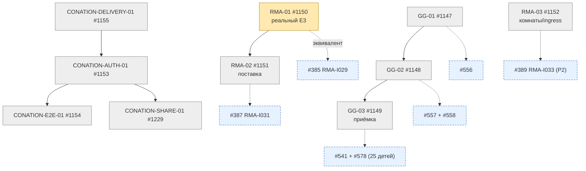
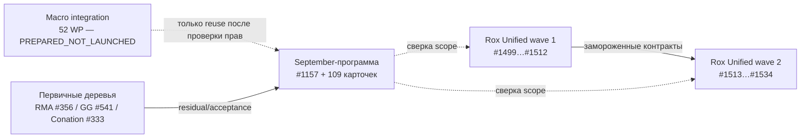

# RECON-01 — граф зависимостей (#1158)

- Наблюдение: **2026-10-08T22:20:00Z**, база чтения — `origin/main` @ `8c5abc7a32a3773645b695b79a81c327b8e6758d`.
- Источник рёбер: `docs/september-program/task-registry.json` (109 задач, 464 ребра) плюс ссылки в телах issues.
- Граф ниже — **отображение зарегистрированных зависимостей**, а не подтверждение исполнения.

## 1. Критический путь программы

## 2. Волны внутри программы (свёрнутый вид)

## 3. Внешние зависимости программы (первичные деревья)

## 4. Кросс-программные зависимости

## 5. Разблокировки: что реально держит очередь

| Блокер | Держит | Условие снятия |
|---|---|---|
| SHARED-01 #1160 | 103 задач | принятие DATA-01 #1212 |
| DATA-01 #1212 | 77 задач | принятая версия контракта сущности/ревью |
| AUDIT-01 #1159 | 24 задач UI-слоя | фактический аудит экранов на живой сборке |
| #385 E3 | RMA-02 #1151, GG-03 #1149, RELEASE-01 #1162 | реальное E3-доказательство (merge #991 не является приёмкой) |
| U25 / DECISION-01 #1156 | ничего не должно блокировать | независимый достоверный источник; до него выключено |
| Windows / macOS / iOS-приёмка | RELEASE-01 | собственные наблюдения на каждой платформе |

