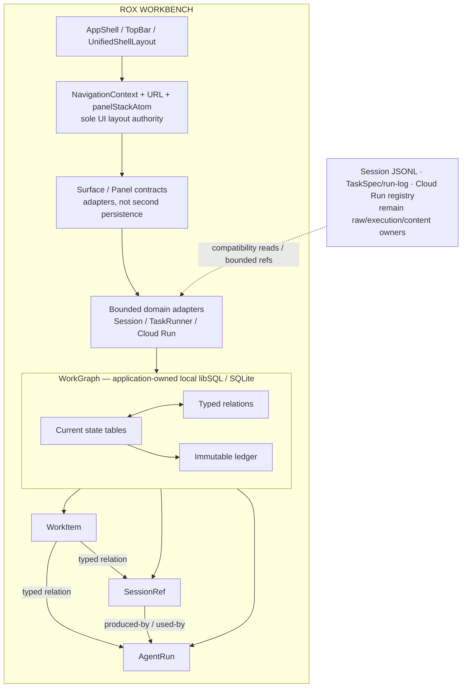
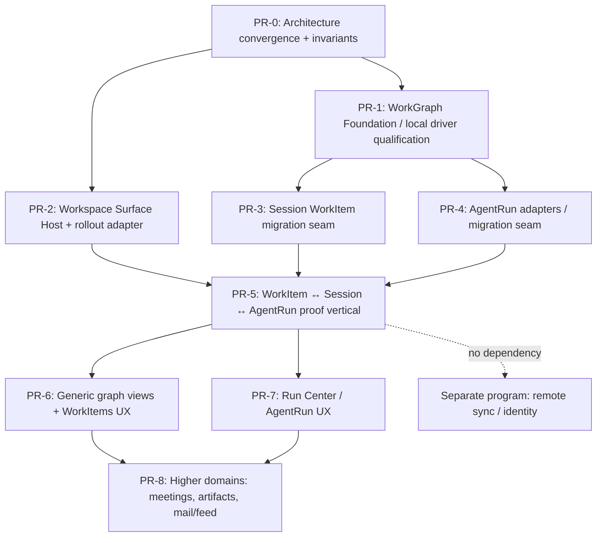

# WB-ADR-000. Rox Workbench Architecture Convergence

- **Документ**: WB-ADR-000 · PR-0 · `docs/specs/2026-08-10-rox-workbench-architecture-convergence.md`
- **Статус**: Accepted for implementation
- **Дата**: 2026-08-10
- **Входные решения**: утверждённые владельцем продукта решения PR-0: UI authority сохраняется; два ключа rollout; локальный-only WorkGraph на libSQL/SQLite; `state + immutable ledger`; первая вертикаль `WorkItem ↔ Session ↔ AgentRun`; explicit cutover с compatibility reads; Action/Command остаются разными namespace без нового bridge.
- **Входные документы**: [Suite S README](./2026-08-07-unified-shell/README.md), [S-02 Surface Registry](./2026-08-07-unified-shell/02-surface-registry-tabs.md), [S-03 Panels/Rails](./2026-08-07-unified-shell/03-panels-rails.md), [S-04 Omnibox](./2026-08-07-unified-shell/04-omnibox.md), [S-09 roadmap](./2026-08-07-unified-shell/09-roadmap-waves.md), [K-01 ADRs](./2026-08-07-siyuan-integration/01-adrs.md).
- **Связанные программы**: Rox ID, @passkey, remote WorkGraph sync, Infisical/PathKey — отдельные программы; они не являются зависимостями PR-0.

---

## Обозначения доказательств

- **[VERIFIED CURRENT STATE]** — подтверждено текущими файлами/символами репозитория.
- **[LOCKED DECISION]** — решение владельца продукта для этой программы.
- **[INFERENCE]** — вывод из текущего кода; не существующая реализация.
- **[PROPOSED CONTRACT]** — новый обязательный контракт для последующих PR.
- **[DEFERRED]** — намеренно не решается в PR-0.
- **[OUT OF SCOPE]** — принадлежит другой программе и не должен появиться в этом PR.

В случае расхождения между данным ADR и текущим кодом приоритет для описания факта имеет код; изменение принятого решения требует отдельного ADR со статусом `Superseded`.

---

## 1. Цель и контекст

### 1.1. Цель

[LOCKED DECISION] PR-0 — это только Architecture Convergence ADR и узкие исполняемые инварианты. Он не реализует новый shell, WorkGraph, календарь, Run Center, Tasks UI, remote sync, Rox ID, @passkey или Infisical.

Цель PR-0 — оставить следующему PR один проверяемый набор границ:

1. текущий renderer/navigation остаётся единственным владельцем layout/navigation;
2. WorkGraph получает чёткую будущую canonical domain authority без копирования UI или контента;
3. migration/cutover не создаёт indefinite dual writers;
4. feature rollout имеет единственную детерминированную two-key семантику;
5. ActionRegistry и CommandRegistry не получают пересекающуюся неявную ownership-модель;
6. первая реализуемая vertical slice зафиксирована как `WorkItem ↔ Session ↔ AgentRun`.

### 1.2. Почему convergence, а не rewrite

[VERIFIED CURRENT STATE] `NavigationContext.syncUrl()` сериализует `panelStackAtom` в URL и сохраняет search string в `storage.KEYS.workspaceUrl`; `reconcileFromUrlParams()` восстанавливает его через `reconcilePanelStackAtom` (`apps/electron/src/renderer/contexts/NavigationContext.tsx`). `panel-stack.ts` является однополосным (`PanelLaneId = 'main'`) state owner для panel topology/focus/proportions (`apps/electron/src/renderer/atoms/panel-stack.ts`).

[VERIFIED CURRENT STATE] `UnifiedShellLayout` уже подключает `ActivityRail`, `SurfaceTabs` и `InspectorHost` только при `featureUnifiedShellAtom`; при false возвращает children без изменения shell (`apps/electron/src/renderer/platform/index.tsx`, `apps/electron/src/renderer/atoms/unified-shell.ts`).

[INFERENCE] Parallel shell, новый layout store или замена URL transport в одном PR одновременно сломают deep links, workspace restore, focus identity, split proportions и mounted React instance preservation. Поэтому Workbench должен адаптировать существующие seams, а не создавать второй shell.

[VERIFIED CURRENT STATE] Session JSONL несёт не только conversational metadata, но и `projectId`, `parentSessionId`, `kanbanColumn`, `rank`, `priority`, `dueDate`, `taskSlug`, `taskRunId` и соседние Task Conductor поля (`packages/shared/src/sessions/types.ts`, `SESSION_PERSISTENT_FIELDS`). Это fragmentированный work-domain state, а не самостоятельная WorkItem модель.

[LOCKED DECISION] WorkGraph вводится как canonical domain data store для новой рабочей модели, но не как общий storage для всего приложения.

### 1.3. Совместимость с существующими ADR

[VERIFIED CURRENT STATE] K-01 ADR-003 запрещает shared/universal database для Craft sessions, SiYuan documents и runs и фиксирует отдельную ownership-модель (`docs/specs/2026-08-07-siyuan-integration/01-adrs.md`, ADR-003).

[PROPOSED CONTRACT] Этот ADR не отменяет ADR-003. WorkGraph не копирует Session conversation, SiYuan content, task node output или Cloud Run artifact payload. Он каноничен только для *work-domain records, typed relations и immutable evidence*, указанных в §7. JSONL, `task.yaml`, task run-log, Cloud Run provider data и knowledge provider остаются owners своих raw/execution/content данных до отдельно описанного migration/cutover.

---

## 2. Goals и non-goals

### Goals

- [LOCKED DECISION] Converge существующие AppShell/navigation/panel/surface seams, не заменяя их wholesale.
- [LOCKED DECISION] Сохранить URL + NavigationContext + panel stack единственной live authority layout/navigation.
- [LOCKED DECISION] Специфицировать local-only WorkGraph на libSQL/SQLite с current-state rows и immutable ledger.
- [LOCKED DECISION] Зафиксировать `WorkItem ↔ Session ↔ AgentRun` как первую proof vertical.
- [LOCKED DECISION] Специфицировать explicit migration + compatibility reads и запрет indefinite dual-write.
- [LOCKED DECISION] Зафиксировать operator gate + user preference truth table.
- [LOCKED DECISION] Сохранить Action и Command как разные authorities с отдельными namespace и без нового bridge.
- [PROPOSED CONTRACT] Дать PR-1 конкретные package/process/rollback/test gates.

### Non-goals

- [OUT OF SCOPE] Rox ID, @passkey, account lifecycle, remote ACL, multi-device identity, cloud/replica/sync protocol.
- [OUT OF SCOPE] Infisical, PathKey, secrets retrieval/rotation/synchronization, plaintext secret storage.
- [OUT OF SCOPE] Turso Cloud, remote libSQL URL, auth token, replica, `syncUrl`, background transport, cloud backup.
- [DEFERRED] top chrome redesign, status bar, Run Center, calendar/meeting, mail/feed, shared presence, graph visualization, generic views UX.
- [DEFERRED] WorkGraph implementation, package installation, native-module packaging, any data migration execution.
- [DEFERRED] Action/Command legacy bridge removal; PR-0 documents the required boundary but does not refactor it.

---

## 3. Current architecture map

| Plane | Current authority / owner | Persistence | Verified public seam | WorkGraph relationship |
| --- | --- | --- | --- | --- |
| App composition | Renderer `App.tsx` | React/Jotai runtime | `ActionRegistryProvider` → `NavigationProvider` → `AppShell` | Survives; no new root shell. |
| Navigation / layout | `NavigationContext` + `panelStackAtom` | URL (`route`, `panels`, `fi`, `sidebar`) + per-workspace `workspaceUrl` | `syncUrl()`, `reconcileFromUrlParams()`, `reconcilePanelStackAtom` | Survives unchanged; WorkGraph is never a layout writer. |
| Panel topology/focus | `panelStackAtom`, `focusedPanelIdAtom` | Renderer/Jotai; URL restore | `pushPanelAtom`, `closePanelAtom`, `resizePanelsAtom`, `updateFocusedPanelRouteAtom` | Survives; future host adapter consumes it. |
| Unified chrome | `UnifiedShellLayout` | renderer localStorage | `featureUnifiedShellAtom`, `ActivityRail`, `SurfaceTabs`, `InspectorHost` | Reused, not rewritten. |
| Surface platform contract | `@craft-agent/core/platform` barrel (`surfaces` exports) | no production persistence | `createSurfaceRegistry`, `WorkspaceSurfaceHost` interface | [VERIFIED CURRENT STATE] factory/interface exist; repository construction is currently test-only. A renderer adapter is future work. |
| Panel platform contract | `@craft-agent/core/platform` barrel (`panels` exports) | `LayoutProfile`/`PanelRegistryState` types only | `createPanelRegistry`, `LayoutProfile` | [VERIFIED CURRENT STATE] contract exists; current live panel stack is not a multi-lane registry host. |
| Browser tabs | `BrowserTabStrip` separate from embedded panel browser | browser Jotai/IPC state | `components/browser/BrowserTabStrip.tsx` | Remains distinct from SurfaceTabs; do not conflate lifecycle. |
| Global actions | Renderer ActionRegistry | in-memory handler/override state | `ActionRegistryProvider`, `useActionRegistry` | Retained as legacy/global action namespace. |
| Palette commands | core Command/Context registries via Omnibox | in-memory registry/context snapshot | `omnibox-bootstrap.ts`, `OmniboxHost` | Retained as Command namespace; boundary in §10. |
| Session conversation | SessionManager / Session JSONL | `session.jsonl` header + messages | `SessionConfig`, `SESSION_PERSISTENT_FIELDS` | Content remains Session-owned; selected work metadata migrates by §9. |
| Task execution plan/run | TaskSpec / TaskRunner | `tasks/<slug>/task.yaml`, `run-log.jsonl`, node output, spec snapshot | `TaskSpec`, `RunLogEntry`, `TaskRunner` | Becomes a bounded AgentRun adapter/reference; not a raw-log replacement. |
| Cloud run lifecycle | Cloud Run provider/registry | `cloud-runs-registry.json` + provider storage | `RunSpec`, `RunHandle`, RPC handlers | Becomes bounded AgentRun adapter/reference; no graph operation controls provider lifecycle. |
| Collections/views | Session/knowledge-specific filter systems | `views.json`, session collection storage | `ViewConfig` | [DEFERRED] generic graph view/query language. |
| Sources / notes | workspace source config / knowledge provider | source `config.json`, provider stores | source and knowledge contracts | [OUT OF SCOPE] as WorkGraph canonical content. |
| Existing SQLite | server-core FTS projection | local FTS database | `packages/server-core/src/memory/fts-index.ts` | Must not be reused: it is explicitly fail-soft/rebuildable, whereas WorkGraph is canonical. |

### Current divergence to preserve as migration input

1. [VERIFIED CURRENT STATE] `SurfaceTabs` derives directly from `panelStackAtom`; it is not a live `SurfaceRegistry` host (`apps/electron/src/renderer/platform/SurfaceTabs.tsx`).
2. [VERIFIED CURRENT STATE] `layout-snapshot.ts` is an auxiliary URL codec. It states that `KEYS.workspaceUrl` wins and does not own snapshot-only persistence (`apps/electron/src/renderer/platform/layout-snapshot.ts`).
3. [VERIFIED CURRENT STATE] `featureUnifiedShellAtom` is a user-local `atomWithStorage` flag, default false. Shared `CRAFT_FEATURE_*` getters are separate environment flags and no current Workbench operator gate exists (`apps/electron/src/renderer/atoms/unified-shell.ts`, `packages/shared/src/feature-flags.ts`).
4. [VERIFIED CURRENT STATE] `omnibox-bootstrap.ts` currently registers legacy action definitions as Command contributions. This is an existing bridge, not proof of the target no-bridge contract.
5. [VERIFIED CURRENT STATE] Task run-log tolerantly skips malformed lines; current AuditLog truncates history. Neither meets immutable canonical-ledger requirements (`packages/shared/src/tasks/storage.ts`, `packages/server-core/src/memory/AuditLog.ts`).

---

## 4. Target architecture



[PROPOSED CONTRACT] UI surface identity is not a domain entity. A tab/panel may display a WorkItem, Session or AgentRun, but it never owns their state.

[PROPOSED CONTRACT] WorkGraph is a local application-owned database. The renderer never receives a database handle, SQL surface, database filesystem path, remote URL or credential. The trusted local owner is Electron main / the app-local server-core boundary selected by PR-1; every renderer request crosses a typed, workspace-scoped API.

---

## 5. Authority matrix

| Concern | Current authority | Target authority | PR where changed |
| --- | --- | --- | --- |
| Layout/navigation route, open panels, focus, proportions | `NavigationContext` URL + `panelStackAtom` | Unchanged | PR-0 contract; no UI-authority migration planned. |
| Surface/panel registration metadata | core contracts, no live renderer host | Renderer adapter over current navigation/panel stack | Later platform PR. |
| Renderer shell preference | `featureUnifiedShellAtom` localStorage | User key of two-key Workbench rollout; exact migration from existing flag is a later bounded change | Later rollout/platform PR. |
| Runtime capability | scattered `CRAFT_FEATURE_*` getters; no Workbench gate | One validated operator Workbench capability gate | Later rollout/platform PR. |
| WorkItem lifecycle/order/priority/due/relations | Session header fields and project/collection UI | WorkGraph `work_items` + relations | WorkItem cutover PR. |
| Session conversational content | Session JSONL | Unchanged Session JSONL | Never moved by this vertical. |
| Task execution plan/node output | TaskSpec, TaskRunner run files | Unchanged specialized stores | Never copied to WorkGraph. |
| Cross-domain AgentRun record/status/linkage | TaskRunner and Cloud Run incompatible seams | WorkGraph `agent_runs`, after each bounded adapter cutover | AgentRun adapter/cutover PR. |
| Raw Cloud Run provider/artifact lifecycle | Cloud Run provider/registry | Unchanged provider | Graph only holds validated refs/metadata. |
| Current task-run history | append-only but tolerant JSONL | Remains execution trace; graph ledger is separate canonical domain evidence | Adapter/cutover PR. |
| Command execution | ActionRegistry global actions; CommandRegistry/Omnibox commands | Separate namespaces and explicit ownership; no new cross-registration | Command-boundary PR. |
| Immutable work activity | no common canonical record | WorkGraph ledger | WorkGraph Foundation PR. |

[PROPOSED CONTRACT] At any cutover gate, a concern has exactly one canonical writer. Compatibility reads may project legacy data into the new model; they never constitute a second writer.

---

## 6. Two-key Workbench rollout

### 6.1. Contract

[LOCKED DECISION] Workbench availability is the conjunction of an operator/runtime capability and an explicit user preference.

[PROPOSED CONTRACT]

```ts
export type WorkbenchAvailability = 'unavailable' | 'legacy' | 'enabled'

export function resolveWorkbenchAvailability(
  operatorCapability: unknown,
  userPreference: unknown,
): WorkbenchAvailability
```

The future main-process enforcement point, not the renderer alone, evaluates this decision before any WorkGraph provisioning, migration, import, indexing or mutation. The UI may display intent but cannot elevate an unavailable capability.

### 6.2. Truth table

| Operator capability | User preference | Availability | Required behavior |
| --- | --- | --- | --- |
| false / missing / invalid | false / missing / invalid | `unavailable` | Workbench capability unavailable; no DB creation, migration, import or mutation. Existing legacy experience remains available. |
| false / missing / invalid | true | `unavailable` | User preference cannot bypass operator policy. No graph side effect. |
| true | false / missing / invalid | `legacy` | Current experience; no WorkGraph side effect. |
| true | true | `enabled` | Only then may the explicitly enabled local capability run. |

[PROPOSED CONTRACT] Both keys default false. Turning either key off stops new WorkGraph work but never deletes the local database, rewrites legacy source data or implies a successful rollback of a completed schema/data cutover.

[DEFERRED] Exact environment variable name, settings UX, persistence key migration and runtime wiring. PR-0 introduces only the pure semantic contract and executable truth-table invariant.

---

## 7. WorkGraph contract

### 7.1. Scope and storage topology

[LOCKED DECISION] WorkGraph is local-only libSQL/SQLite on the application/device. It must work without cloud identity, network access or an OS-user-name identity assumption.

[PROPOSED CONTRACT]

- The first driver candidate is local `@tursodatabase/database`, not `@libsql/client`, sync, serverless or replica packages. Its published API accepts a filesystem path and has no required remote endpoint. See [Turso TypeScript reference](https://docs.turso.tech/sdk/ts/reference) and [native package source](https://github.com/tursodatabase/turso/tree/046e9cbf67d22491e8ecc941ec2891b02a9f3cad/bindings/javascript).
- Driver selection is **not** a PR-0 installation decision. `@tursodatabase/database@0.7.2` is pre-1.0 and its published macOS artifact evidence covers arm64 but not x64; Craft ships both macOS architectures. A packaged signed arm64 load/open/migrate/commit/close smoke and an x64 support decision are release gates before feature enablement.
- The database lives under an app-owned local config child such as `join(CONFIG_DIR, 'workgraph', 'workgraph.db')`, never a workspace supplied path, packaged resource, renderer argument, `:memory:` database or URL. `CONFIG_DIR` is currently defined in `packages/shared/src/config/paths.ts`.
- No WorkGraph schema/config/API may contain a remote endpoint, remote database URL, sync interval, auth token, passkey, Infisical reference, plaintext secret or raw SQL/filesystem-path input.
- First provisioning is explicit and is permitted only when **both** the database and an app-owned provisioning record are absent. After initial schema commit and integrity verification, the owner writes an atomically-renamed `workgraph-provisioning.json` sidecar outside `workgraph.db`; it records only immutable opaque database installation ID, relative DB filename and provisioning state.
- A present record with a missing DB, a present DB with an absent/incomplete record, or an installation/relative-location mismatch is `unavailable` and requires explicit recovery/re-provision. It never silently creates/replaces a canonical DB. A crash before marker commit is deliberately an unavailable incomplete provisioning state, not clean first use.

### 7.2. Minimal primitives for the first vertical

[PROPOSED CONTRACT] PR-1 begins with a small normalized model, not a generic JSON-property graph.

| Domain primitive | Persistence responsibility | Explicit non-responsibility |
| --- | --- | --- |
| `GraphObject` | opaque identity, workspace scope, kind, create/update timestamps | UI panel/tab, raw source content, file path |
| `WorkItem` | status, priority, due date, rank/order, selected project/parent references, lifecycle timestamps | Session transcript, TaskSpec body, calendar/meeting data |
| `SessionRef` | stable reference to a validated Session ID, source kind/version/digest | copy of Session header/messages/paths |
| `AgentRun` | executor kind, external source ID, status projection, timestamps, budget/usage metadata only when allowlisted | provider settings, artifact contents, lifecycle-control RPC |
| `TypedRelation` | directed `from`/`to` `GraphObject` IDs, relation type, provenance, lifecycle | arbitrary user-supplied SQL or filesystem target |
| `LedgerEntry` | append-only evidence of committed state transition | raw prompts, tool output, artifacts, credentials or conversation content |
| `MigrationSource` | source identity/digest/schema/cursor/status for idempotent import | permission to mutate/rewrite legacy source |

[PROPOSED CONTRACT] `graph_objects` provides one FK target for relations. Per-kind tables (`work_items`, `session_refs`, `agent_runs`) own queryable typed columns. `workgraph_relations` only relates same-workspace graph object IDs. `workgraph_ledger` and `workgraph_schema_migrations` are separate tables. No free-form `properties` bag becomes a first-vertical query contract.

### 7.3. IDs, time and ordering

[PROPOSED CONTRACT]

- Every graph object, relation, migration record and ledger event has an application-generated opaque text ID. IDs are generated in the trusted local owner with `crypto.randomUUID()`-class entropy; no ID embeds OS username, path, workspace filename, credential or remote identity.
- `workspace_id` is opaque and always stored/queried with each object. Caller-supplied workspace/object/run/session IDs are untrusted selectors, not authorization.
- State timestamps are UTC epoch milliseconds. Ledger ordering is the database-assigned monotonically increasing integer `sequence`; timestamps are diagnostic and never resolve equal-time ordering.
- Ledger rows include `event_id`, `sequence`, `workspace_id`, object/relation reference, event type, main-process occurrence timestamp, `actor_kind`, optional opaque `actor_id`, `source_kind`, correlation/causation IDs, schema version, outcome and allowlisted redacted payload digest.

### 7.4. Current state + immutable ledger transaction semantics

[LOCKED DECISION] WorkGraph uses state tables plus immutable ledger; it is not full event sourcing.

[PROPOSED CONTRACT]

1. Every logical graph mutation executes in one database transaction.
2. The transaction writes/updates typed current-state rows and appends exactly one or more explicitly enumerated `LedgerEntry` rows before commit.
3. If state mutation, relation change, validation or ledger append fails, the transaction rolls back. “state changed but audit failed” is not a successful result.
4. The repository exposes no direct update/delete API for ledger rows. Database-level `BEFORE UPDATE`/`BEFORE DELETE` abort triggers and repository access rules enforce insert-only behavior; this is corruption detection inside the application boundary, not a claim to defend against the OS-account owner.
5. Driver code must use the driver’s exclusive async transaction API (for the current Turso candidate, `transactionAsync`), pass all SQL through the provided transaction handle, and never issue database-handle calls from inside that callback.
6. The canonical write path is main-process-owned and serializes connection lifecycle; renderer code never opens a database or sees an SQL handle.

[VERIFIED CURRENT STATE] Current TaskRunner run-log tolerates malformed entries and `AuditLog` tail-rotates records; neither has these atomicity/immutability properties. Therefore WorkGraph ledger must not reuse either store.

### 7.5. Schema, migrations, crash and retry behavior

[PROPOSED CONTRACT]

- Ordered, checksummed, application-owned SQL migrations create a `workgraph_schema_migrations` table and execute one migration transactionally.
- Unknown future schema, checksum mismatch, failed migration, missing encryption key, database corruption or integrity failure yields `unavailable`/read-blocked graph health; never a best-effort fresh canonical database.
- Source materialization records canonical source identity, source digest, source schema version, cursor/status and last error. Retrying an unchanged completed source is idempotent; changed digest triggers explicit reconciliation/audited review state, not silent overwrite.
- An interrupted transaction leaves neither target state nor its ledger entries committed. An interrupted source import remains incomplete and must not enable cutover.
- Initial provisioning has the same crash rule: DB bootstrap commits and verifies before its sidecar marker is atomically published. The immutable marker does not carry mutable schema state; the database migration table remains the only schema authority. PR-1 must test pre-marker interruption, post-marker database deletion, marker/database ID mismatch and explicit recovery; all four block reads/mutations rather than silently opening a fresh canonical store.
- App downgrade against a future WorkGraph schema does not execute a reverse migration. It leaves WorkGraph unavailable while legacy application behavior remains intact.
- No destructive migration may ship until a pinned-driver, local-only, database-consistent backup/recovery protocol is verified. The current candidate’s `Database.backup()` is unimplemented, so it must not be called or promised.

### 7.6. Security and input boundary

[VERIFIED CURRENT STATE] `RoutedClient` uses `isLocalOnly()` only to select a client; the headless bootstrap can call `registerAllRpcHandlers`, and current `WsRpcServer` advertises/dispatches registered handlers without a `LOCAL_ONLY` receive-path fence (`apps/electron/src/transport/routed-client.ts`, `packages/server-core/src/bootstrap/headless-start.ts`, `packages/server-core/src/transport/server.ts`). The following contract closes that gap.

[PROPOSED CONTRACT]


- `LOCAL_ONLY` is a routing classification, not an authorization boundary. WorkGraph handlers register only in the local-Electron server profile and are omitted from remote/headless handler registration and handshake advertisement. Remote/headless dispatch rejects a local-only channel **before** handler lookup.
- Workspace scope is minted only by Electron main from a verified `webContents`/window-to-workspace binding. Handshake `workspaceId`/`webContentsId`, RPC arguments and caller-supplied selectors cannot create, widen or substitute that binding.
- Every SQL query includes that derived scope; cross-workspace IDs return non-enumerating denial/no-result and never mutate state.
- All relationship source/target IDs are schema-validated opaque IDs on every operation. No graph adapter accepts a raw path, `..`, separator, URL, provider config, command, model, permission mode or artifact payload.
- Session JSONL migration scans registered canonical roots only, rejects symlink/path escape and malformed/oversized/non-versioned source input, and imports only allowlisted metadata/relations/digests. It never silently skips a malformed source line and marks the source complete.
- TaskRunner/Cloud Run adapters are passive metadata/reference adapters. A graph operation cannot create, resume, cancel, configure, import, share or message an agent run.
- Ledger payloads contain metadata, stable references and allowlisted hashes only. They never duplicate raw prompt text, conversation, tool output, artifact bytes, bearer token, secret, header, URL query string or absolute filesystem path.
- Encryption-at-rest is not claimed for PR-0. If later enabled, its key must come from an approved local secure-key lifecycle; a plaintext `hexkey` may not appear in config, migrations, logs, ledger, backup or repository.

---

## 8. First proof vertical: `WorkItem ↔ Session ↔ AgentRun`

[LOCKED DECISION] This is the first mandatory proof vertical. Meeting transcript → tasks, generic graph demo and visual graph UI are not substitutes.

### Required semantic relations

```text
WorkItem --related-to--> SessionRef
WorkItem --executed-by / tracked-by--> AgentRun
SessionRef --produced-by / used-by--> AgentRun
WorkItem --parent-of--> WorkItem                (when migrated hierarchy exists)
```

[PROPOSED CONTRACT] Relation type names may be normalized in PR-1, but each relation has a typed allowlist, workspace scope, source provenance and no arbitrary untyped edge label.

### Acceptance boundary after implementation

1. A WorkItem has canonical ID, status, priority, due date and rank/order in WorkGraph.
2. It links to an existing validated Session without copying transcript content.
3. It links to one or more Task Conductor/Cloud Run AgentRun records through passive adapters.
4. A committed mutation atomically changes current state and appends immutable metadata-only evidence.
5. The cutover reads legacy fields only through a bounded compatibility reader until explicit removal.
6. Queries return work items by status/priority/due/order plus typed Session/AgentRun relations, scoped to one workspace.

---

## 9. Migration and cutover

### 9.1. Mandatory migration state machine

```text
CURRENT AUTHORITY
  → VALIDATED COMPATIBILITY READ
  → DIGEST-BOUND MATERIALIZATION
  → LEGACY MIGRATED-FIELD WRITE FREEZE + QUEUE DRAIN
  → FINAL ALLOWLISTED-PROJECTION DIGEST COMPARE
  → AUTHORITY-TRANSFER TRANSACTION + EPOCH
  → WORKGRAPH AUTHORITY
  → LEGACY WRITE REMOVAL
  → LEGACY READ REMOVAL
```

[LOCKED DECISION] Indefinite dual-write is prohibited. A bounded coexistence window may have compatibility reads, but not two canonical writers for the same concern.

### 9.2. Migration/cutover matrix

| Domain/Data | Current Authority | Target Authority | Compatibility Read | Dual Write? | Migration Trigger | Cutover Gate | Legacy Removal Condition | Rollback |
| --- | --- | --- | --- | --- | --- | --- | --- | --- |
| WorkItem lifecycle (`status`, priority, due, rank, parent/project relation) | Session JSONL header fields in `SessionConfig`/metadata | `work_items` + typed relations | Strict, versioned reader over an allowlisted header projection; source ID + projection digest; no message import | **No** | Explicit user-confirmed migration with both gates enabled | All eligible sources materialized, graph integrity passes, every migrated-field legacy writer is `write-frozen` and drained, final projection digest matches the materialized projection, then one authority-transfer transaction commits graph state/relations/ledger/migration record plus `authority_epoch` before the single resolver changes owner | No remaining caller writes/reads migrated fields from Session except bounded legacy reader | Before cutover: release freeze and retain untouched legacy headers. After transfer commit: recovery consults the epoch/journal; never silently copy graph values back. |
| Session conversation | `session.jsonl` | Unchanged Session JSONL | Existing reader only | N/A | None | N/A | Never removed by WorkGraph vertical | Unchanged |
| Session ↔ WorkItem linkage | Implicit `projectId`/parent/task fields | `session_refs` + `workgraph_relations` | Read only validated session ID/allowlisted metadata/digest | **No** | Same explicit materialization | Relation validation + workspace ownership test | Legacy relation fields removed only after WorkItem cutover | Leave original source untouched; graph relation can be disabled before cutover |
| Task Conductor AgentRun semantic state | `task.yaml`, task `run-log.jsonl`, node files/spec snapshot | `agent_runs` + ledger for cross-domain run facts | Read-only adapter keyed by task slug/run ID/source digest | **No** for canonical domain fields; task log remains raw execution trace, not a second semantic writer | Explicit source-materialization after WorkGraph foundation | New lifecycle adapter writes graph state/ledger; historical source reconciliation complete | Run log remains retained execution evidence; graph stops treating it as canonical domain state | Disable graph adapter before cutover; never delete task files |
| Cloud Run AgentRun semantic state | provider + `cloud-runs-registry.json` | `agent_runs` + ledger for cross-domain run facts | Passive source adapter accepts only a validated opaque run ID **and verified workspace scope**; missing/unknown scope becomes blocked, never inferred | **No** for canonical domain fields; provider registry remains provider-specific trace | Explicit source-materialization over a captured source snapshot after WorkGraph foundation | Every entry has verified ID/scope; snapshot digest is recorded; lifecycle write path is single-authority; no claim of complete history is permitted for a bounded rolling registry | Provider data remains provider-owned; WorkGraph no longer reads it as authoritative status after cutover | Disable adapter before cutover; no graph operation controls/deletes provider data |
| WorkGraph ledger | No common canonical ledger; task log/AuditLog are insufficient | `workgraph_ledger` | None | **No** | First graph schema bootstrap | Insert-only triggers + transaction invariant + integrity test | Never repurposed to legacy file logs | Restore only through verified database recovery procedure |

### 9.3. Cutover rules

[PROPOSED CONTRACT]

- Migration never rewrites or deletes Session JSONL, task specs, task run logs, Cloud Run provider files or knowledge data.
- Compatibility reader failure creates a per-source blocked/error state with no partial source marked complete.
- A source is complete only after the transaction commits state, relations, ledger fact and digest-bound migration record.
- Before a source changes authority, its old owner enters per-source `migrating` then `write-frozen` state. Every migrated-field writer, including queued persistence, must consult that state; in-flight writes drain before the final allowlisted projection digest is read. Non-migrated Session conversation writes may continue.
- If that final digest differs from the materialized digest, the transfer aborts back to reconciliation; no stale WorkGraph state becomes canonical. A source that cannot freeze, drain and compare is blocked from cutover.
- The final state/relations/ledger/migration-source record and opaque `authority_epoch` commit in one WorkGraph transaction. The single `WorkDomainAuthority` resolver derives ownership from that record; it is not a separate preference or best-effort flag. After commit, legacy migrated-field writes reject or route through that one authority.
- A crash during transfer starts in `cutover-recovery`: migrated-field writes remain blocked until the service reconciles the source freeze state with the committed authority epoch. It must not implicitly resume legacy writes after a committed transfer.
- [VERIFIED CURRENT STATE] Cloud Run `workspaceId` is optional and its registry retains a rolling tail. A Cloud Run entry without verified workspace binding is `blocked-unscoped`, never materializable by inference from run/provider data. A retained registry snapshot can prove coverage only for that snapshot; it must never be labelled a complete historical migration (`packages/server-core/src/handlers/rpc/cloud-runs.ts`).
- A stale/changed source must be reconciled deliberately; it is not silently rematerialized over existing canonical rows.
- PR-0 does not authorize the migration execution; it supplies the exact gates that a later PR must implement and test.

---

## 10. Command/action namespace policy

[VERIFIED CURRENT STATE] `ActionRegistryProvider` owns global key capture/handlers. Core `CommandRegistry` and `ContextKeyService` are instantiated by `omnibox-bootstrap.ts`; that module currently registers legacy actions as command contributions.

[LOCKED DECISION] Action and Command remain permanent separate namespaces without a new bridge.

[PROPOSED CONTRACT]

| Authority | Namespace | Owns | Must not own |
| --- | --- | --- | --- |
| ActionRegistry | existing `ActionId` namespace | existing/global keyboard actions and their legacy enablement semantics | new Workbench command IDs or a second handler for a Command ID |
| CommandRegistry | new `command.*` namespace | Omnibox/palette-only Workbench commands with its own context semantics | legacy Action IDs, capture-phase Action hotkey dispatch, cross-registration of existing actions |

- One semantic intent has exactly one authority and one stable identifier.
- Namespace collision is a validation error; no ID may exist in both registries.
- Keyboard ownership is declared by the owning authority; a Command does not silently acquire a global shortcut.
- Execution diagnostics record authority plus ID, never a duplicate execution path.
- [VERIFIED CURRENT STATE] Existing Omnibox action bridge violates the target end state. [PROPOSED CONTRACT] PR-0 neither removes nor expands it. A dedicated later command-boundary PR must stop/segregate that cross-registration and add a runtime collision guard before a Workbench `command.*` contributor ships.
- [DEFERRED] Any eventual unification/bridge is a separate architecture decision; this ADR does not make permanent separation impossible to revisit.

---

## 11. Failure, compatibility and rollback semantics

| Condition | Required behavior |
| --- | --- |
| DB unavailable, corrupt, missing after provisioning, future/unknown schema | WorkGraph health is unavailable; no mutation/import/new DB recreation. Legacy navigation/session behavior remains available. |
| Migration interrupted | Transaction leaves no partial committed source; `MigrationSource` remains incomplete and cutover stays blocked. |
| Compatibility read fails | Fail closed for that source; record redacted failure metadata; do not mark source complete or mutate graph from partial data. |
| Ledger append / validation fails | Roll back state/relation change. Success cannot be returned. |
| State write appears successful but post-commit integrity is uncertain | Mark WorkGraph health degraded and block new mutations pending integrity verification; never compensate with unaudited ad-hoc write. |
| Operator or user key turns false | Stop new graph provisioning/migration/mutation. Preserve files and legacy behavior; do not delete data. |
| App downgrade | Do not reverse schema. WorkGraph remains unavailable until compatible application returns. |
| Partial source migration | No global cutover. Isolate affected source, retain legacy authority, provide explicit remediation. |
| Cross-workspace/ref mismatch | Non-enumerating denial/no-result, no graph mutation, redacted denied-attempt evidence only where policy permits. |

[PROPOSED CONTRACT] Feature-off compatibility means the existing URL/panel stack, Session JSONL and run systems continue to work without a WorkGraph DB or WorkGraph UI state. WorkGraph may not become a startup requirement for the legacy experience.

---

## 12. Observability without a telemetry platform

[PROPOSED CONTRACT] Local diagnostics expose only:

- WorkGraph availability/health and driver/schema version;
- migration source counts by `pending | complete | blocked | reconciliation-required`;
- compatibility-read usage count and remaining legacy fields/readers;
- cutover gate status and reason;
- ledger integrity/version check result and last sequence;
- two-key decision without values that reveal secrets or identity;
- namespace collision/invariant violations.

No diagnostic emits raw Session content, artifact contents, credential values, absolute paths or ledger payload body.

---

## 13. Security and identity boundary

- [LOCKED DECISION] WorkGraph is local-only and must not assume `user == local OS username`.
- [PROPOSED CONTRACT] Local actor IDs are opaque application IDs. Workspace scope derives from trusted local window/client binding, not from caller-supplied request fields.
- [PROPOSED CONTRACT] All future WorkGraph channels are local-only and main-process-enforced. Renderer input is untrusted selector data.
- [PROPOSED CONTRACT] No plaintext secret, passkey, bearer token, remote credential, raw content or agent instruction resides in graph state/ledger.
- [OUT OF SCOPE] Rox ID / @passkey identity, remote ACL, remote database auth, sync, cloud backup and Infisical are not fallback mechanisms for this architecture.
- [INFERENCE] The existing local WS-RPC model accepts caller workspace selectors and some session/cloud-run paths lack a derived workspace authorization check. A future WorkGraph API must not inherit those behaviors; its PR must add workspace-scoped query predicates and ID validation on every operation.

---

## 14. Rejected alternatives

| Alternative | Decision | Why |
| --- | --- | --- |
| Atomic Rox Workbench rewrite | Rejected | Duplicates/replaces live navigation, panel and URL authority at maximum migration risk. |
| Second shell/layout persistence authority | Rejected | Creates divergent restore/focus/panel topology state. |
| Remote-first graph / Turso Cloud requirement | Rejected | Violates local-only, adds auth/sync/credentials and crosses Rox ID boundary. |
| `@libsql/client` as default driver | Rejected for first local vertical | Its configuration accepts remote/sync/token routes; local native driver is a narrower fail-closed surface. |
| Indefinite dual write | Rejected | Makes conflict resolution and canonical ownership ambiguous. |
| Full event sourcing | Rejected | State+ledger satisfies durable evidence without replay/compaction becoming first-vertical scope. |
| Mutable state only | Rejected | Cannot prove cross-domain transition/audit history. |
| Generic graph demo / visual graph first | Rejected | Does not exercise real Session/AgentRun migration or cutover. |
| Store full prompt/artifact/session payload in ledger | Rejected | Duplicates sensitive/tainted content and increases backup/retention attack surface. |
| Reuse existing FTS SQLite as canonical storage | Rejected | Existing FTS is explicitly fail-soft and rebuildable. |

---

## 15. Accepted decisions

1. [LOCKED DECISION] PR-0 is ADR + focused executable invariants only.
2. [LOCKED DECISION] URL/navigation/panel stack remains UI authority; no second layout channel.
3. [LOCKED DECISION] WorkGraph is canonical domain storage, local-only libSQL/SQLite.
4. [LOCKED DECISION] WorkGraph uses current state tables + immutable ledger, not full event sourcing.
5. [LOCKED DECISION] First proof vertical is `WorkItem ↔ Session ↔ AgentRun`.
6. [LOCKED DECISION] Migration is explicit cutover + compatibility reads; indefinite dual writes are prohibited.
7. [LOCKED DECISION] Rollout is operator capability AND user preference; both default false.
8. [LOCKED DECISION] Action and Command remain separate namespaces; PR-0 introduces no new bridge.
9. [LOCKED DECISION] Rox ID, @passkey, Infisical, remote sync and cloud graph storage are out of scope.

---

## 16. Deferred decisions

- [VERIFIED PR-1] local driver pin/package qualification: `@tursodatabase/database@0.7.2` with the published `@tursodatabase/database-darwin-arm64@0.7.2` N-API artifact; an ad-hoc-signed arm64 app bundle was smoke-tested from its packaged resource layout on 2026-08-10;
- [DEFERRED] macOS x64 driver support; current candidate has no verified published x64 macOS artifact and remains unavailable by platform predicate;
- [DEFERRED] database encryption/key lifecycle and key recovery;
- [DEFERRED] database-consistent backup/restore implementation and retention UX;
- [DEFERRED] exact `WorkGraphService` package placement and IPC DTOs;
- [DEFERRED] renderer WorkspaceSurfaceHost/PanelRegistry live adapter;
- [DEFERRED] migration UI, user confirmation and cutover implementation;
- [DEFERRED] command-bridge separation refactor and collision enforcement;
- [DEFERRED] views, calendar, meetings, mail, feeds, artifacts UX, shared presence and remote sync.

---

## 17. Acceptance matrix

| ID | Requirement | Evidence | Invariant/Test | PR | Status |
| --- | --- | --- | --- | --- | --- |
| WB-ARCH-001 | Layout/navigation has one live authority | `NavigationContext.syncUrl()` + `reconcileFromUrlParams()`; `panel-stack.ts` | existing navigation/panel-stack and layout-snapshot tests | PR-0 | Locked / existing coverage verified |
| WB-ARCH-002 | Snapshot is transport-derived, not a persistence writer | `platform/layout-snapshot.ts` comment and codec; `workspaceUrl` writer | `layout-snapshot.test.ts` URL round-trip/non-surface tests | PR-0 | Locked / existing coverage verified |
| ROLL-001 | Operator false always prevents Workbench | §6 truth table | `workbench-rollout.test.ts` | PR-0 | Added |
| ROLL-002 | Missing/invalid user preference degrades to legacy deterministically | §6 truth table | `workbench-rollout.test.ts` | PR-0 | Added |
| WG-001 | WorkGraph is local-only and main-process-owned | §7.1, §7.6 | implemented kernel, Electron composition, routing and package smoke in §21 | PR-1 | Implemented / locally verified |
| WG-002 | State + ledger commit atomically | §7.4 | `packages/server-core/src/workgraph/index.test.ts` rollback and concurrent-create coverage | PR-1 | Implemented / locally verified |
| WG-004 | Provisioned DB cannot be confused with clean first bootstrap | §7.1, §7.5 | `packages/server-core/src/workgraph/index.test.ts` marker/interruption/mismatch coverage | PR-1 | Implemented / locally verified |
| WG-003 | Ledger excludes raw content/secrets and is insert-only | §7.4, §7.6 | schema/trigger and ledger fixture coverage in `packages/server-core/src/workgraph/index.test.ts` | PR-1 | Implemented / locally verified |
| MIG-001 | Session work metadata cuts over via compatibility reads, not dual write | §9 matrix | materialization/cutover tests | later vertical PR | Proposed |
| MIG-002 | Source migration is digest-bound and idempotent | §7.5, §9 | repeat/changed/malformed-source tests | later migration PR | Proposed |
| MIG-003 | Final legacy write freeze prevents stale authority transfer | §9.1, §9.2, §9.3 | queue-drain, changed projection digest, crash/recovery and epoch-routing tests | later vertical PR | Proposed |
| CMD-001 | Action and Command IDs do not overlap in target policy | §10 | runtime collision test after boundary implementation | later command-boundary PR | Deferred; current bridge documented |
| SEC-001 | WorkGraph requests are workspace-scoped/local-only | §7.6, §13 | trusted local binding test and cross-workspace kernel test | PR-1 | Implemented / locally verified |
| SEC-002 | Graph adapter cannot control TaskRunner/Cloud Run or ingest payloads | §7.6 | allowlist/no-side-effect tests | later AgentRun adapter PR | Proposed |
| SEC-003 | LOCAL_ONLY channels cannot be reached through remote/headless transport | §7.6 | remote registration/advertisement absence, direct remote invocation and forged workspace/webContents/proof denial tests | PR-1 | Implemented / locally verified |

---

## 18. Implementation DAG after PR-0



| PR | Purpose | Depends On | Files/Packages | Acceptance Gate | Can parallelize with |
| --- | --- | --- | --- | --- | --- |
| PR-0 | ADR, authority/migration/DAG contracts, pure rollout invariant | — | `docs/specs`, renderer platform test seam | ADR grounded; focused tests pass | — |
| PR-1 | WorkGraph Foundation and local native-driver qualification | PR-0 | `packages/server-core/workgraph`, shared routing, Electron main/preload/package config | local-only boundary, atomicity/provisioning, arm64 packaged driver smoke | Implemented 2026-08-10 |
| PR-2 (implemented 2026-08-11) | Renderer `WorkspaceSurfaceHost`/two-key rollout adapter over existing URL/panel stack | PR-0 | renderer platform, navigation, feature-gate seam | feature-off parity; URL/panel stack remains authority | PR-1 |
| PR-3 | Strict Session compatibility reader + digest-bound WorkItem materializer | PR-1 | shared sessions, server-core migration service | malformed/cross-workspace/idempotency tests; no JSONL rewrite | PR-4 after shared contract is fixed |
| PR-4 | Passive TaskRunner + Cloud Run AgentRun adapters | PR-1 | tasks, cloud-runner, server-core adapters | no lifecycle control; ID/path validation; source provenance tests | PR-3 |
| PR-5 | First end-to-end WorkItem–Session–AgentRun cutover | PR-2, PR-3, PR-4 | domain service, RPC/UI adapter, migration gate | one writer per concern; state+ledger transaction; explicit cutover/rollback | — |
| PR-6 | Generic local views and WorkItems UX | PR-5 | renderer views/collections + WorkGraph query API | typed query visibility and no session-field shadow writer | PR-7 |
| PR-7 | Run Center / AgentRun UX | PR-5 | renderer run surfaces + read-only adapters | run status/relation correctness; no provider-control bypass | PR-6 |
| PR-8 | Higher domains | PR-6 or PR-7 as applicable | dedicated domains | own ADRs for calendar/sync/content semantics | sibling higher-domain PRs |
| Separate identity/sync program | Rox ID/@passkey/remote sync | separate explicit approval | separate repositories/packages/contracts | independent security/identity acceptance | no dependency on PR-0…PR-8 |

### PR-1 implementation record

**PR-1 — WorkGraph Foundation / Local Driver Qualification (implemented locally)**

- **Objective:** introduce the smallest main-process-owned local WorkGraph kernel and prove that the selected local libSQL driver can be safely packaged on supported architecture(s).
- **Scope:** pinned local driver qualification; platform predicate; DB path/lifecycle plus durable provisioning marker; schema bootstrap; ordered checksummed migration table; `GraphObject`/`WorkItem`/`SessionRef`/`AgentRun`/relation/ledger primitives; transaction helper; health/version API; local-Electron-only handler registration profile and routing classification; unit/integration/package smoke tests.
- **Non-scope:** any Session/Task/Cloud Run migration, UI surface, WorkItem UI, calendar, graph visualisation, remote driver/config/sync, identity, encryption/key recovery, backup UX.
- **Affected packages:** expected `packages/core`, `packages/server-core`, `packages/shared` protocol routing, `apps/electron` main/preload/package configuration; exact placement is fixed by PR-1 discovery.
- **Acceptance criteria:** no remote-capable client import/config; WorkGraph handlers absent from remote/headless advertisement and denied before dispatch; renderer cannot access DB/SQL/path; state+ledger atomic transaction tests; pre-marker/post-marker/mismatch provisioning tests fail closed; schema drift and cross-workspace access fail closed; signed packaged arm64 local-driver smoke; macOS x64 remains unavailable until supported native artifact/build is verified.
- **Tests:** focused WorkGraph transaction/migration/provisioning/validation/routing tests plus Electron main packaging smoke; no broad session migration tests yet.
- **Dependency:** WB-ARCH/Rollout contracts in PR-0.
- **Rollback boundary:** PR-1 can leave the feature gated false and no migration executed; removing its disabled code/package has no legacy-data transformation to undo.

### PR-1 verification record — 2026-08-10

- **Driver:** `@tursodatabase/database@0.7.2`, with the `darwin/arm64` N-API artifact copied as real package resources outside ASAR. The CJS main bundle resolves the facade from its own `__filename` and dynamically imports the original ESM module, preserving its `import.meta.url` native-loader semantics. `darwin/x64` remains explicitly unavailable.
- **Ownership and transport:** `WorkGraphKernel` is composed only by Electron main; the `workgraph:getHealth` and `workgraph:getVersion` channels require a main-issued renderer proof resolved against the live Electron window/workspace binding. Remote/headless registration and unbound dispatch fail closed.
- **Persistence:** schema/version marker, checksummed migrations, integrity validation, state-plus-ledger transaction, insert-only ledger triggers, and workspace-filtered reads are implemented in `packages/server-core/src/workgraph/index.ts`.
- **Focused verification:** `25 pass` WorkGraph/transport tests; `17 pass` shared routing tests; `6 pass` Electron binding/handler tests; `tsc --noEmit` passed in `packages/server-core`; Electron `typecheck` passed.
- **Packaging verification:** `electron-builder --mac --arm64 --dir --publish never` produced an ad-hoc-signed bundle; `codesign --verify --deep --strict` passed; the CJS main-bundle resolution path opened a real local database from `Contents/Resources/app/node_modules` and returned `{"arch":"arm64","value":19}`.
- **Release boundary:** this is a local ad-hoc-signed packaging qualification, not a notarized or published distribution. No WorkGraph UI, Session/Task/Cloud Run migration, remote sync, identity, encryption/recovery, or backup UX was introduced.

### PR-2 implementation record — 2026-08-11

**PR-2 — Workspace Surface Host / Two-Key Rollout Adapter (implemented locally)**

- **Objective:** connect the approved two-key rollout contract to one renderer composition boundary without creating a second URL, navigation, panel, or layout authority.
- **Implementation:** added `WorkspaceSurfaceHost`, an explicit `workbench-enabled` preference with bounded fallback to the old `feature-unified-shell` key, and an injected `workbenchOperatorCapability` AppShell prop that defaults closed. The existing `ActivityRail`, `SurfaceTabs`, `InspectorHost`, `NavigationContext`, and panel-stack atoms remain unchanged authorities.
- **Safety boundary:** disabled and legacy states render the existing children unchanged; PR-2 performs no WorkGraph, IPC, network, database, migration, import, indexing, or graph mutation work.
- **Focused verification:** PR-2 rollout/preference tests `6 pass`, `0 fail`, `41 expect()` calls; adjacent layout/surface tests `25 pass`, `0 fail`, `98 expect()` calls; Electron renderer `typecheck` passed.
- **Specification verification:** `docs/specs/2026-08-11-rox-workbench-pr2-surface-host.md` passed strict validation at `100/100`, with all 8 acceptance criteria extracted successfully. The enabled visual path was not exercised in a desktop smoke; the capability defaults false pending later main-process runtime wiring.

---

## 19. PR-0 acceptance criteria

- [x] This ADR distinguishes verified state, locked decisions, inference, proposed contract, deferred and out-of-scope items.
- [x] Existing UI layout authority is recorded as URL/NavigationContext/panel stack; no second persistence channel is proposed.
- [x] Existing Surface/Panel/UnifiedShell components are cited by real paths and their current runtime gaps are named.
- [x] WorkGraph topology is local-only libSQL/SQLite with no cloud/sync/identity/secret dependency.
- [x] Current state + immutable ledger, transaction, IDs, timestamps, ordering, migration, failure and observability contracts are explicit.
- [x] The first vertical is exactly `WorkItem ↔ Session ↔ AgentRun`.
- [x] The migration/cutover matrix names current/target authority, compatibility reads, dual-write policy, triggers, gates, removal and rollback.
- [x] Two-key truth table and permanent command namespace contract are explicit.
- [x] Security, remote identity/sync and secret boundaries are explicit.
- [x] A dependency DAG and exactly one next PR are included.
- [x] Focused executable PR-0 invariants pass (`21 pass`, `0 fail`, 2026-08-10).

---

## 20. Open questions

None block PR-0. Deferred implementation questions are listed in §16 and are intentionally owned by their named future PRs.
