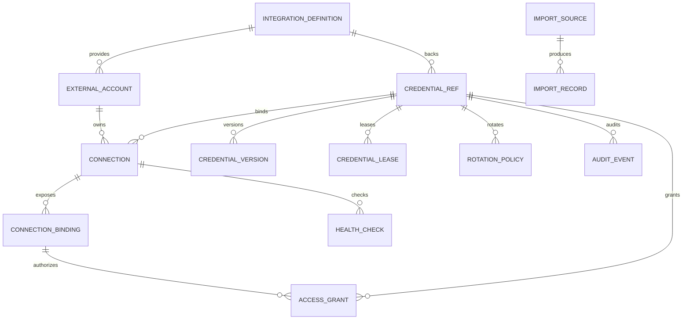

# Domain Model

## Canonical identity rules

- `CredentialRef.id` is immutable and globally opaque: `cred_<uuid>`.
- Provider id, external account id, locator, version, and storage mode are replaceable metadata.
- `Connection.id` is stable across provider moves; it never embeds a provider locator.
- WorkGraph and `identity.json` store references, metadata, digests, and decisions only.
- Raw payloads exist only inside a provider or the broker's bounded delivery operation.

## TypeScript contract (proposed)

```ts
export type StorageMode = 'reference' | 'copy' | 'mirror' | 'managed' | 'ephemeral'

export type CredentialKind =
  | 'api_key' | 'oauth2_token_set' | 'bearer_token' | 'basic_auth'
  | 'aws_credential_source' | 'gcp_adc' | 'ssh_agent_identity'
  | 'x509_identity' | 'opaque_bundle' | 'browser_session'

export interface IntegrationDefinition {
  id: string
  providerKind: string
  displayName: string
  supportedKinds: readonly CredentialKind[]
  deliveryMechanisms: readonly DeliveryMechanism[]
  capabilities: ProviderCapabilities
}

export interface ExternalAccount {
  id: string
  providerId: string
  tenant?: string
  displayName?: string
  status: 'connected' | 'expired' | 'error' | 'disconnected'
}

export interface Connection {
  id: string
  workspaceId: string
  integrationId: string
  externalAccountId?: string
  credentialRefId: string
  storageMode: StorageMode
  scopes: readonly string[]
  healthCheckId?: string
  rotationPolicyId?: string
}

export interface CredentialRef {
  id: `cred_${string}`
  kind: CredentialKind
  providerId: string
  locator: ProviderLocator
  currentVersionId?: string
  createdAt: number
  updatedAt: number
}

export interface CredentialVersion {
  id: string
  credentialRefId: string
  codec: string
  fingerprint: string
  providerVersion?: string
  createdAt: number
  expiresAt?: number
  status: 'active' | 'superseded' | 'revoked' | 'invalid'
}

export interface ConnectionBinding {
  id: string
  connectionId: string
  consumerId: string
  purpose: string
  allowedActions: readonly string[]
  resources: readonly string[]
  approvalPolicyId?: string
}

export interface AccessGrant {
  id: string
  workspaceId: string
  consumerId: string
  credentialRefId: string
  actions: readonly string[]
  resources: readonly string[]
  expiresAt?: number
  status: 'active' | 'revoked' | 'expired' | 'denied'
}

export interface CredentialLease {
  id: string
  credentialRefId: string
  consumer: ConsumerIdentity
  purpose: string
  action: string
  resources: readonly string[]
  audience?: string
  issuedAt: number
  expiresAt: number
  delivery: DeliveryDescriptor
  status: 'active' | 'revoked' | 'expired' | 'used' | 'denied'
}

export interface ImportSource {
  id: string
  kind: string
  locator: string
  metadataOnly: boolean
  capabilities: readonly ('discover' | 'preview' | 'read' | 'watch')[]
}

export interface ImportRecord {
  id: string
  sourceId: string
  candidateCount: number
  selectedMode?: StorageMode
  status: 'discovered' | 'previewed' | 'committed' | 'rolled_back' | 'failed'
  sourceDigest: string
  errorCode?: string
}

export interface HealthCheck {
  id: string
  connectionId: string
  checkedAt: number
  status: 'healthy' | 'expired' | 'unauthorized' | 'unreachable' | 'invalid'
  detailCode?: string
}

export interface RotationPolicy {
  id: string
  credentialRefId: string
  mode: 'manual' | 'scheduled' | 'provider_managed'
  intervalMs?: number
  revokeLeasesOnChange: boolean
}

export interface AuditEvent {
  id: string
  workspaceId: string
  credentialRefId?: string
  consumer?: string
  action: string
  target?: string
  timestamp: number
  decision: 'allow' | 'deny' | 'error'
  versionFingerprint?: string
  correlationId: string
}
```

## Provider locator and consumer types

```ts
export type ProviderLocator =
  | { type: 'local'; key: string }
  | { type: 'keychain'; service: string; account: string }
  | { type: 'infisical'; projectId: string; environment: string; secretPath: string; secretKey: string }
  | { type: 'opaque'; provider: string; locator: string }

export type ConsumerIdentity = {
  kind: 'agent' | 'workflow' | 'tool' | 'mcp' | 'plugin' | 'remote-client' | 'human'
  id: string
  workspaceId: string
}

export type DeliveryMechanism =
  | 'trusted-http-header' | 'proxy' | 'mcp-tool-host' | 'git-credential-helper'
  | 'docker-credential-helper' | 'aws-credential-process' | 'ssh-agent'
  | 'stdin' | 'fd' | 'temporary-file' | 'browser-partition' | 'env-legacy'
```

## ERD



## Storage modes

- `reference`: store only provider-native locator; lease resolves provider at use time.
- `copy`: import a version into a different provider; source remains independent.
- `mirror`: maintain source and destination versions under explicit sync policy; conflicts deny commit.
- `managed`: provider is managed by ROX broker lifecycle; still never exposed to renderer/agent.
- `ephemeral`: materialize only for a bounded lease and destroy after expiry/revoke.

No mode may make a provider locator the logical credential identity.
