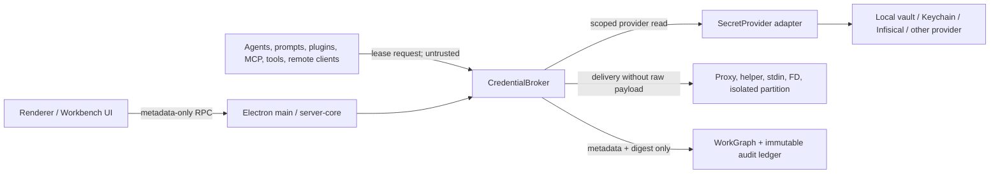

# Threat Model

## Trust boundaries

Trusted: Electron main, broker, provider adapter, OS-native protection, provider endpoint. Untrusted: renderer input, agent process, prompt content, plugins, MCP server, remote/headless client, imported metadata, provider response fields until validated.

## Threats and required controls

| Threat | Control | Acceptance evidence |
| --- | --- | --- |
| Renderer exfiltration | Renderer receives metadata, candidates, decisions, and lease handles only; no raw payload RPC | IPC contract tests and response redaction assertions |
| Prompt injection asks agent for a secret | Agent gets a lease-bound delivery mechanism, not a value; broker checks consumer/action/resource/TTL | adversarial agent fixture cannot read value or broaden scope |
| Malicious plugin/MCP | Treat plugin/MCP as untrusted consumer; broker requires explicit `AccessGrant` and provider-specific target allowlist | deny-by-default capability tests |
| Remote client impersonation | Main-issued local binding/proof and explicit remote capability profile; no local-only secret channels in thin client | routing/authorization tests |
| URL/argv/log leakage | Reject raw values in URLs, argv, telemetry, crash context, logs, WorkGraph, identity file | structural redaction and transport tests |
| Stale/revoked lease | Lease contains expiry and version; revoke/rotation invalidates active leases before affected closure | transition tests |
| Confused deputy | Every request carries workspace, consumer, purpose, action, resources, audience, TTL; broker re-evaluates grants | cross-workspace and wrong-consumer tests |
| Provider compromise or malformed response | Validate provider-native response against codec; never stringify arbitrary mapping/list into public artifacts | provider adapter negative tests |
| Corrupt local vault | Keep original immutable, quarantine copy, create recovery record, require explicit repair/cutover | corruption recovery tests |
| Machine identity loss | Random DEK wrapped by OS-native protection; recovery path is explicit and audited | key rotation/recovery matrix |
| Import disclosure | Metadata discovery before access; preview masks values; access requested only after selection | import state-machine tests |
| Mirror conflict | Detect source/version/fingerprint conflict; deny atomic commit rather than silently overwrite | conflict/rollback tests |
| Audit leakage | Audit stores `credentialRef`, consumer, action, target, time, decision, fingerprint only | schema and serialization tests |

## Security invariants

1. Raw secret payload never crosses renderer, WorkGraph, `identity.json`, URL, argv, logs, telemetry, crash reports, prompts, or agent context.
2. No provider adapter may expose a general `getSecret(ref)` method to consumers. Only broker-owned, purpose-bound resolution is allowed.
3. A lease is denied unless workspace, consumer, action, resource, audience, TTL, and approval policy all pass.
4. Missing, malformed, expired, revoked, unavailable, or ambiguous state fails closed.
5. Provider-native references are opaque and validated by the provider adapter; they are not interpolated into URLs without encoding/allowlist checks.
6. Revoke and rotation invalidate leases first, then append audit, then compute affected closure and revalidate consumers.
7. Import is a transaction: discover → candidates → access approval → preview → mode choice → duplicate/conflict check → validate → atomic commit → rollback on failure.
8. Recovery never deletes a source store as a first response.

## Privacy and audit

Audit records are minimal and immutable. `versionFingerprint` is a non-reversible digest bound to credential version/provider identity; it is not a hash used to guess the secret. Error details use stable codes and redacted context.
