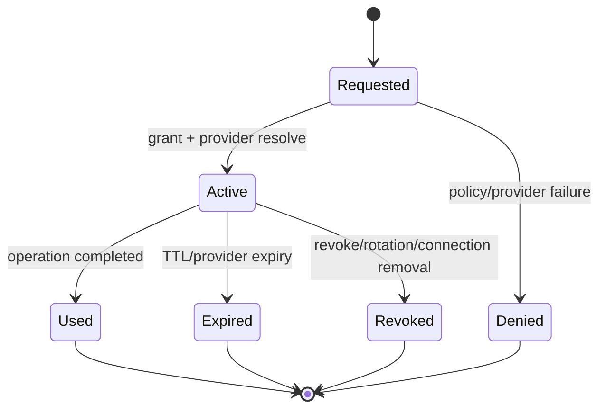
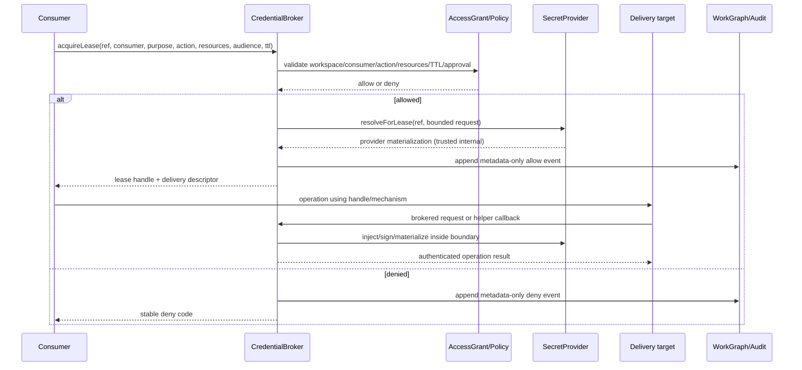
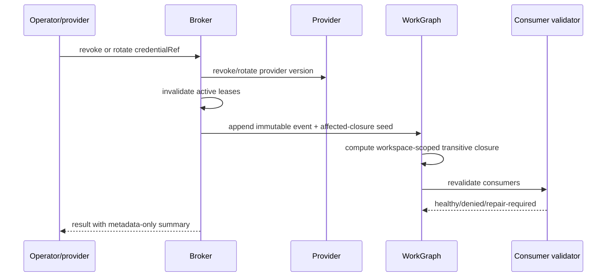

# Credential Broker and Lease Contract

## Primary operation

Consumers do not request a raw value. They call:

```ts
export interface AcquireLeaseInput {
  credentialRef: `cred_${string}`
  consumer: ConsumerIdentity
  purpose: string
  action: string
  resources: readonly string[]
  audience?: string
  ttl: number
}

export interface CredentialBroker {
  acquireLease(input: AcquireLeaseInput): Promise<CredentialLease>
  revokeLease(leaseId: string, reason: string): Promise<void>
  revalidateConsumer(consumer: ConsumerIdentity): Promise<ConsumerValidation>
}
```

`ttl` is bounded by broker policy and provider expiry. The returned `CredentialLease` contains a non-secret handle and delivery descriptor; it never contains a payload field.

## Delivery selection

The broker chooses the least-exposing mechanism supported by the target:

1. trusted HTTP/header injection;
2. broker proxy;
3. MCP/tool-host injection;
4. git credential helper;
5. Docker credential helper;
6. AWS `credential_process`;
7. SSH agent/signing;
8. stdin or file descriptor;
9. short-lived temporary file;
10. isolated browser partition;
11. explicit `env-legacy` fallback only when a consumer declares it and policy allows it.

The broker must reject a mechanism that cannot satisfy the requested audience, resource allowlist, or cleanup guarantee.

## Lease state machine



A revoked or expired lease cannot be renewed. Renewal is a new authorization decision and may produce a new version/fingerprint.

## Request sequence



## Revoke/rotation sequence



## Failure semantics

- Unknown ref, wrong workspace, missing grant, expired provider, malformed provider response, stale version, unsupported delivery, or unavailable provider → deny with stable code.
- Provider timeout does not fall back to a broader scope or raw local credential automatically.
- Revoke succeeds only when active leases are marked invalid or a durable recovery record explains why; partial failure is surfaced as `revoke_pending` and blocks affected workflows.
- Provider renewal never mutates a `CredentialRef` in place without creating a new `CredentialVersion`.
