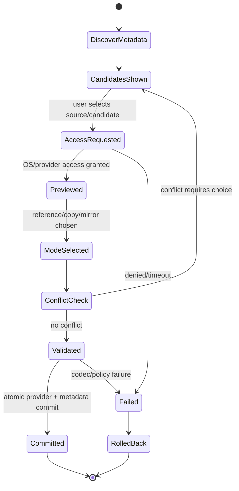

# Import Contract

## Import state machine



Required order: discover metadata → show candidates → request OS/provider access → preview → choose `reference`/`copy`/`mirror` → duplicate/conflict detection → validate codec/policy → atomic commit → rollback.

Preview data is masked and metadata-only by default. A provider may expose a user-approved field label or fingerprint; it must not return arbitrary raw payload to renderer.

## Importer contract

```ts
export interface ImportCandidate {
  id: string
  sourceId: string
  kind: CredentialKind
  label: string
  locator?: string
  fingerprint?: string
  expiresAt?: number
  conflictKey: string
}

export interface ImportPreview {
  candidateId: string
  inferredKind: CredentialKind
  targetProviderId: string
  proposedMode: StorageMode
  maskedSummary: string
  warnings: readonly string[]
}

export interface ImportCommitInput {
  candidateId: string
  targetProviderId: string
  mode: StorageMode
  workspaceId: string
  requestedBy: string
}
```

## Adapter matrix

| Priority | Source | Discovery | Read/access | Initial target mode | Notes |
| --- | --- | --- | --- | --- | --- |
| P0 | current `credentials.enc` | local metadata | trusted main only | copy/reference | dual-read; never delete source before verification |
| P0 | `.env` / `.env.*` | file names/keys | explicit file approval | copy | no shell expansion; redact preview |
| P0 | macOS Keychain | service/account metadata | OS prompt | reference/copy | Keychain is the preferred Personal Local provider |
| P0 | Git credential helpers | helper config/host | helper process through controlled stdin | reference/copy | no raw output to renderer |
| P0 | Docker credential helpers | config/registry metadata | helper process | reference/copy | helper argv/environment sanitized |
| P0 | AWS shared profiles/config | profile metadata | SDK/credential_process | reference/copy | support `aws_credential_source` and expiring credentials |
| P0 | Google ADC | file/env metadata | OS-approved file/process | reference/copy | support `gcp_adc`; redact JSON |
| P0 | SSH Agent | socket/key metadata | agent signing | reference | private key never imported by default |
| P1 | Windows Credential Manager | metadata | OS API | reference/copy | cross-platform provider |
| P1 | Linux Secret Service | metadata | OS API | reference/copy | cross-platform provider |
| P1 | 1Password/Bitwarden | account/item metadata | provider auth | reference/copy | require provider-native access grant |
| P1 | Infisical | project/env/path/key metadata | REST API via provider adapter | reference/copy/mirror | team/remote only by default |
| P1 | Vault/OpenBao | mount/path/key metadata | REST API via provider adapter | reference/copy/mirror | no generic URL fetch |
| P1 | kubeconfig/Secret manifest | context/name/key metadata | explicit file/cluster access | reference/copy | Kubernetes secret values remain provider-bound |
| P2 | browser sessions/cookies | browser profile metadata | isolated browser partition | ephemeral | opt-in, provider-specific, no sync-by-default |

## Duplicate/conflict rules

- Same `conflictKey` and same fingerprint → offer existing reference; do not duplicate.
- Same key and different fingerprint → require explicit reference/copy/mirror decision; default deny.
- Same logical `CredentialRef` with provider move → update locator/version metadata without changing Connection id.
- Import failure after provider write → provider rollback is mandatory where supported; otherwise mark `repair_required` and block consumer activation.
