# DATA-MODEL: the single entity model for the Rox Unified Suite

**Version:** unified **v2**, 2026-10-08 (MSK). v1 is kept in `v1/` · **Baseline:** `rox-one/rox-one` @ `aedff592` (read-only) · Decisions are referenced as ADR-U01…U20 (PRD §2).

> **v2 changes:**
> - storage root `configDir` = **`~/rox`** (ADR-U13; was `~/.rox` or `~/rox`);
> - new kind `invitation` (54 kinds);
> - new §5.11–§5.17: identity lifecycle and placeholder principals, personal agent `@rox`, audit log, agent governance, personal Drive and quota, domain automation rules R1–R5, collaboration data;
> - 5 new migration files (27 total) adding 18 tables (103 new tables in total), and 4 existing tables extended;
> - MIG-13…MIG-16.
>
> **v2.1 changes:** §5.18 (agent panel, chrome and cross-functional storage notes). No new tables, kinds or relations; one new notification kind `reminder_due` (§9.2).

## 1. Principles
1. **One concept, one aggregate, one owner module.** Lark and Operately contribute *surfaces*, never parallel tables (OPERATELY-SPEC §12.1 guiding rule, applied to Rox owners).
2. **Exactly one authority per entity instance at any time.**

   | Authority | Who | Store |
   |---|---|---|
   | `local` | the device's server-core, acting for the owning principal | files / SQLite under the config dir or workspace root |
   | `workspace` | `apps/workspace-service` | Postgres |
   | `external` | a provider: Stalwart (mail), Google/Outlook/CalDAV (calendar), Lark/Telegram bridge (mirrored chats), SiYuan (knowledge) | provider |

   The authority is a field on every record (`authority`) and in every preview.
3. **Ids are stable across authority moves.** Rox-native ids are UUIDv7. Existing ids (personal tasks, notes, projects, roadmap milestones) are kept verbatim. A local→workspace move keeps the id and leaves a local tombstone `{id, movedTo:'workspace', workspaceId, at, receipt}`.
4. **No universal entity database** (audit §9.1). Cross-integration uses only:
   - (a) the kind registry;
   - (b) `entity_link` (edges only);
   - (c) `rox://` routes;
   - (d) the resolver / preview registry, which asks owners and caches in memory.

   No owner copies another owner's fields, except denormalised **display caches** in previews, which are never persisted server-side.
5. **Command-driven, versioned changes** (ADR-0001 #9). Every mutation is a command `{commandId, idempotencyKey, actor, ref, expectedRevision, op, payload}`. It returns a receipt `{revision, eventIds}` and emits `domain_event` rows through the transactional outbox. AI mutations arrive as ChangeProposals.
6. **No domain state in Jotai.** Renderer atoms hold view state and caches only. Stores live in `packages/core` (domain + zod) with persistence in server-core (local) or workspace-service (server).
7. **Migrations never auto-share** (audit §9.5). Only explicit Share, Assign or Move commands change authority.
8. **Conventions:**
   - server tables follow `01-domain-contract.sql`: `uuid` PK, `workspace_id`, `schema_version`, `revision bigint`, `created_at/updated_at timestamptz DEFAULT clock_timestamp()`, `deleted_at`, `CHECK` enums, checksum-bound additive migrations;
   - local JSON records follow `personal-persist.ts`: `{id, revision, record}`, tmp+rename, per-record lock.

## 2. Stores by authority

| Store | Authority | Location | Holds (kinds) |
|---|---|---|---|
| WorkItem local store (extends `PersonalTaskPersistStore`) | local | `{configDir}/personal-tasks/<id>.json` + `meta.json` (`configDir` = `~/rox`, ADR-U13) | `task` (personal), `task-list`, `task-section`, `task-list-group` (personal) |
| Notes vault (unchanged) | local | `{workspaceRoot}/notes/**/*.md` + `.craft/vault-index.sqlite` + native journal | `note` (private) |
| Projects store (extended) | local | `{workspaceRoot}/projects/{slug}/config.json`, `roadmap.json`, `milestones.json` (new), `okr.json` (legacy, read-only after migration) | `project`, `milestone` (local projects) |
| Local work store (new, same JSON pattern) | local | `{workspaceRoot}/work/{goals,check-ins,reviews,kpis,cycles}/<id>.json` | `goal` (+ embedded targets / checks), `check-in`, `review`, `kpi` (+ entries), `okr-cycle` |
| Local entity-link store (new) | local | `{workspaceRoot}/.craft/entity-links.sqlite` | `entity_link` edges whose *both* endpoints are local or external |
| Local contacts store (new; Dossier migration target when offline) | local | `{workspaceRoot}/contacts/<id>.json` | `person` (contact cards), `crm-company` |
| Sessions, pages, memory, skills, sources, automations, connections, meetings journal | local | unchanged | `session`, `page`, `memory`, `skill`, `source`, `automation`, `connection`, `call`, `workflow`, `workflow-run`, `decision`, `radar-topic`, `feed-item`, `agent-team` |
| Workspace-service Postgres | workspace | `apps/workspace-service/migrations/*` | every shared kind (§4) |
| Object store (S3 API) | workspace | SeaweedFS / S3 | `file` bytes |
| Hocuspocus (Yjs) | workspace | `doc_yjs_update` in Postgres | live state of shared `note` |
| Stalwart (JMAP) | external | separate process | `mail-thread` |
| Calendar providers | external | Google / Outlook / CalDAV | `calendar-event` (external), `calendar` (external) |
| Messaging bridges | external (mirrored) | messaging-gateway | `channel` with `external_source` |
| ✚ Local Drive (v2) | local | `~/rox/drive/**` (visible folder) + session artifact dirs, read in place | `file`, `folder` (local) |
| ✚ Local agent / audit / rules (v2) | local | `{configDir}/agents/personal.json`, `{configDir}/audit/*.jsonl`, `{configDir}/rules/executions.sqlite` | personal agent binding, audit, rule executions |
| ✚ Ephemeral presence (v2) | workspace | Valkey (TTL) + Hocuspocus awareness | presence, typing, cursors (not persisted) |

**Storage root (ADR-U13, v2):** every local path in this document is under **`~/rox`**:
- `configDir` = `~/rox`;
- `workspaceRoot` = `~/rox/workspaces/{id}`.

`~/.rox` is migrated by MIG-13 and kept as a compatibility symlink. Per-workspace hidden metadata folders (`{workspaceRoot}/.craft/`, `{workspaceRoot}/.rox/`) stay inside the visible tree.

## 3. Reference grammar, kind registry, deep links

### 3.1 Grammar
```
EntityRef   := kind ":" id [ "#" fragment ]          e.g. task:01J9…, note:01J8…#blk-7f3a, channel-message:01JA…
kind        := canonical kind | alias            (aliases normalised by parseEntityRef; ADR-U08)
fragment    := "blk-" blockId | "c-" commentId | "seq-" n | "t-" targetId | free
DeepLink    := "rox://" [ "workspace/" wsId "/" ] route
WebLink     := https://<host>/w/<wsId>/<route>           (webui; same route grammar)
```
- `packages/core/src/rox2/platform-contract.ts` keeps `formatRox2EntityId` and `parseRox2EntityId`. The new `packages/core/src/entities/kinds.ts` re-exports them with alias normalisation and the extended kind list.
- `ROX2_ENTITY_KINDS` stays a subset (it does not shrink).

### 3.2 Alias table (ADR-U08)

| Alias | Canonical kind |
|---|---|
| `doc` | `note` |
| `post` | `note` |
| `discussion` | `note` |
| `chat` | `channel` |
| `message` | `channel-message` |
| `meeting` | `call` |
| `event` | `calendar-event` |
| `user` | `person` |
| `contact` | `person` |
| `company` | `crm-company` |
| `objective` | `goal` |
| `key-result` | `goal-target` |
| `kr` | `goal-target` |
| `mail` | `mail-thread` |
| `workflowRun` | `workflow-run` |
| `list` | `task-list` |
| `heading` | `task-section` |
| `area` | `task-list-group` |

### 3.3 `rox://` routes per kind
These are added to `apps/electron/src/shared/routes.ts` and `route-parser.ts` (`COMPOUND_ROUTE_PREFIXES`). Existing routes are unchanged.

| Kind | Route |
|---|---|
| task | `tasks/task/{id}` (existing) |
| task-list | `tasks/list/{id}` |
| task-section | `tasks/list/{listId}?section={id}` |
| note | `notes/note/{id}` (existing; alias `docs/{id}`) |
| folder | `docs/folder/{id}` |
| wiki-space | `docs/wiki/{id}` (+ `/{noteId}`) |
| drive-link | `docs/link/{id}` |
| channel | `messenger/{chatId}` (+ `/{tab}`) |
| channel-message | `messenger/{chatId}?seq={n}` (resolver maps id → chat + seq) |
| call | `meetings/{id}` |
| calendar-event | `calendar/event/{id}` |
| calendar | `calendar/cal/{id}` |
| goal | `goals/goal/{id}` (`?tab=check-ins\|discussions\|docs\|activity`) |
| goal-target | `goals/goal/{goalId}#t-{id}` |
| goal-check | `goals/goal/{goalId}#k-{id}` |
| check-in | `goals/check-in/{id}` |
| review | `goals/review/{id}` |
| okr-cycle | `goals/okrs?cycle={id}` |
| project | `projects/{slug}` (existing; `?tab=tasks\|check-ins\|discussions\|docs\|activity\|workspace`) |
| milestone | `projects/milestone/{id}` |
| space | `goals/space/{id}` (+ `/work-map`, `/kanban`, `/kpis`, `/discussions`) |
| kpi | `goals/space/{spaceId}/kpis/{id}` |
| person | `contacts/person/{id}` |
| crm-company | `contacts/company/{id}` |
| department | `contacts/department/{id}` |
| base, base-table, base-view, base-record | `base/{baseId}/{tableId}/{viewId}?record={id}` |
| form | `forms/{id}` |
| app | `home/apps/{id}` |
| mail-thread | `inbox/mail/{threadId}` |
| project-template | `goals/templates/{id}` |
| invitation (v2) | `contacts/invitations/{id}` |
| drive (v2, not a kind) | `docs/drive` (`/my`, `/shared`, `/recent`, `/starred`, `/trash`, `/storage`, `/artifacts`) |
| others | existing routes (`session`, `page`, `memory`, `skill`, `source`, `automation`, `connection`, `knowledge`, …) |

## 4. Entity catalog (54 kinds)

**Columns:**
- **Auth** = possible authorities (L = local, W = workspace, X = external).
- **Owner module** = the package that owns commands and the resolver.
- **Store** = §2.

The 21 existing `ROX2_ENTITY_KINDS` are marked ✔. The 33 new kinds are marked ✚ (32 in v1, plus `invitation` in v2).

| # | Kind | Entity (UI names) | ✔/✚ | Owner module | Auth | Local store / server table | Key relations |
|---|---|---|---|---|---|---|---|
| 1 | `session` | AI session (Chat) | ✔ | sessions (server-core) | L (published → W projection) | `sessions/{id}/session.jsonl` / `session_publication` | derived-from message; attached-to task (delegation) |
| 2 | `note` | Doc = Note (subtypes `doc`, `post`, `announcement`, `wiki-page`, `minutes`, `daily`, `template`, `check-in-body`) | ✔ | docs (core/docs + server-core notes) | L or W | vault `.md` / `doc` | parent folder / wiki-space; mentions *; attached-to channel |
| 3 | `task` | Task = WorkItem | ✔ | tasks | L or W | `personal-tasks/<id>.json` / `work_item` | parent task; member-of task-list; parent milestone/project; blocks task; assigned person |
| 4 | `project` | Project (Rox project = Operately project) | ✔ | projects | L or W | `projects/{slug}/config.json` / `project` | parent goal; member-of space; resource-of note/file/link |
| 5 | `page` | Page (agent dashboard) | ✔ | pages | L | `pages/{slug}` | — |
| 6 | `memory` | Memory lesson | ✔ | memory | L | memory store | derived-from decision |
| 7 | `skill` | Skill | ✔ | skills | L | — | — |
| 8 | `source` | Source | ✔ | sources | L | — | — |
| 9 | `automation` | Automation | ✔ | automations | L (W later) | automations store | — |
| 10 | `connection` | Connection | ✔ | connections | L | — | — |
| 11 | `file` | File (Drive file, attachment) | ✔ | drive | L or W | workspace files / `file_object` + `folder_item` | parent folder; attached-to * |
| 12 | `mail-thread` | Mail thread | ✔ | mail | X | Stalwart | derived-from (task from mail) |
| 13 | `calendar-event` | Calendar event | ✔ | calendar | X or W | provider / `calendar_event` | in-calendar calendar; attached-to call |
| 14 | `crm-company` | Company (contact card) | ✔ | contacts | L or W | `contacts/<id>.json` / `contact_card(kind=company)` | member-of (person works at) |
| 15 | `channel` | Chat: DM / group / channel / topic group / space chat / bot chat / bridged chat | ✔ | messenger | W (X mirrored) | — / `chat` | member-of space; attached-to entity (discussion chat) |
| 16 | `channel-message` | Message | ✔ | messenger | W | — / `message` | parent channel; mentions * |
| 17 | `call` | Meeting | ✔ | meetings | L or W | meetings journal / `meeting_room` + journal | in-calendar event; derived-from channel |
| 18 | `reminder` | Reminder (calendar `ReminderProposal`, personal reminder) | ✔ | calendar / tasks | L | existing | attached-to task / event |
| 19 | `workflow` | WorkflowSpec (Conductor) | ✔ | workflows | L | `tasks/<slug>/task.yaml` (legacy dir) | — |
| 20 | `person` | Person: member / bot / guest / external contact / Dossier person | ✔ | contacts (directory) | W or L | `contacts/<id>.json` / `principal` + `user_profile` or `contact_card` | member-of space / department / channel |
| 21 | `license-component` | Licence component | ✔ | licences | W | `license_component` | — |
| 22 | `goal` | Goal = OKR Objective | ✚ | goals | L or W | `work/goals/<id>.json` / `goal` | parent goal; aligned-to goal; member-of space; in okr-cycle |
| 23 | `goal-target` | Target = Key result | ✚ | goals | (as goal) | embedded / `goal_target` | parent goal |
| 24 | `goal-check` | Checklist item (goal) | ✚ | goals | (as goal) | embedded / `goal_check` | parent goal |
| 25 | `check-in` | Check-in (goal or project; Lark KR progress record) | ✚ | goals | L or W | `work/check-ins/<id>.json` / `check_in` | parent goal/project |
| 26 | `review` | Retrospective / OKR cycle review | ✚ | goals | L or W | `work/reviews/<id>.json` / `review` | parent goal/project/okr-cycle; attached-to note |
| 27 | `okr-cycle` | OKR cycle (named period) | ✚ | goals | L or W | `work/cycles/<id>.json` / `okr_cycle` | — |
| 28 | `milestone` | Milestone | ✚ | projects | (as project) | `projects/{slug}/milestones.json` / `milestone` | parent project |
| 29 | `space` | Space | ✚ | spaces | W (implicit local "Personal") | — / `space` | attached-to channel (space chat), folder (root) |
| 30 | `kpi` | KPI | ✚ | kpis | L or W | `work/kpis/<id>.json` / `kpi` | member-of space; aligned-to goal |
| 31 | `kpi-entry` | KPI value | ✚ | kpis | (as kpi) | embedded / `kpi_entry` | parent kpi |
| 32 | `task-list` | Task list (Lark) = Things project = project/space board | ✚ | tasks | L or W | `meta.json` / `task_list` | member-of task-list-group; owned-by project/space |
| 33 | `task-section` | Section (Lark custom group) = Things heading | ✚ | tasks | (as list) | `meta.json` / `task_section` | parent task-list |
| 34 | `task-list-group` | Task-list group (Lark sidebar group) = Things area | ✚ | tasks | L (per user) or W | `meta.json` / `task_list_group` | — |
| 35 | `folder` | Folder (Drive; space / goal / project root = Operately resource hub) | ✚ | drive | W (L = vault folder) | vault dirs / `folder` | parent folder; owned-by space/goal/project |
| 36 | `drive-link` | Link resource (Figma, Google Doc, Notion…) | ✚ | drive | W | — / `drive_link` | parent folder; resource-of project |
| 37 | `wiki-space` | Wiki space | ✚ | wiki | W | — / `wiki_space` | — |
| 38 | `comment` | Comment (any shared entity; inline doc comments) | ✚ | social | W | — / `comment` | parent = commented entity |
| 39 | `base` | Base | ✚ | tables (#1295) | W (L views) | note views / `base` | parent folder |
| 40 | `base-table` | Table (source: custom or adapter over an owner) | ✚ | tables | W | — / `base_table` | parent base |
| 41 | `base-view` | View (grid / kanban / calendar / gantt / gallery / form) | ✚ | tables | W | — / `base_view` | parent base-table |
| 42 | `base-record` | Custom record (free tables only; adapter rows keep their own kind) | ✚ | tables | W | — / `custom_record` | parent base-table |
| 43 | `form` | Form (public fill) | ✚ | tables / forms | W | — / `base_view(type=form)` + `form_share` | parent base-table |
| 44 | `calendar` | Calendar (container) | ✚ | calendar | X or W | provider / `calendar` | — |
| 45 | `room` | Meeting room (bookable resource) | ✚ | calendar | W | — / `room` | — |
| 46 | `department` | Department | ✚ | contacts | W | — / `department` | parent department |
| 47 | `app` | Workplace app | ✚ | workplace | W (L for local pages) | — / `workplace_app` | — |
| 48 | `project-template` | Project template | ✚ | projects | W | — / `project_template` | member-of space |
| 49 | `decision` | Decision | ✚ (TaskLinkKind already) | decisions | L (→ W later) | decisions store (moved off localStorage) | derived-from call/session |
| 50 | `feed-item` | Feed item (news, X post, agent action) | ✚ (TaskLinkKind already) | feed | L | feed store | — |
| 51 | `workflow-run` | WorkflowRun (Conductor run) | ✚ (TaskLinkKind `workflowRun`) | workflows | L | `tasks/<slug>/runs/<runId>` | derived-from workflow |
| 52 | `radar-topic` | Radar topic | ✚ | radar | L | radar store (moved off localStorage) | — |
| 53 | `agent-team` | Agent team (link only; tasks stay in agent-teams store) | ✚ | agent-teams | L | `.agent-teams/<teamId>/team.json` | relates-to task (`#node-…` fragment) |
| 54 | `invitation` | Invitation (email invite; placeholder member) (v2) | ✚ | identity (directory) | W | — / `invitation` | member-of workspace / space / channel (targets); assigned person (placeholder) |

**Non-referenceable internal tables** (have rows, but no kind; addressed through their parent):
- `reaction`, `subscription`, `entity_link`;
- `acl_entry`, `resource_policy`;
- `domain_event`, `notification`, `notification_pref`, `notification_email_batch`;
- `command_receipt`;
- `task_status`, `task_in_list`, `work_item_user_state`, `work_item_member`;
- `project_member`, `chat_member`, `chat_tab`, `chat_label(_item)`, `message_flag`, `chat_pin`, `chat_top_notice`, `message_draft`, `chat_member_event`;
- `doc_yjs_update`, `doc_snapshot`, `folder_item`, `drive_recent`, `drive_favorite`, `wiki_node`;
- `event_attendee`, `freebusy_cache`;
- `kpi_entry_edit`, `kpi_annotation`;
- `user_profile`, `department_member`, `contact_star`, `external_contact`, `bot_app`;
- `search_document`, `search_usage`;
- `workplace_favorite`, `mail_account`, `meeting_room_session`, `recording`;
- `base_field`, `form_share`, `form_response` (→ record);
- `space_member` (= `acl_entry` rows);
- v2: `agent_binding`, `agent_grant`, `approval_policy`, `approval_request`, `standing_approval`, `rate_limit_policy`, `audit_log`, `automation_rule`, `rule_execution`, `drive`, `storage_ledger`, `file_version`, `file_preview`, `upload_session`, `doc_suggestion`, `doc_view`, `calendar_member`.
  - Approval requests are addressed as `person:<agent>#approval-<id>` and shown in Inbox.
  - Personal agents resolve as `person` (principal kind `bot`).

## 5. Entity definitions (new and extended)

### 5.1 WorkItem (`task`): PersonalTask v2 → v3 (ADR-U01)
`packages/core/src/tasks/personal/types.ts` keeps the `PersonalTask` name as a type alias of `WorkItem` for one release. `PERSONAL_TASK_SCHEMA_VERSION = 3`. All v3 fields are **optional and additive**, so v2 readers ignore them.

```ts
interface WorkItem {
  // identity (source-scoped, lark-suite-reference/07 §2)
  id: string                        // unchanged; UUIDv7 for new items
  authority: 'local' | 'workspace'  // default 'local'
  workspaceId?: string              // set when authority = workspace
  ownerPrincipalId: string          // creator/owner ("Owner" in Lark)
  nativeId?: string; sourceStoreId?: string
  revision: number                  // CAS (local file revision or server row revision)
  // content
  title: string
  notes: string                     // Markdown (local); shared items also keep notesDoc?: ProseMirror JSON
  notesDoc?: unknown
  // Things planning (per user for shared items, see work_item_user_state)
  list: 'inbox'|'today'|'upcoming'|'anytime'|'someday'
  startAt?: string; evening: boolean; order: number
  // placement (v2 fields renamed with read aliases)
  listId?: string        // v2 projectId  → task-list (Things project = Lark task list)
  sectionId?: string     // v2 headingId  → task-section
  listGroupId?: string   // v2 areaId     → task-list-group (only for list-less tasks in an area)
  parentId?: string      // subtask
  projectId?: string     // Rox/Operately project (workspace project), NOT the Things project
  milestoneId?: string
  spaceId?: string
  // Operately format
  statusKey: string                  // key in the effective task_status set; default set: pending|in_progress|done|canceled
  priority: 'none'|'low'|'normal'|'high'|'urgent'   // v2 'medium' → 'normal'
  size?: 'xs'|'s'|'m'|'l'|'xl'
  dueAt?: string; duePrecision?: 'day'|'month'|'quarter'|'year'  // Operately contextual dates
  // people
  assigneeIds: string[]              // Lark owners/assignees; Operately task_assignees; empty = owner only
  // lifecycle
  createdAt: string; updatedAt?: string
  completedAt?: string; cancelledAt?: string; reopenedAt?: string; trashedAt?: string; archivedAt?: string
  // reminders (union of Things, Lark, Operately)
  reminderAt?: string; reminderTimeZone?: string
  reminderOffsets?: number[]         // minutes before due (Lark alert)
  reminderOnDates?: string[]; remindDueDay?: boolean; remindOverdue?: boolean
  reminderDeliveredFor?: string; reminderRetryAt?: string; reminderError?: 'permission-denied'|'permission-required'|'presentation-failed'
  // recurrence (unchanged)
  recurrence?: Recurrence; repeatOf?: string; repeatOccurrenceAt?: string; repeatNextId?: string
  // checklist (unchanged; Lark "sub-task" = child WorkItem; checklist stays lightweight)
  checklist?: { id: string; title: string; done: boolean }[]
  tags: string[]
  customFields?: Record<string, unknown>   // keyed by base_field id (Unified Tables field registry)
  estimateMinutes?: number                 // Lark "Estimates"
  origin?: EntityRef                       // v2 `source` (TaskLink) → derived-from link; kept denormalised for "Created from"
  // v2 `links[]` → entity_link rows (§6.1); field kept read-only for one release
}
```

**Status semantics:**
- `completedAt` is set iff the status has `closed=true` and is not a cancel. `cancelledAt` is set iff the status key = `canceled`, or it is a custom status with `closed=true` and `kind='canceled'`.
- Things "Logbook" = closed. Lark "Completed" = `completedAt`. Operately "Show closed statuses" = closed.

**Per-user planning for shared items:** `work_item_user_state(work_item_id, principal_id, list, start_at, evening, order, today_rank, hidden)`.
- The Things "When" fields are personal. For a local item they live on the item. For a workspace item each participant has their own row, which is how "assignee plans it into their own Today" works.

**Server table:**
```sql
-- 20-work-item.sql
CREATE TABLE work_item (
  work_item_id uuid PRIMARY KEY, workspace_id uuid NOT NULL REFERENCES workspace(workspace_id),
  owner_principal_id uuid NOT NULL REFERENCES principal(principal_id),
  title text NOT NULL CHECK (length(btrim(title)) > 0), notes_md text NOT NULL DEFAULT '', notes_doc jsonb,
  parent_id uuid REFERENCES work_item(work_item_id), project_id uuid, milestone_id uuid, space_id uuid,
  status_set_owner text NOT NULL DEFAULT 'workspace', status_key text NOT NULL DEFAULT 'pending',
  priority text NOT NULL DEFAULT 'none' CHECK (priority IN ('none','low','normal','high','urgent')),
  size text CHECK (size IN ('xs','s','m','l','xl')),
  start_at timestamptz, due_at timestamptz, due_precision text NOT NULL DEFAULT 'day' CHECK (due_precision IN ('day','month','quarter','year')),
  recurrence jsonb, repeat_of uuid, checklist jsonb NOT NULL DEFAULT '[]', tags text[] NOT NULL DEFAULT '{}',
  custom_fields jsonb NOT NULL DEFAULT '{}', estimate_minutes int,
  reminder_offsets int[] NOT NULL DEFAULT '{}', reminder_on_dates date[] NOT NULL DEFAULT '{}',
  remind_due_day boolean NOT NULL DEFAULT false, remind_overdue boolean NOT NULL DEFAULT false,
  origin_ref text,                                   -- kind:id of the creating entity (denormalised; edge in entity_link)
  completed_at timestamptz, cancelled_at timestamptz, reopened_at timestamptz, archived_at timestamptz,
  schema_version int NOT NULL DEFAULT 3, revision bigint NOT NULL DEFAULT 1,
  created_at timestamptz NOT NULL DEFAULT clock_timestamp(), updated_at timestamptz NOT NULL DEFAULT clock_timestamp(), deleted_at timestamptz
);
CREATE TABLE work_item_member (work_item_id uuid REFERENCES work_item, principal_id uuid REFERENCES principal,
  role text NOT NULL CHECK (role IN ('assignee')), added_by uuid, created_at timestamptz DEFAULT clock_timestamp(),
  PRIMARY KEY (work_item_id, principal_id, role));          -- followers/subscribers live in `subscription`
CREATE TABLE work_item_user_state (work_item_id uuid REFERENCES work_item, principal_id uuid REFERENCES principal,
  list text NOT NULL DEFAULT 'anytime' CHECK (list IN ('inbox','today','upcoming','anytime','someday')),
  start_at timestamptz, evening boolean NOT NULL DEFAULT false, sort_key text NOT NULL DEFAULT 'm', hidden boolean NOT NULL DEFAULT false,
  revision bigint NOT NULL DEFAULT 1, PRIMARY KEY (work_item_id, principal_id));
CREATE TABLE task_list (task_list_id uuid PRIMARY KEY, workspace_id uuid NOT NULL,
  owner_type text NOT NULL CHECK (owner_type IN ('user','project','space','chat')), owner_id uuid NOT NULL,
  name text NOT NULL, notes text, deadline_at timestamptz, group_id uuid, sort_key text NOT NULL DEFAULT 'm',
  status_set_enabled boolean NOT NULL DEFAULT false,   -- Lark list opting into Operately status columns
  completed_at timestamptz, archived_at timestamptz, revision bigint NOT NULL DEFAULT 1,
  created_at timestamptz DEFAULT clock_timestamp(), deleted_at timestamptz);
CREATE TABLE task_section (task_section_id uuid PRIMARY KEY, task_list_id uuid NOT NULL REFERENCES task_list,
  title text NOT NULL, sort_key text NOT NULL, revision bigint NOT NULL DEFAULT 1, deleted_at timestamptz);
CREATE TABLE task_list_group (task_list_group_id uuid PRIMARY KEY, workspace_id uuid NOT NULL, principal_id uuid NOT NULL,
  name text NOT NULL, sort_key text NOT NULL, collapsed boolean NOT NULL DEFAULT false, deleted_at timestamptz);
CREATE TABLE task_in_list (work_item_id uuid REFERENCES work_item, task_list_id uuid REFERENCES task_list,
  task_section_id uuid REFERENCES task_section, sort_key text NOT NULL, added_by uuid, created_at timestamptz DEFAULT clock_timestamp(),
  PRIMARY KEY (work_item_id, task_list_id));          -- Lark: a task can be in several lists
CREATE TABLE task_status (workspace_id uuid NOT NULL, set_owner_type text NOT NULL CHECK (set_owner_type IN ('workspace','project','space','task_list')),
  set_owner_id uuid NOT NULL DEFAULT '00000000-0000-0000-0000-000000000000', key text NOT NULL, label text NOT NULL, color text NOT NULL CHECK (color IN ('gray','blue','green','red','amber','purple')),
  icon text NOT NULL DEFAULT 'circle', closed boolean NOT NULL DEFAULT false, kind text NOT NULL DEFAULT 'open' CHECK (kind IN ('open','done','canceled')),
  sort_key text NOT NULL, PRIMARY KEY (workspace_id, set_owner_type, set_owner_id, key));   -- nil uuid = workspace default set
```

- **Default status set** (Operately §3.3): `pending` "Not started" gray · `in_progress` "In progress" blue · `done` "Done" green (closed, done) · `canceled` "Canceled" red (closed, canceled).
- **Effective set:** the task_list's set (if enabled) → the project's set → the space's set → the workspace default.
- **Local (personal) lists:** use the workspace default set unless customised in `meta.json.statusSets`.

### 5.2 Docs (`note`), folders, wiki, drive (ADR-U02)
**Private note:** unchanged (`NoteDocument`, vault, journal).

Frontmatter keys added:
- `rox_id`: written only if absent; the id equals the existing note id when one exists;
- `rox_authority: local|workspace`;
- `rox_doc_id`;
- `rox_subtype`: default `doc`.

**Shared doc (server):**
```sql
-- 10-docs.sql
CREATE TABLE doc (doc_id uuid PRIMARY KEY, workspace_id uuid NOT NULL, owner_id uuid NOT NULL,
  subtype text NOT NULL DEFAULT 'doc' CHECK (subtype IN ('doc','post','announcement','wiki-page','minutes','daily','template','check-in-body')),
  title text NOT NULL DEFAULT '', folder_id uuid, wiki_space_id uuid, parent_ref text,      -- parent_ref for posts: goal:…, project:…, space:…
  space_id uuid, state text NOT NULL DEFAULT 'published' CHECK (state IN ('draft','scheduled','published')),
  scheduled_at timestamptz, published_at timestamptz,
  source_note_ref text, migrated_from_local_at timestamptz,   -- #1112 provenance
  markdown_snapshot text NOT NULL DEFAULT '', snapshot_revision bigint NOT NULL DEFAULT 0, snapshot_at timestamptz,
  public_token text UNIQUE, page_width text NOT NULL DEFAULT 'standard' CHECK (page_width IN ('standard','wide','full')),
  schema_version int NOT NULL DEFAULT 1, revision bigint NOT NULL DEFAULT 1,
  created_at timestamptz DEFAULT clock_timestamp(), updated_at timestamptz DEFAULT clock_timestamp(), deleted_at timestamptz);
CREATE TABLE doc_yjs_update (doc_id uuid REFERENCES doc, seq bigserial, update bytea NOT NULL, actor_id uuid, created_at timestamptz DEFAULT clock_timestamp(), PRIMARY KEY (doc_id, seq));
CREATE TABLE doc_snapshot (doc_id uuid REFERENCES doc, version int NOT NULL, yjs_state bytea NOT NULL, markdown text NOT NULL,
  editor_id uuid, origin text NOT NULL CHECK (origin IN ('created','edited','restored','migration','autosave')), restored_from int,
  created_at timestamptz DEFAULT clock_timestamp(), PRIMARY KEY (doc_id, version));   -- = Operately document versions
-- 11-drive-wiki.sql
CREATE TABLE folder (folder_id uuid PRIMARY KEY, workspace_id uuid NOT NULL, parent_id uuid REFERENCES folder,
  owner_type text NOT NULL CHECK (owner_type IN ('user','space','goal','project','chat','workspace')), owner_id uuid,
  name text NOT NULL, revision bigint NOT NULL DEFAULT 1, created_at timestamptz DEFAULT clock_timestamp(), deleted_at timestamptz);
CREATE TABLE folder_item (folder_id uuid REFERENCES folder, item_ref text NOT NULL,   -- note:… | file:… | drive-link:… | base:… | folder:… (shortcut)
  is_shortcut boolean NOT NULL DEFAULT false, sort_key text NOT NULL DEFAULT 'm', added_by uuid, created_at timestamptz DEFAULT clock_timestamp(),
  PRIMARY KEY (folder_id, item_ref));
CREATE TABLE drive_link (drive_link_id uuid PRIMARY KEY, workspace_id uuid NOT NULL, folder_id uuid REFERENCES folder, url text NOT NULL,
  link_type text NOT NULL DEFAULT 'other' CHECK (link_type IN ('airtable','dropbox','figma','google','google_doc','google_sheet','google_slides','notion','other')),
  title text NOT NULL, description jsonb, author_id uuid, revision bigint DEFAULT 1, created_at timestamptz DEFAULT clock_timestamp(), deleted_at timestamptz);
CREATE TABLE wiki_space (wiki_space_id uuid PRIMARY KEY, workspace_id uuid NOT NULL, name text NOT NULL, description text, icon text,
  space_id uuid, home_doc_id uuid, revision bigint DEFAULT 1, created_at timestamptz DEFAULT clock_timestamp(), deleted_at timestamptz);
CREATE TABLE wiki_node (wiki_space_id uuid REFERENCES wiki_space, node_ref text NOT NULL, parent_ref text, sort_key text NOT NULL,
  PRIMARY KEY (wiki_space_id, node_ref));
CREATE TABLE drive_recent (principal_id uuid, item_ref text, opened_at timestamptz, PRIMARY KEY (principal_id, item_ref));
CREATE TABLE drive_favorite (principal_id uuid, item_ref text, sort_key text, PRIMARY KEY (principal_id, item_ref));
```

- **Doc mapping:**
  - Operately resource documents = `doc(subtype='doc')` in the hub folder; versions = `doc_snapshot`.
  - Discussions = `doc(subtype='post', parent_ref=space|goal|project)`.
  - Lark announcement = `doc(subtype='announcement')` referenced by `chat_announcement.doc_id`.
- **Files:** `file_object` (`04-files.sql`, Phase-2 TECH-SPEC §3.5, unchanged) + `folder_item`.
- **Local private files** keep their workspace paths (`file:` with a path-hash id).

### 5.3 Messenger (`channel`, `channel-message`)
- Phase-2 `05-im.sql` is adopted and renumbered `12-im.sql`. Table names stay `chat`, `chat_member`, `message`, … and the kinds are `channel` / `channel-message` (ADR-U08).
- **Changes vs Phase 2:**
  - `chat.kind` adds `'space'` and `'entity'` (discussion chat about an entity). New columns: `space_id uuid`, `subject_ref text` (for kind `entity`).
  - `chat_tab.kind` adds `'entity'`, with a column `ref text` (any `kind:id`).
  - **`chat_link` is dropped.** Quick panels query `entity_link` where the endpoint is `channel:<id>` or `channel-message:<id in chat>`.
  - **`message_reaction` is replaced by `reaction`** (resource_type `channel-message`), plus a covering index `(resource_type, resource_id)` for IM performance.
  - `message.content` mentions use the unified mention node `{type:'mention', ref:'kind:id'}`, and `message.mentions uuid[]` keeps people only. Entity refs extracted at send time become `entity_link(mentions)` rows.
  - `chat_announcement.doc_id` → `doc(subtype=announcement)`.

### 5.4 Goals, targets, checks, cycles (ADR-U03)
```sql
-- 22-goals.sql
CREATE TABLE okr_cycle (okr_cycle_id uuid PRIMARY KEY, workspace_id uuid NOT NULL, name text NOT NULL,    -- "2026 Q4"
  starts_on date NOT NULL, ends_on date NOT NULL, time_zone text NOT NULL DEFAULT 'UTC',
  status text NOT NULL DEFAULT 'draft' CHECK (status IN ('draft','published','archived')), origin_project_id uuid,
  revision bigint DEFAULT 1, created_at timestamptz DEFAULT clock_timestamp(), deleted_at timestamptz);
CREATE TABLE goal (goal_id uuid PRIMARY KEY, workspace_id uuid NOT NULL,
  scope text NOT NULL CHECK (scope IN ('company','space','personal')), space_id uuid, parent_goal_id uuid REFERENCES goal,
  goal_kind text NOT NULL DEFAULT 'goal' CHECK (goal_kind IN ('goal','objective')), okr_cycle_id uuid REFERENCES okr_cycle,
  name text NOT NULL, description jsonb, champion_id uuid, reviewer_id uuid, creator_id uuid NOT NULL,
  start_on date, start_precision text DEFAULT 'day', due_on date, due_precision text NOT NULL DEFAULT 'day'
    CHECK (due_precision IN ('day','month','quarter','year')),
  weight numeric(6,3), sort_key text NOT NULL DEFAULT 'm',
  publish_state text NOT NULL DEFAULT 'published' CHECK (publish_state IN ('draft','published')),   -- Lark draft objectives
  last_check_in_id uuid, last_check_in_status text CHECK (last_check_in_status IN ('on_track','caution','off_track')),
  next_check_in_due_at timestamptz, check_in_cadence text NOT NULL DEFAULT 'monthly' CHECK (check_in_cadence IN ('weekly','biweekly','monthly','quarterly','none')),
  closed_at timestamptz, success_status text CHECK (success_status IN ('achieved','missed')), closed_by uuid,
  archived_at timestamptz, progress_cache numeric(5,4),       -- derived; recomputed by command handler
  schema_version int NOT NULL DEFAULT 1, revision bigint NOT NULL DEFAULT 1,
  created_at timestamptz DEFAULT clock_timestamp(), updated_at timestamptz DEFAULT clock_timestamp(), deleted_at timestamptz);
CREATE TABLE goal_target (goal_target_id uuid PRIMARY KEY, goal_id uuid NOT NULL REFERENCES goal, name text NOT NULL,
  from_value double precision NOT NULL, to_value double precision NOT NULL, value double precision, unit text NOT NULL DEFAULT '',
  direction text NOT NULL DEFAULT 'increase' CHECK (direction IN ('increase','decrease')), weight numeric(6,3),
  status_override text CHECK (status_override IN ('on_track','caution','off_track','pending')),   -- Lark per-KR status
  owner_id uuid, evidence jsonb NOT NULL DEFAULT '[]', measured_at timestamptz, freshness_days int,  -- from Rox OKR measurement
  sort_key text NOT NULL, revision bigint DEFAULT 1, deleted_at timestamptz);
CREATE TABLE goal_check (goal_check_id uuid PRIMARY KEY, goal_id uuid NOT NULL REFERENCES goal, name text NOT NULL,
  done boolean NOT NULL DEFAULT false, done_at timestamptz, done_by uuid, weight numeric(6,3), evidence jsonb NOT NULL DEFAULT '[]',
  sort_key text NOT NULL, revision bigint DEFAULT 1, deleted_at timestamptz);
```

- **Alignment** (Lark `okr_alignment`): `entity_link(goal → goal, relation 'aligned-to')`. There is no extra table.
- **Progress:** `mean(clamp((value-from)/(to-from)))` over targets, combined with the checklist done ratio. With weights, it is weight-normalised (Lark auto weights split equally to 100%).
- **Rox `OkrProgress {knownContribution, coverage, score|null}`** stays a derived view (a missing score is still distinct from zero).
- **Derived status:** OPERATELY §3.2 (achieved / missed if closed; outdated if `next_check_in_due_at` + 3 d < now; last check-in status; else pending).
- **Local mode:** the same structure lives in `work/goals/<id>.json` with embedded `targets[]` and `checks[]`.

### 5.5 Projects, milestones, members (extends the existing Rox project)
- **Local** `ProjectConfig` gains:
  - `spaceId?`, `parentGoalId?`;
  - `championId?`, `reviewerId?`, `contributors?[{personId, role, responsibility}]`;
  - `status?: 'active'|'paused'|'closed'`;
  - `startedAt?`, `deadline?`, `deadlinePrecision?`;
  - `checkInCadence?` (default weekly), `nextCheckInDueAt?`, `lastCheckInId?`, `lastCheckInStatus?`;
  - `closedAt?`, `successStatus?`, `pausedAt?`;
  - `descriptionDoc?`, `privacy?`.
- **Server** `project` (existing in `01-domain-contract.sql`) is extended additively in `23-projects.sql`:
```sql
ALTER TABLE project ADD COLUMN slug text, ADD COLUMN space_id uuid, ADD COLUMN parent_goal_id uuid, ADD COLUMN champion_id uuid,
  ADD COLUMN reviewer_id uuid, ADD COLUMN status text NOT NULL DEFAULT 'active' CHECK (status IN ('active','paused','closed')),
  ADD COLUMN description jsonb, ADD COLUMN started_at date, ADD COLUMN deadline date, ADD COLUMN deadline_precision text DEFAULT 'day',
  ADD COLUMN check_in_cadence text NOT NULL DEFAULT 'weekly', ADD COLUMN next_check_in_due_at timestamptz, ADD COLUMN last_check_in_id uuid,
  ADD COLUMN last_check_in_status text, ADD COLUMN paused_at timestamptz, ADD COLUMN closed_at timestamptz,
  ADD COLUMN success_status text CHECK (success_status IN ('achieved','missed')), ADD COLUMN task_list_id uuid;
-- visibility private|members stays; richer access via acl_entry(resource_type='project')
CREATE TABLE project_member (project_id uuid NOT NULL, workspace_id uuid NOT NULL, principal_id uuid NOT NULL,
  role text NOT NULL CHECK (role IN ('champion','reviewer','contributor')), responsibility text,
  created_at timestamptz DEFAULT clock_timestamp(), PRIMARY KEY (project_id, principal_id, role));
CREATE TABLE milestone (milestone_id uuid PRIMARY KEY, workspace_id uuid NOT NULL, project_id uuid NOT NULL,
  title text NOT NULL, description jsonb, status text NOT NULL DEFAULT 'pending' CHECK (status IN ('pending','done')),
  roadmap_status text CHECK (roadmap_status IN ('planned','active','done','blocked')),   -- Rox roadmap compatibility
  start_on date, due_on date, due_precision text DEFAULT 'day', completed_at timestamptz, stages jsonb NOT NULL DEFAULT '[]',
  sort_key text NOT NULL, revision bigint DEFAULT 1, created_at timestamptz DEFAULT clock_timestamp(), deleted_at timestamptz);
```

- **Resources** (Operately key resources) = `entity_link(project → note|file|drive-link, relation 'resource-of' reversed, role 'resource')` + `folder_item` in the project's root folder.
- **Project progress** = done milestones ÷ all milestones. **Next step** = the next pending milestone by due date.
- **Roadmap fields** (goal, expectedResult, doneCriteria, inputs, requirements, risks, openQuestions) stay in `roadmap.json` (local) or `project.roadmap jsonb` (server, added in the same migration) as the "Workspace" tab content.

### 5.6 Check-ins and reviews
```sql
-- 24-check-ins-reviews.sql
CREATE TABLE check_in (check_in_id uuid PRIMARY KEY, workspace_id uuid NOT NULL,
  subject_type text NOT NULL CHECK (subject_type IN ('goal','project')), subject_id uuid NOT NULL,
  author_id uuid NOT NULL, status text NOT NULL CHECK (status IN ('on_track','caution','off_track','pending')),
  message jsonb NOT NULL,                              -- ProseMirror JSON (TipTap)
  target_snapshot jsonb, check_snapshot jsonb,          -- goals only: [{target_id, value, prev_value}] / [{check_id, done}]
  due_date_change jsonb,                                -- {from, to, precision}
  source text NOT NULL DEFAULT 'form' CHECK (source IN ('form','kr_update','agent_draft','import')),
  state text NOT NULL DEFAULT 'published' CHECK (state IN ('draft','scheduled','published')), scheduled_at timestamptz, published_at timestamptz,
  notify text NOT NULL DEFAULT 'everyone' CHECK (notify IN ('everyone','selected','none')),
  acknowledged_by uuid, acknowledged_at timestamptz, editable_until timestamptz,   -- published_at + 3 days
  revision bigint DEFAULT 1, created_at timestamptz DEFAULT clock_timestamp(), deleted_at timestamptz);
CREATE TABLE review (review_id uuid PRIMARY KEY, workspace_id uuid NOT NULL,
  subject_type text NOT NULL CHECK (subject_type IN ('goal','project','okr_cycle')), subject_id uuid NOT NULL,
  author_id uuid NOT NULL, success_status text CHECK (success_status IN ('achieved','missed')),
  notes jsonb, doc_id uuid, score jsonb, acknowledged_by uuid, acknowledged_at timestamptz,
  revision bigint DEFAULT 1, created_at timestamptz DEFAULT clock_timestamp(), deleted_at timestamptz);
```

### 5.7 Spaces and KPIs
```sql
-- 09-spaces.sql
CREATE TABLE space (space_id uuid PRIMARY KEY, workspace_id uuid NOT NULL, name text NOT NULL, purpose text,
  icon text, color text, is_company_space boolean NOT NULL DEFAULT false,
  tools jsonb NOT NULL DEFAULT '{"goals_projects":true,"discussions":true,"docs":true,"tasks":true,"kpis":false,"templates":false}',
  chat_id uuid NOT NULL, root_folder_id uuid NOT NULL, wiki_space_id uuid,     -- ADR-U07: created in the same command
  default_access text NOT NULL DEFAULT 'members' CHECK (default_access IN ('members','company_view','company_comment','company_edit')),
  revision bigint DEFAULT 1, created_at timestamptz DEFAULT clock_timestamp(), archived_at timestamptz, deleted_at timestamptz);
-- 25-kpi.sql
CREATE TABLE kpi (kpi_id uuid PRIMARY KEY, workspace_id uuid NOT NULL, space_id uuid NOT NULL, champion_id uuid,
  name text NOT NULL, unit text NOT NULL DEFAULT '', cadence text NOT NULL CHECK (cadence IN ('weekly','monthly')), description jsonb,
  direction text NOT NULL DEFAULT 'increase', target_value double precision, next_entry_due_at timestamptz,
  revision bigint DEFAULT 1, created_at timestamptz DEFAULT clock_timestamp(), deleted_at timestamptz);
CREATE TABLE kpi_entry (kpi_entry_id uuid PRIMARY KEY, kpi_id uuid NOT NULL REFERENCES kpi, recorded_by uuid NOT NULL,
  value double precision NOT NULL, period date NOT NULL, note text, created_at timestamptz DEFAULT clock_timestamp(), deleted_at timestamptz,
  UNIQUE (kpi_id, period));
CREATE TABLE kpi_entry_edit (kpi_entry_id uuid REFERENCES kpi_entry, edited_by uuid, previous_value double precision, previous_period date, edited_at timestamptz DEFAULT clock_timestamp());
CREATE TABLE kpi_annotation (kpi_annotation_id uuid PRIMARY KEY, kpi_id uuid REFERENCES kpi, created_by uuid, date date NOT NULL, title text NOT NULL, deleted_at timestamptz);
-- 26-templates.sql
CREATE TABLE project_template (project_template_id uuid PRIMARY KEY, workspace_id uuid NOT NULL, space_id uuid, name text NOT NULL,
  description text, payload jsonb NOT NULL,   -- {milestones[{title, offset_days, duration_days}], tasks[{title, milestone_idx, offset_days, assignee_role}], roles[], discussions[], doc_refs[]}
  archived_at timestamptz, revision bigint DEFAULT 1, created_at timestamptz DEFAULT clock_timestamp());
```

### 5.8 Social: comments, reactions, subscriptions, links
```sql
-- 08-social.sql
CREATE TABLE entity_link (link_id uuid PRIMARY KEY, workspace_id uuid NOT NULL,
  from_kind text NOT NULL, from_id text NOT NULL, to_kind text NOT NULL, to_id text NOT NULL,
  relation text NOT NULL CHECK (relation IN ('parent','mentions','blocks','assigned','in-calendar','derived-from','attached-to','member-of',
                                              'embeds','relates-to','aligned-to','resource-of')),
  role text,                     -- tab | resource | discussion | evidence | origin | okr-of | announcement | …
  anchor jsonb,                  -- {blockId} | {seq} | {line} | {targetId}
  created_by uuid NOT NULL, created_at timestamptz DEFAULT clock_timestamp(), revision bigint DEFAULT 1, deleted_at timestamptz);
CREATE UNIQUE INDEX entity_link_uniq ON entity_link (from_kind, from_id, relation, to_kind, to_id, COALESCE(role,'')) WHERE deleted_at IS NULL;
CREATE INDEX entity_link_to ON entity_link (to_kind, to_id) WHERE deleted_at IS NULL;      -- backlinks
CREATE TABLE comment (comment_id uuid PRIMARY KEY, workspace_id uuid NOT NULL, resource_kind text NOT NULL, resource_id text NOT NULL,
  author_id uuid NOT NULL, content jsonb NOT NULL, anchor jsonb, parent_id uuid REFERENCES comment, resolved_at timestamptz, resolved_by uuid,
  edited_at timestamptz, created_at timestamptz DEFAULT clock_timestamp(), deleted_at timestamptz);
CREATE INDEX comment_by_resource ON comment (resource_kind, resource_id, created_at);
CREATE TABLE reaction (workspace_id uuid NOT NULL, resource_kind text NOT NULL, resource_id text NOT NULL, principal_id uuid NOT NULL,
  emoji text NOT NULL, created_at timestamptz DEFAULT clock_timestamp(), PRIMARY KEY (resource_kind, resource_id, principal_id, emoji));
CREATE TABLE subscription (workspace_id uuid NOT NULL, resource_kind text NOT NULL, resource_id text NOT NULL, principal_id uuid NOT NULL,
  kind text NOT NULL CHECK (kind IN ('invited','joined','mentioned','follower','auto')), canceled boolean NOT NULL DEFAULT false,
  created_at timestamptz DEFAULT clock_timestamp(), PRIMARY KEY (resource_kind, resource_id, principal_id));
```

- `resource_policy.policy.notify_everyone` replaces Operately `subscription_lists.send_to_everyone`.
- A mention auto-subscribes the mentioned person (`kind='mentioned'`).
- Lark task followers = `subscription(kind='follower')`.

### 5.9 Directory and contacts (ADR-U06)
- Phase-2 `02-directory.sql` is adopted (`principal.kind`, `user_profile`, `department`, `department_member`, `contact_star`, `external_contact`, `bot_app`).
- **Additions:**
  - `principal.kind` adds `'guest'`;
  - `user_profile` adds `manager_id uuid`, `title`, `person_type text CHECK (IN ('human','guest'))` and `notification_prefs` (moved to `notification_pref`);
  - new table:
```sql
CREATE TABLE contact_card (contact_card_id uuid PRIMARY KEY, workspace_id uuid NOT NULL, owner_scope text NOT NULL CHECK (owner_scope IN ('workspace','personal')),
  owner_id uuid, kind text NOT NULL CHECK (kind IN ('person','company')), principal_id uuid REFERENCES principal,   -- linked when the person is a member
  company_card_id uuid REFERENCES contact_card, display_name text NOT NULL, emails text[] DEFAULT '{}', phones text[] DEFAULT '{}',
  title text, notes jsonb, fields jsonb NOT NULL DEFAULT '{}', touches jsonb NOT NULL DEFAULT '[]',   -- Dossier touches (refs)
  revision bigint DEFAULT 1, created_at timestamptz DEFAULT clock_timestamp(), deleted_at timestamptz);
```
- `person:<id>` resolves to a principal (member / bot / guest) or a `contact_card(kind=person)`. `crm-company:<id>` resolves to `contact_card(kind=company)`.

### 5.10 Calendar, meetings, base, workplace, mail, events, notifications
- **Calendar:** Phase-2 `21-calendar.sql` (`calendar`, `calendar_event`, `event_attendee`, `room`, `freebusy_cache`) is adopted unchanged, except:
  - `calendar_event.origin_ref` (`kind:id`, e.g. created from chat);
  - external provider events are **not** copied into `calendar_event`; they are resolved through adapters (`authority='external'`) and cached in `freebusy_cache` only. `calendar_event` rows are workspace-native events.
- **Meetings:** the existing journal stays the authority for Meeting state. `30-vc.sql` adds `meeting_room(call_id, livekit_room, state, started_at, ended_at)` and `recording(call_id, file_id, consent jsonb)`. Shared meetings publish a projection row through the outbox.
- **Base:** owned by Unified Tables (#1295; `docs/unified-tables/TECH-SPEC-V2`). Phase-2 `40-bitable.sql` is **superseded**:
  - `base_table.source` ∈ `custom | adapter:tasks | adapter:goals | adapter:projects | adapter:notes | adapter:meetings`;
  - adapter tables have no rows; records are the owner's entities;
  - `custom_record` holds free tables only.
- **Workplace / mail:** Phase-2 `51-workplace.sql` and `52-mail.sql` unchanged.
- **Events:** `05-events.sql`:
  - `domain_event(sequence bigserial, event_id uuid, workspace_id, type text, actor_id, subject_kind, subject_id, aggregate_revision, policy_epoch, causation_id, correlation_id, payload jsonb, created_at)`;
  - `command_receipt(workspace_id, idempotency_key, command_id, request_hash, observed_revision, result jsonb)`;
  - this generalises `project_event` / `project_create_receipt`. Those tables stay for compatibility, and new code writes `domain_event`.
- **Notifications:** `06-notify.sql`: Phase-2 `notification` + `notification_pref` plus `notification_email_batch(principal_id, status, window_minutes DEFAULT 5, window_started_at, send_at, sent_at, error)` and `notification.email_state`.

### 5.11 Identity lifecycle: accounts, teams, invitations, placeholder principals (v2; requirements E3, E4)

**Team = workspace.** A "team" in Mark's wording is the workspace (Lark tenant / Operately company). Spaces are sub-teams.
- **Team chats (D-v2-2, approved 2026-10-08):**
  - Each workspace gets **one General group chat by default**: `chat.kind='group'`, `visibility='public'`, `system_role='general'`. It is created with the workspace, and `workspace.general_chat_id` points to it. All active members are auto-joined; invited placeholders are `pending_activation` members. It cannot be deleted or made private; it can be renamed.
  - **Members create additional chats** with `im.create_chat`:
    - **group chats** (`kind='group'`): a conversation for a chosen set of people, name optional;
    - **channels** (`kind='channel'`): named, topic-based, long-lived, with `description` and `posting_policy`.
  - Each is either **public** (`visibility='public'`: listed in «Обзор чатов», any workspace member may `im.join_chat`, content readable by workspace members after joining) or **private** (`visibility='private'`: invite-only, not discoverable, name and content visible only to members).
  - Spaces keep their own auto-chat (ADR-U07; `kind='space'`).
- **Who may create:** any active member (workspace setting `chat_creation: 'members'|'admins'`, default members). Placeholders cannot create chats.
- **Membership rules:**
  - roles `owner | admin | member`;
  - public chats are self-join / self-leave;
  - private chats join only by invitation from a member (setting `invite_policy: 'members'|'admins'`, default members);
  - switching private → public needs owner / admin and a confirmation (history becomes visible to joiners); public → private keeps current members.

**Principal states.** The `principal` table (existing, `01-domain-contract.sql`) is extended:
```sql
-- 13-identity-lifecycle.sql
ALTER TABLE principal ADD COLUMN status text NOT NULL DEFAULT 'active'
    CHECK (status IN ('active','placeholder','deactivated')),
  ADD COLUMN primary_email citext,                       -- normalised (lower-case, trimmed, IDN → punycode)
  ADD COLUMN activated_at timestamptz, ADD COLUMN invited_by uuid REFERENCES principal(principal_id);
CREATE UNIQUE INDEX principal_email_uniq ON principal (primary_email) WHERE primary_email IS NOT NULL AND status <> 'deactivated';
ALTER TABLE workspace ADD COLUMN general_chat_id uuid;    -- set by workspaces.create (same transaction as the chat)
ALTER TABLE workspace_member ADD COLUMN status text NOT NULL DEFAULT 'active'
    CHECK (status IN ('invited','active','left','removed')), ADD COLUMN joined_at timestamptz;
CREATE TABLE invitation (invitation_id uuid PRIMARY KEY, workspace_id uuid NOT NULL REFERENCES workspace,
  email citext NOT NULL, principal_id uuid NOT NULL REFERENCES principal,          -- placeholder or existing account
  invited_by uuid NOT NULL REFERENCES principal, role text NOT NULL DEFAULT 'member' CHECK (role IN ('member','admin','guest')),
  targets jsonb NOT NULL DEFAULT '[]',                     -- [{kind:'space'|'channel', id, role}] joined on activation (General is implicit)
  token_hash bytea NOT NULL, status text NOT NULL DEFAULT 'pending'
    CHECK (status IN ('pending','accepted','revoked','expired','bounced')),
  message text, sent_at timestamptz, last_reminded_at timestamptz, expires_at timestamptz NOT NULL,   -- default sent_at + 30 days
  accepted_at timestamptz, created_at timestamptz DEFAULT clock_timestamp(), revision bigint DEFAULT 1);
CREATE UNIQUE INDEX invitation_pending_uniq ON invitation (workspace_id, email) WHERE status = 'pending';
-- team chats (extends the v1 12-im.sql chat definition; Phase-2 already has kind IN ('p2p','group','channel','topic_group','bot_p2p')
-- plus v1 'space','entity', and visibility IN ('private','public'))
ALTER TABLE chat ADD COLUMN system_role text CHECK (system_role IN ('general')),
  ADD COLUMN posting_policy text NOT NULL DEFAULT 'all' CHECK (posting_policy IN ('all','admins')),   -- channels: "only admins post"
  ADD COLUMN invite_policy text NOT NULL DEFAULT 'members' CHECK (invite_policy IN ('members','admins')),
  ADD COLUMN archived_at timestamptz;
CREATE UNIQUE INDEX chat_general_uniq ON chat (workspace_id) WHERE system_role = 'general';
ALTER TABLE chat ADD CONSTRAINT chat_general_public CHECK (system_role IS NULL OR (kind = 'group' AND visibility = 'public'));
-- chat_member (v1): role IN ('owner','admin','member'); state IN ('active','pending_activation','left','removed')
CREATE INDEX chat_public_browse ON chat (workspace_id, kind) WHERE visibility = 'public' AND archived_at IS NULL;
```

**Placeholder principal rules (ADR-U16):**
1. **Invite a new email** (`people.invite`):
   - when no principal with that `primary_email` exists, create `principal(kind='human', status='placeholder')`;
   - create `workspace_member(status='invited')`;
   - add `chat_member(state='pending_activation')` to General and to every chat in `targets`;
   - create the `invitation` row.
2. **Invite an existing account** (email matches an active principal): no placeholder is created. The account gets `workspace_member(status='invited')`, the same `pending_activation` chat membership, and an Inbox invite card. Accepting turns it `active`.
3. **What a placeholder can and can't do:**
   - it can be mentioned, assigned tasks, added as an event attendee (email invite only) or made a contributor;
   - it cannot sign in, receive in-app notifications or appear in presence;
   - notifications addressed to it are **held** and summarised in one "you have N updates waiting" email at most every 24 h (no content leakage beyond titles the inviter could share).
4. **Activation** (`identity.activate_placeholder`): on sign-up or SSO with a verified email equal to `primary_email`, the auth subject is attached to the **same** `principal_id` (`auth_subject_alias`).
   - `status` becomes active, `activated_at` is set, and memberships flip to `active`.
   - Held notifications are released to Inbox (collapsed).
   - **History is preserved because ids never change.**
5. **Revoke / expiry:** the placeholder is removed from chats (`chat_member_event` "invitation revoked"). Messages that mention it keep the mention, rendered as "former invitee". A placeholder with no remaining invitations is `deactivated` after 30 days.
6. **Email conflicts:** if an existing account later adds a verified secondary email equal to a placeholder's email, `identity.merge_placeholder` re-points the placeholder's memberships, assignments and mentions to the account. The merge is audited (§5.13) and needs an admin's confirmation.

**Local-only mode:** there is one local human principal and its local agent (§5.12). There are no invitations; the invite UI asks the user to connect a workspace.

### 5.12 Personal agent per member (`@rox`) (v2; requirements D, E2, E3)
```sql
-- 13-identity-lifecycle.sql (continued)
CREATE TABLE agent_binding (agent_principal_id uuid PRIMARY KEY REFERENCES principal,      -- principal.kind = 'bot'
  workspace_id uuid NOT NULL REFERENCES workspace, owner_principal_id uuid NOT NULL REFERENCES principal,
  handle text NOT NULL,                       -- global alias 'rox'; disambiguated display handle 'rox-<owner-username>'
  display_name text NOT NULL,                 -- «Rox» to the owner, «Rox · Марк» to others
  runtime text NOT NULL DEFAULT 'omp' CHECK (runtime IN ('omp','external')),   -- existing Rox agent runtime; no new orchestrator
  dm_chat_id uuid,                            -- owner ↔ agent DM (rule R3)
  status text NOT NULL DEFAULT 'active' CHECK (status IN ('active','paused','revoked')),
  policy_id uuid,                             -- approval_policy (§5.14)
  created_at timestamptz DEFAULT clock_timestamp(), revision bigint DEFAULT 1,
  UNIQUE (workspace_id, owner_principal_id));
```
- **One personal agent per member per workspace.** It is created by rule R2 (member joins) or R3 (new account); both call the idempotent `agents.provision_personal_agent`.
- **Handle resolution for `@rox`:** in any chat, doc or comment, `@rox` resolves to **the author's own personal agent**.
  - It is a *contextual alias*: the stored mention is the concrete `person:<agent_principal_id>`.
  - To mention someone else's agent, use the explicit handle `@rox-<username>` (shown in the picker as «Rox · Марк»).
  - Mentioning an agent in a chat where it is not a member adds it as a **guest bot for that thread** only if the author may add members. Otherwise the agent replies in the author's DM with a link (Macro-style explicit-mention trigger, see TECH-SPEC §17).
- The agent principal has **no ACL rights of its own beyond its owner's**: effective permission = owner's ACL ∩ agent grants (§5.14).
- **Local-only mode:** the binding lives in `{configDir}/agents/personal.json` (`configDir = ~/rox`).

### 5.13 Audit log (v2; requirement D)
```sql
-- 14-agent-governance.sql
CREATE TABLE audit_log (seq bigserial PRIMARY KEY, audit_id uuid NOT NULL UNIQUE, workspace_id uuid NOT NULL,
  actor_principal_id uuid NOT NULL, actor_kind text NOT NULL CHECK (actor_kind IN ('human','bot','system','rule')),
  on_behalf_of uuid,                          -- owner principal for agent actions; inviter for rule actions
  command_type text NOT NULL, target_ref text,                       -- kind:id (after execution, the created ref)
  decision text NOT NULL CHECK (decision IN ('executed','proposed','approved','rejected','expired','denied','rate_limited','failed','undone')),
  risk_class text NOT NULL CHECK (risk_class IN ('routine','consequential','privileged')),
  approval_request_id uuid, rule_execution_id uuid,
  provenance jsonb NOT NULL,                  -- {session_id?, message_ref?, trigger:'mention'|'dm'|'rule:R1'|'schedule'|'ui', model?, tool_call_id?, source_event_id?}
  request_hash bytea NOT NULL, receipt jsonb, error text,
  prev_hash bytea, hash bytea NOT NULL,       -- sha256(prev_hash ‖ canonical row): tamper-evident chain per workspace
  created_at timestamptz DEFAULT clock_timestamp());
CREATE INDEX audit_by_actor ON audit_log (workspace_id, actor_principal_id, created_at DESC);
CREATE INDEX audit_by_target ON audit_log (target_ref);
```
- **What is recorded:**
  - every command whose actor is a bot, system or rule;
  - every human decision on an approval request;
  - every ACL / sharing change, invitation, placeholder merge and quota change.
- Ordinary human edits stay in `domain_event`, which is the activity history, not the audit log.
- **Append-only.** The DB role used by the app has `INSERT` + `SELECT` only. Retention defaults to 400 days per workspace policy.
- Every agent-created entity also gets `entity_link(entity → session|channel-message, 'derived-from', role='origin')`, so provenance is navigable from the entity (omp requirement #11).
- **Local-only mode:** `{configDir}/audit/audit-YYYY-MM.jsonl` with the same fields and hash chain.

### 5.14 Agent governance: grants, approval policy, standing approvals, rate limits (v2; requirement D)
```sql
-- 14-agent-governance.sql (continued)
CREATE TABLE agent_grant (agent_grant_id uuid PRIMARY KEY, workspace_id uuid NOT NULL, agent_principal_id uuid NOT NULL REFERENCES principal,
  scope text NOT NULL,                        -- see scope list below
  selector jsonb NOT NULL DEFAULT '{}',       -- {container?: 'space:…'|'task-list:…'|'channel:…', kinds?: [...]}
  granted_by uuid NOT NULL, expires_at timestamptz, created_at timestamptz DEFAULT clock_timestamp(), revoked_at timestamptz);
CREATE TABLE approval_policy (policy_id uuid PRIMARY KEY, workspace_id uuid NOT NULL, owner_principal_id uuid NOT NULL,
  rules jsonb NOT NULL,                       -- [{scope, risk_class, mode:'auto'|'ask'|'deny'}]; defaults below
  workspace_floor jsonb NOT NULL DEFAULT '{}',-- admin-enforced minimums (e.g. people:invite always 'ask')
  revision bigint DEFAULT 1, updated_at timestamptz DEFAULT clock_timestamp());
CREATE TABLE approval_request (approval_request_id uuid PRIMARY KEY, workspace_id uuid NOT NULL,
  agent_principal_id uuid NOT NULL, owner_principal_id uuid NOT NULL,
  command jsonb NOT NULL,                     -- full CommandEnvelope (idempotency key preserved)
  risk_class text NOT NULL, summary text NOT NULL, preview jsonb NOT NULL,   -- rendered card: what/where/who will see it
  status text NOT NULL DEFAULT 'pending' CHECK (status IN ('pending','approved','rejected','expired','executed','failed')),
  decided_by uuid, decided_at timestamptz, remember jsonb,  -- {standing:true, selector, until} when "Always allow here"
  expires_at timestamptz NOT NULL,            -- default +24 h
  created_at timestamptz DEFAULT clock_timestamp());
CREATE TABLE standing_approval (standing_approval_id uuid PRIMARY KEY, workspace_id uuid NOT NULL, agent_principal_id uuid NOT NULL,
  scope text NOT NULL, selector jsonb NOT NULL, created_from uuid REFERENCES approval_request,
  expires_at timestamptz, created_by uuid NOT NULL, created_at timestamptz DEFAULT clock_timestamp(), revoked_at timestamptz);
CREATE TABLE rate_limit_policy (workspace_id uuid NOT NULL, subject text NOT NULL,   -- 'agent:*' | 'agent:<id>' | 'rule:*'
  scope text NOT NULL, per_minute int, per_hour int, per_day int, PRIMARY KEY (workspace_id, subject, scope));
```

**Scopes** (`<module>:<verb>`, mirrors the command registry):
- tasks: `tasks:create`, `tasks:update`, `tasks:assign_others`;
- docs and drive: `docs:create`, `docs:update`, `docs:share`, `drive:write`;
- calendar and calls: `calendar:create`, `calendar:invite_others`, `vc:start`;
- messenger: `im:send_owner_dm`, `im:send_chat`, `im:create_group`;
- people and goals: `people:invite`, `goals:draft_check_in`, `goals:publish_check_in`;
- destructive: `*:delete`.

**Risk classes** (computed by the command definition from the payload, not declared by the agent):

| Class | Definition | Examples | Default mode |
|---|---|---|---|
| `routine` | Private to the owner, reversible, no one else notified | create task in owner's lists; private doc; calendar hold without attendees; reply in owner ↔ agent DM; draft check-in | `auto` |
| `consequential` | Visible to or notifying other people, or hard to undo | message in a shared chat; create a group chat with others; event with attendees / invites; start a call with others; assign a task to someone else; share or change access; publish a check-in; send email | `ask` |
| `privileged` | Destructive, or changes membership / security | delete anything shared; invite people to the workspace; change ACL to public link; bulk operations (> 20 entities) | `ask`, and the workspace floor can force `deny` |

**Standing approvals:** "Always allow in this chat / list / calendar until …" creates a `standing_approval` (scope + selector + expiry). This removes repeated prompts (omp requirement #16) but never applies to `privileged`.

**Rate limits** (defaults; token buckets in Valkey, or in memory for local mode):

| Scope | Per minute | Per hour | Per day |
|---|---|---|---|
| `im:send_chat` | 10 | 120 | 500 |
| `im:create_group` | — | 5 | 20 |
| `tasks:create` | 30 | 200 | 1,000 |
| `calendar:create` | 5 | 30 | 100 |
| `vc:start` | — | 5 | 20 |
| `docs:create` | 10 | 100 | 500 |
| `people:invite` | — | 10 | 30 |
| All commands per agent | 60 | 600 | 5,000 |
| Rules (`rule:*`) per principal | — | 200 | 2,000 |

Exceeding a limit returns `RATE_LIMITED {retryAfter}`, writes an audit row and posts one notice to the owner's agent DM (deduped per hour).

### 5.15 Personal Drive, files, versions, quota (v2; requirement E5)
```sql
-- 16-drive-quota.sql
CREATE TABLE drive (drive_id uuid PRIMARY KEY, workspace_id uuid NOT NULL, owner_principal_id uuid NOT NULL REFERENCES principal,
  root_folder_id uuid NOT NULL REFERENCES folder,     -- «Мой диск»
  quota_bytes bigint NOT NULL DEFAULT 1099511627776,  -- 1 TiB (shown as "1 TB")
  used_bytes bigint NOT NULL DEFAULT 0, reserved_bytes bigint NOT NULL DEFAULT 0, trash_bytes bigint NOT NULL DEFAULT 0,
  state text NOT NULL DEFAULT 'active' CHECK (state IN ('active','over_quota','frozen')),
  created_at timestamptz DEFAULT clock_timestamp(), revision bigint DEFAULT 1, UNIQUE (workspace_id, owner_principal_id));
CREATE TABLE storage_ledger (entry_id bigserial PRIMARY KEY, drive_id uuid NOT NULL REFERENCES drive,
  delta_bytes bigint NOT NULL, reason text NOT NULL CHECK (reason IN ('upload','version','copy','artifact','recording','trash','restore','purge','transfer_in','transfer_out','adjust')),
  file_id uuid, version_no int, idempotency_key text NOT NULL UNIQUE, created_at timestamptz DEFAULT clock_timestamp());
CREATE TABLE file_version (file_id uuid NOT NULL REFERENCES file_object, version_no int NOT NULL, size_bytes bigint NOT NULL,
  sha256 bytea NOT NULL, storage_key text NOT NULL, content_type text NOT NULL, created_by uuid NOT NULL,
  created_at timestamptz DEFAULT clock_timestamp(), PRIMARY KEY (file_id, version_no));
CREATE TABLE file_preview (file_id uuid NOT NULL, version_no int NOT NULL, kind text NOT NULL CHECK (kind IN ('thumb_256','thumb_1024','pdf','text','poster')),
  storage_key text, status text NOT NULL DEFAULT 'pending' CHECK (status IN ('pending','ready','failed','unsupported')),
  PRIMARY KEY (file_id, version_no, kind));
CREATE TABLE upload_session (upload_session_id uuid PRIMARY KEY, drive_id uuid NOT NULL REFERENCES drive, folder_id uuid,
  file_name text NOT NULL, size_expected bigint NOT NULL, content_type text, s3_upload_id text, parts jsonb NOT NULL DEFAULT '[]',
  reserved_bytes bigint NOT NULL, status text NOT NULL DEFAULT 'open' CHECK (status IN ('open','completed','aborted','expired')),
  idempotency_key text NOT NULL UNIQUE, expires_at timestamptz NOT NULL, created_at timestamptz DEFAULT clock_timestamp());
```
**`file_object` columns** (added in the v1 `04-files.sql` definition, since it has not shipped):
- ownership and size: `owner_drive_id`, `size_bytes`, `sha256`, `content_type`;
- storage: `storage_key`, `current_version`;
- provenance: `source_ref` (`session:… | channel-message:… | note:… | call:… | upload`);
- trash: `trashed_at`, `trashed_by`, `purge_after` (= `trashed_at` + 30 days).

**Quota rules:**
1. **Charged to the owner's drive:**
   - every stored version (`file_version.size_bytes`);
   - trash, until purge;
   - chat attachments, charged to the **uploader**;
   - meeting recordings, charged to the meeting **organiser**;
   - agent artifacts uploaded to the workspace, charged to the agent's **owner**.

   Shared files count only against the owner (Google Drive semantics).
2. `drive.used_bytes = Σ storage_ledger.delta_bytes`. It is maintained in the same transaction as each ledger insert, and a nightly reconciler recomputes it from `file_version` and repairs drift (audited `adjust`).
3. **Upload admission:**
   - `reserved_bytes += size_expected` at `upload_session` open;
   - rejected with `QUOTA_EXCEEDED` if `used + reserved + size > quota`;
   - on complete, the reservation is converted to a ledger `upload` entry;
   - on abort or expiry, the reservation is released.
4. Physical storage is content-addressed by sha256 in the bucket (`blobs/sha256/ab/cd/…`). Dedupe saves backend space but **never** reduces the logical charge.
5. **States:** `over_quota` blocks new uploads but not reads or deletes. Warnings at 80%, 90% and 100% (notifications `quota_warning`).

**Artifacts in Drive** (requirement E5: "how artifacts from agents / sessions / notes appear there"):

| Source | Local-only | Workspace | Drive location |
|---|---|---|---|
| Uploaded files | `~/rox/drive/**` (visible folder) | `file_object` in the user's drive | «Мой диск» (folders as created) |
| Agent / session outputs (files written by a session into its working dir, `session` artifacts) | Listed from `~/rox/workspaces/{ws}/sessions/{id}/` through the local Drive provider (no copy) | Registered as `file_object(source_ref='session:…')` when the session is published or the user clicks "Save to Drive" | Virtual folder «Артефакты агентов» → by session |
| Note attachments / exports | Vault attachments folder | `file_object(source_ref='note:…')` when the note is shared | «Вложения заметок» (virtual) + inline in the doc |
| Chat attachments | — | `file_object(source_ref='channel-message:…')` | «Файлы из чатов» (virtual; Lark "Shared files" equivalent) |
| Meeting recordings / transcripts | meetings journal | `recording.file_id` | «Записи встреч» (virtual) |

Virtual folders are saved queries over `file_object.source_ref` (no `folder_item` rows), so a file is never duplicated. Users can add a shortcut to a real folder.

### 5.16 Domain automation rules (v2; requirement E)
```sql
-- 15-automation-rules.sql
CREATE TABLE automation_rule (automation_rule_id uuid PRIMARY KEY, rule_id text NOT NULL, workspace_id uuid NOT NULL,   -- 'R1'…'R5' system rules; 'U…' reserved
  enabled boolean NOT NULL DEFAULT true, params jsonb NOT NULL DEFAULT '{}', scope text NOT NULL DEFAULT 'workspace'
    CHECK (scope IN ('workspace','principal')), principal_id uuid,                        -- per-user opt-out / params
  updated_by uuid, updated_at timestamptz DEFAULT clock_timestamp());
CREATE UNIQUE INDEX automation_rule_uniq ON automation_rule (workspace_id, rule_id, COALESCE(principal_id, '00000000-0000-0000-0000-000000000000'::uuid));
CREATE TABLE rule_execution (rule_execution_id uuid PRIMARY KEY, workspace_id uuid NOT NULL, rule_id text NOT NULL,
  idempotency_key text NOT NULL UNIQUE,       -- e.g. 'R1:<event_id>:<occurrence>:<owner>'
  source_event_id uuid NOT NULL, status text NOT NULL CHECK (status IN ('running','succeeded','partially_succeeded','failed','skipped')),
  steps jsonb NOT NULL DEFAULT '[]',          -- [{action, command_id, receipt_ref, status}]
  attempts int NOT NULL DEFAULT 1, last_error text, created_at timestamptz DEFAULT clock_timestamp(), finished_at timestamptz);
```
- **These are domain rules, not the Automations canvas (#1096–#1100) and not an orchestrator.**
  - Each rule is a `domain_event` consumer in the owning modules' process.
  - Its actions are ordinary commands dispatched through the command bus with actor = `system` (or the agent for agent-facing steps) and `on_behalf_of` = the affected principal.
  - Each step has a deterministic idempotency key, so a retried rule never duplicates.
- Each step's command idempotency key is `"{rule_execution.idempotency_key}:{step}"`. A redelivered event finds the existing `rule_execution` and resumes failed steps only.

| Rule | Trigger (`domain_event.type`) | Conditions | Actions (commands, in order) | Idempotency key | Undo / follow-ups |
|---|---|---|---|---|---|
| **R1** Event → meeting notes + prep task | `calendar.event_created` (workspace-native); `calendar.external_event_seen` (first sync of a provider event); recurring: scheduler `calendar.occurrence_upcoming` at T-24 h | Owner = organiser (param `for: 'organiser'\|'all_rox_attendees'`, default organiser). Skip all-day, declined and `transparency=free` events, and events with the `#no-notes` keyword (params) | 1. `task_lists.ensure_system_list(owner, 'backlog')` 2. `docs.ensure_daily_note(owner, date)` 3. `docs.create_meeting_notes(event_ref, date)` → `note(subtype='minutes')` from template (agenda, attendees, links), private to the organiser and shareable with attendees in one click 4. `docs.append_daily_link(daily, minutes, time)` (block id = step key) 5. `tasks.create({title:'Подготовиться: ⟨event⟩', draft:true, list: backlog, due: event.start, links:[event, minutes]})` 6. `entity_link`: minutes → event `attached-to` role `minutes`; task → event `derived-from`; minutes → daily `parent` | `R1:{event_id}:{occurrence_start\|'single'}:{owner}` | Event retitled or moved → `R1u` updates the minutes title and daily link (same key family). Event cancelled → the draft task is cancelled if untouched (still `draft`); notes are kept |
| **R2** Member joins → General chat + personal agent | `people.member_added` (`workspace_member.status → active`, incl. placeholder activation) | Workspace has a General chat | 1. `im.add_members(general_chat, [p])` (no-op if already pending → becomes active) 2. `agents.provision_personal_agent(p)` 3. `im.send_message(general, system card "⟨name⟩ joined")` (param, default on) | `R2:{workspace}:{principal}` | Member removed → agent `revoked`, chat membership removed (history kept) |
| **R3** New account → agent DM + welcome | `identity.account_created` (first verified sign-in, or local profile creation) | — | 1. `agents.provision_personal_agent(p)` (same key as R2 step 2) 2. `im.get_or_create_p2p(p, agent)` 3. `onboarding.seed_starter_content(p)` (guide doc + 3 starter tasks; deterministic UUIDv5 ids; pinned to favourites) 4. `im.send_message(dm, welcome, attribution:'unprompted', notify:'mentions_only', message_id: uuidv5(p,'welcome'))`: content per UI-SPEC §21.2, listing **only resolvable** `@handles` (agents + up to 5 active teammates) | `R3:{principal}` | None (welcome is one-time; "Show welcome again" in Help re-posts with a new key) |
| **R4** Team invites → placeholders in team chat | `people.invitations_sent` (from `workspaces.create` with emails, or Invite dialog) | Per email; existing active account → invite path; else placeholder | 1. `identity.ensure_placeholder(email)` 2. `people.add_workspace_member(status:'invited')` 3. `im.add_members(general + targets, state:'pending_activation')` 4. `notify.send_invite_email(invitation)` | `R4:{workspace}:{email}` | Accept → R2 fires (activation). Revoke / expire → memberships removed |
| **R5** New account → personal Drive (1 TB) | `identity.account_created` | Workspace connected (local-only: ensure `~/rox/drive/` exists) | 1. `drive.provision(p, quota: workspace.default_quota \|\| 1 TiB)` → `drive` row + root folder «Мой диск» 2. Register virtual folders (artifacts, chat files, recordings) | `R5:{principal}` | Account deactivated → drive `frozen`; ownership transfer flow (admin) |

- **Failure handling:**
  - a failed step retries with backoff (1 min, 5 min, 30 min, 2 h);
  - after 4 attempts the execution is `failed`, shown in Settings → Automations → History, and the owner gets one notice in the agent DM;
  - steps already done are never repeated.
- **Opt-out:** R1 is per-user toggleable (Settings → Calendar → "Create meeting notes and prep tasks"). R2–R5 are workspace-level and admin-only, with R3's welcome text editable.

### 5.17 Collaboration data (v2; requirement C)
```sql
-- 17-collab.sql
CREATE TABLE doc_suggestion (suggestion_id uuid PRIMARY KEY, doc_id uuid NOT NULL REFERENCES doc, author_id uuid NOT NULL,
  kind text NOT NULL CHECK (kind IN ('insert','delete','replace','format','block')),
  anchor jsonb NOT NULL,                      -- {start: Y.RelativePosition (base64), end: …, quote}
  summary text NOT NULL,                      -- "Insert «…»", "Delete «…»"
  status text NOT NULL DEFAULT 'open' CHECK (status IN ('open','accepted','rejected','stale')),
  decided_by uuid, decided_at timestamptz, thread_comment_id uuid REFERENCES comment,
  created_at timestamptz DEFAULT clock_timestamp());
CREATE INDEX doc_suggestion_open ON doc_suggestion (doc_id) WHERE status = 'open';
CREATE TABLE doc_view (doc_id uuid NOT NULL REFERENCES doc, principal_id uuid NOT NULL, first_viewed_at timestamptz NOT NULL,
  last_viewed_at timestamptz NOT NULL, view_count int NOT NULL DEFAULT 1, PRIMARY KEY (doc_id, principal_id));
CREATE TABLE calendar_member (calendar_id uuid NOT NULL, subject_type text NOT NULL CHECK (subject_type IN ('principal','space','channel','workspace')),
  subject_id uuid NOT NULL, role text NOT NULL CHECK (role IN ('owner','editor','viewer','free_busy')),
  color text, visible boolean NOT NULL DEFAULT true, notify boolean NOT NULL DEFAULT true,
  created_at timestamptz DEFAULT clock_timestamp(), PRIMARY KEY (calendar_id, subject_type, subject_id));
```
**`comment` columns** (added to the v1 `08-social.sql` definition):
- `thread_status text CHECK (IN ('open','resolved')) DEFAULT 'open'`;
- `kind text CHECK (IN ('comment','suggestion_note','system')) DEFAULT 'comment'`;
- `mentions uuid[] DEFAULT '{}'`;
- `anchor` gains Yjs relative positions `{start, end, quote, blockId}`, so anchors survive concurrent edits.

**`doc` columns:** `daily_date date` (subtype `daily`, `UNIQUE (owner_id, daily_date)`), `event_ref text` (subtype `minutes`), `suggest_mode_default boolean DEFAULT false`.

**`task_list` columns:** `system_role text CHECK (IN ('backlog','inbox','space_board','project_board'))` (`UNIQUE (owner_id, system_role)` for user lists), `share_mode text CHECK (IN ('private','members','space','workspace')) DEFAULT 'private'`.

**Ephemeral (not stored in Postgres):**
- **Presence:** Valkey `presence:{ws}:{principal}` = `{status: online\|away\|dnd\|offline, device, active_ref, typing_in?, last_active_at}`, TTL 60 s with 20 s heartbeats.
- **Doc awareness** (cursor, selection, name, colour) rides on Hocuspocus awareness. It is never persisted.

**Read receipts:**
- Messages: derived from `chat_member.last_read_seq` (Phase-2 IM; no per-message table). DMs show ✓ sent / ✓✓ read; groups ≤ 500 members show "Read by N" with a list. Larger groups don't show receipts (Lark rule).
- Docs: `doc_view` powers "Viewed by".
- Tasks: there are no read receipts. The assignee's "seen" is `work_item_user_state.seen_at` (new column).

### 5.18 v2.1 data notes: agent panel, surface chrome, cross-functional capabilities (no new tables)
The v2.1 pass adds **no tables, no kinds and no relations**. Counts stay at 54 kinds, 12 relations, 27 migration files and 103 new tables.

| Need | Storage | Notes |
|---|---|---|
| Agent panel topics | the existing omp session store (`session`, kind 1), `origin='agent-panel'`, label `agent-panel` | each user message stores `contextSnapshot` (TECH-SPEC §18.1) |
| Panel and chrome UI state | `{configDir}/ui/agent-panel.json`, `agent-panel-drafts.json`, `chrome.json` (local JSON, tmp + rename) | `configDir` = `~/rox` (ADR-U13) |
| Pins (X-26) | `entity_link(person → any, relation 'relates-to', role 'pin', anchor {position})`; local-only: `{configDir}/ui/pins.json` | private to `created_by`; excluded from backlinks, search and activity |
| Reminders on any entity (X-16) | the `reminder` kind (18, local) gains `subjectRef: EntityRef` | fires the notification kind `reminder_due` (added to §9.2) |
| Time blocks (X-14) | `calendar_event.origin_ref = 'task:<id>'` + `entity_link(task → calendar-event, 'in-calendar', role 'time-block')` | provider events keep the origin in extended properties |
| Linked work (X-18) | `entity_link(… 'aligned-to' / 'member-of')` | roll-up computed on read |
| Meeting outcomes (X-15) | `decision` (kind 49), tasks, minutes doc blocks, message; all `derived-from` the `call` | — |
| Bulk actions (X-19) | `command_receipt` rows share a `batch_id` (an existing nullable column is reused if present; otherwise it goes in `payload.batchId`) | one undo group |
| Form actions (X-23) | the form settings JSON (`base_form.settings.on_submit[]`) | idempotency `formResponseId:actionIndex` |


## 6. Relations (`entity_link`) and migrations from current Rox stores

### 6.1 Relation vocabulary
- The first 8 relations are the existing Rox2 relations. The 4 marked ✚ are new.
- Direction is always `from → to`.
- Inverse labels are what the "Referenced in" UI shows on the `to` side.

| Relation | Meaning (from → to) | Inverse label | Typical pairs |
|---|---|---|---|
| `parent` | from is a child of to | Children | task → task, goal → goal, project → goal, milestone → project, check-in → goal |
| `mentions` | from's content mentions to | Mentioned in | note / message / comment / check-in → any |
| `blocks` | from blocks to | Blocked by | task → task (Lark dependencies) |
| `assigned` | from is assigned to the person in to | Assigned | task → person (mirror of `assigneeIds` for search) |
| `in-calendar` | from is scheduled in to | Scheduled | call → calendar-event, task → calendar (overlay) |
| `derived-from` | from was created from to | Created from here | task → channel-message, note → call (minutes), check-in → session (agent draft) |
| `attached-to` | from is attached to to (role tab/discussion/announcement) | Attachments / Tabs | file → task, note → channel (role `tab`), channel → goal (role `discussion`) |
| `member-of` | from belongs to the container to | Members / Contents | task → task-list, person → space, kpi → space, project → space |
| ✚ `embeds` | from renders to inline as a live view | Embedded in | note → base-view, note → goal (card), channel → space work map (tab) |
| ✚ `relates-to` | weak, untyped relation | Related | any ↔ any; agent-team → task |
| ✚ `aligned-to` | goal/kpi/project contributes to a goal without being its child (Lark alignment) | Aligned items | goal → goal, kpi → goal, goal → project (`role='okr-of'`, migrated project OKR) |
| ✚ `resource-of` | from is a key resource of to | Resources | note / file / drive-link → project / goal / space |

**Storage rule:**
- An edge lives in the server `entity_link` if **either** endpoint has workspace authority. Otherwise it lives in the local `entity-links.sqlite`.
- When an endpoint moves to the workspace, its local edges are uploaded in the same share command.
- Existing link stores remain sources:
  - note wikilinks (vault-index `wikilinks`) are surfaced as `mentions` by the resolver, without being copied;
  - TaskLink and roadmap inputs are migrated (below);
  - `knowledge/links.jsonl` stays the knowledge-provider link store and is exposed read-only to the resolver.

### 6.2 Migration catalogue
Every migrator is idempotent, dry-run first (writes a report to `{workspaceRoot}/.craft/migrations/<id>.json`, i.e. under `~/rox`), backs up originals, and is gated by its module flag.

| ID | From (current store) | To | Rule | Reversible |
|---|---|---|---|---|
| MIG-01 | `PersonalTask` v2 files (`{configDir}/personal-tasks/*.json`) | WorkItem v3 (same files) | Add `authority='local'`, `ownerPrincipalId` = local principal, `statusKey` (completed→`done`, cancelled→`canceled`, else `pending`), `priority` medium→`normal`, `assigneeIds=[]`. Rename `projectId→listId`, `headingId→sectionId`, `areaId→listGroupId`, keeping read aliases. Bump `schemaVersion=3` | yes (v2 fields kept one release) |
| MIG-02 | `TaskProject` / `TaskArea` / `TaskHeading` in `meta.json` | `task-list` (owner_type user) / `task-list-group` / `task-section` | Same ids; order → sort_key; `deadlineAt`, `notes`, `completedAt` carried over | yes |
| MIG-03 | `PersonalTask.links[]` (TaskLink) and `source` | `entity_link` (local store) | note → `mentions`/`attached-to` to `note:`; session → `attached-to` `session:`; message → `derived-from` (`channel-message:` if a messenger id, else `session:<id>#msg-…`); workflowRun → `workflow-run:`; meeting → `call:`; feed → `feed-item:`; mail → `mail-thread:`; decision → `decision:`. `source` → `derived-from` + `origin` | yes |
| MIG-04 | Project `okr.json` (`ProjectOkrDocument`) | `okr-cycle`, `goal`, `goal-target`, `goal-check` (local work store, or server if the project is shared) | Cycle → okr-cycle (`origin_project_id`). Objective → goal (`goal_kind='objective'`, scope = space of project or personal, weight, owner → champion). Numeric KR → target (baseline→from, target→to, current→value, unit, direction, evidence, measuredAt, freshness). Binary KR → check (achieved→done). Link goal → project `aligned-to` role `okr-of`. `okr.json` kept as backup and regenerated as an export | yes (export regenerates okr.json) |
| MIG-05 | `roadmap.json` milestones | `milestone` (`projects/{slug}/milestones.json`, or server) | Same id; status planned/active/blocked → `pending` + `roadmap_status`; done → `done`. Dates and stages copied. `taskIds[]` → `task.milestoneId` + `task.projectId` (the task stays personal unless the project is shared; personal tasks in a shared project's milestone prompt "Share?") | yes |
| MIG-06 | Dossier (renderer localStorage `loadWorkspaceJson('dossier')`) | `contact_card` (server if connected, else `contacts/<id>.json`) | Person → card kind person (link `principal_id` by email match with directory members); company → kind company; touches → `touches` refs. One-time, with a count report | export-only |
| MIG-07 | Decisions / Radar localStorage | `decision`, `radar-topic` local stores in server-core | Same ids; Decisions keep writing memory lessons | export-only |
| MIG-08 | `orgs.json` members (`OrgMember`) | directory `principal` + `workspace_member` + `user_profile` | On first connect to workspace-service; never invents people (team rule) | n/a |
| MIG-09 | Team local state (`TeamLocalState` comments, assignments, activity, outbox) | `comment`, `work_item_member`, `domain_event` | Flushed when the target entity is shared; `org-server-required` items replay through the outbox | n/a |
| MIG-10 | Private note → shared doc (#1112, **on demand, per note**) | `doc` + `doc_snapshot` v1 (origin `migration`) + `comment` rows | Markdown → ProseMirror via the TipTap schema (same extensions) → Yjs. `<!-- rox:comment -->` markers and `comment-highlights` quotes → anchored comments. Wikilinks → `mentions` edges. Local file stamped read-only | yes ("Move back to private", owner only, no other editors) |
| MIG-11 | Notes views `base`/`table` (`NoteBaseView`) | `base-view` over `adapter:notes` (Unified Tables) | View definitions only, no data copy (ADR-0001 "views are stored queries") | yes |
| MIG-12 | Session kanban, agent-teams, Conductor tasks | **no migration** (ADR-U01) | Exposed via `session:`, `agent-team:`, `workflow-run:` refs only | — |
| MIG-13 (v2) | `~/.rox/**` (hidden config dir) | `~/rox/**` (visible) | Detect, then move (same volume: `rename`; else copy + verify + swap), then leave `~/.rox` as a symlink to `~/rox`. Conflicts (both exist): merge per file using newest mtime, with the loser kept under `~/rox/.migration/conflicts/`. Never deletes. Full procedure: TECH-SPEC §10 | yes (`rox migrate-config --revert` restores from the symlink swap) |
| MIG-14 (v2) | Existing users without a personal agent / drive / backlog list | `agent_binding`, `drive`, `task_list(system_role='backlog')` | Backfill by replaying R2/R3/R5 provisioning steps with their idempotency keys. **No welcome DM is posted for existing users** (param `backfill:true`) | n/a |
| MIG-15 (v2) | Existing workspaces without a General chat | `chat(kind='group', visibility='public', system_role='general')` + all active members | One per workspace; the name follows the workspace locale («Общий» / "General") | n/a |
| MIG-16 (v2) | Existing `file_object` rows / local session artifacts | `drive` ledger | Recompute `used_bytes` from versions. Session artifacts are registered lazily (on publish or "Save to Drive") | n/a |

## 7. ER diagram

```mermaid
erDiagram
  WORKSPACE ||--o{ PRINCIPAL : "workspace_member"
  PRINCIPAL ||--o| USER_PROFILE : has
  PRINCIPAL }o--o{ DEPARTMENT : department_member
  CONTACT_CARD }o--o| PRINCIPAL : "links to member"
  SPACE ||--|| CHAT : "space chat (auto)"
  SPACE ||--|| FOLDER : "root folder (auto)"
  SPACE ||--o{ GOAL : contains
  SPACE ||--o{ PROJECT : contains
  SPACE ||--o{ KPI : contains
  SPACE ||--o{ TASK_LIST : "space board"
  OKR_CYCLE ||--o{ GOAL : "objectives in cycle"
  GOAL ||--o{ GOAL : "parent_goal_id"
  GOAL ||--o{ GOAL_TARGET : targets
  GOAL ||--o{ GOAL_CHECK : checklist
  GOAL ||--o{ PROJECT : "parent goal"
  GOAL ||--o{ CHECK_IN : "check-ins (subject)"
  PROJECT ||--o{ CHECK_IN : "check-ins (subject)"
  GOAL ||--o| REVIEW : retrospective
  PROJECT ||--o| REVIEW : retrospective
  PROJECT ||--o{ PROJECT_MEMBER : "champion/reviewer/contributors"
  PROJECT ||--o{ MILESTONE : milestones
  PROJECT ||--|| TASK_LIST : "project board (auto)"
  PROJECT ||--|| FOLDER : "Docs & Files"
  MILESTONE ||--o{ WORK_ITEM : "milestone_id"
  TASK_LIST ||--o{ TASK_SECTION : sections
  TASK_LIST_GROUP ||--o{ TASK_LIST : groups
  TASK_LIST ||--o{ TASK_IN_LIST : membership
  WORK_ITEM ||--o{ TASK_IN_LIST : "in lists"
  WORK_ITEM ||--o{ WORK_ITEM : subtasks
  WORK_ITEM ||--o{ WORK_ITEM_MEMBER : assignees
  WORK_ITEM ||--o{ WORK_ITEM_USER_STATE : "per-user Today/When"
  TASK_STATUS }o--|| TASK_LIST : "status set owner (list/project/space)"
  KPI ||--o{ KPI_ENTRY : values
  KPI ||--o{ KPI_ANNOTATION : annotations
  CHAT ||--o{ CHAT_MEMBER : members
  CHAT ||--o{ MESSAGE : messages
  CHAT ||--o{ CHAT_TAB : tabs
  FOLDER ||--o{ FOLDER_ITEM : items
  FOLDER_ITEM }o--o| DOC : "note:"
  FOLDER_ITEM }o--o| FILE_OBJECT : "file:"
  FOLDER_ITEM }o--o| DRIVE_LINK : "drive-link:"
  WIKI_SPACE ||--o{ WIKI_NODE : tree
  DOC ||--o{ DOC_SNAPSHOT : versions
  DOC ||--o{ DOC_YJS_UPDATE : updates
  CALENDAR ||--o{ CALENDAR_EVENT : events
  CALENDAR_EVENT ||--o{ EVENT_ATTENDEE : attendees
  CALENDAR_EVENT |o--o| MEETING_ROOM : "call (VC)"
  ENTITY_LINK }o--|| ANY_ENTITY : "from kind:id"
  ENTITY_LINK }o--|| ANY_ENTITY : "to kind:id"
  COMMENT }o--|| ANY_ENTITY : "resource kind:id"
  REACTION }o--|| ANY_ENTITY : "resource kind:id"
  SUBSCRIPTION }o--|| ANY_ENTITY : "resource kind:id"
  ACL_ENTRY }o--|| ANY_ENTITY : "resource"
  DOMAIN_EVENT }o--|| ANY_ENTITY : "subject"
  DOMAIN_EVENT ||--o{ NOTIFICATION : "fan-out"
  WORKSPACE ||--|| CHAT : "General chat (v2)"
  PRINCIPAL ||--o| AGENT_BINDING : "personal agent (owner)"
  AGENT_BINDING ||--o{ AGENT_GRANT : scopes
  AGENT_BINDING ||--o{ APPROVAL_REQUEST : "asks owner"
  AGENT_BINDING ||--o{ STANDING_APPROVAL : remembered
  PRINCIPAL ||--o{ INVITATION : "invitee (placeholder)"
  PRINCIPAL ||--o| DRIVE : "personal drive (1 TB)"
  DRIVE ||--o{ STORAGE_LEDGER : quota
  FILE_OBJECT ||--o{ FILE_VERSION : versions
  FILE_VERSION ||--o{ FILE_PREVIEW : previews
  DOC ||--o{ DOC_SUGGESTION : suggestions
  DOC ||--o{ DOC_VIEW : "viewed by"
  CALENDAR ||--o{ CALENDAR_MEMBER : "shared with"
  AUTOMATION_RULE ||--o{ RULE_EXECUTION : runs
  AUDIT_LOG }o--|| ANY_ENTITY : "target"
```



`ANY_ENTITY` is not a table. It denotes the polymorphic `kind:id` reference resolved by the kind registry (ADR-U09).

## 8. Permissions model

### 8.1 Roles and levels
- One ACL engine (`acl_entry` + `resource_policy`; Phase-2 TECH-SPEC §3.2).
- `resource_type` is extended to: `channel`, `note`, `folder`, `wiki-space`, `task-list`, `task`, `calendar`, `base`, `form`, `okr-cycle`, `goal`, `project`, `space`, `kpi`, `project-template`.
- Subject types: `principal | department | channel | space | workspace | link`.

| Rox role | Operately level (value) | Rox2 verbs granted |
|---|---|---|
| `owner` | full (100) | all, incl. destroy, transfer |
| `manager` | admin (90) | read, comment, write, share, publish, destroy (not transfer) |
| `editor` | edit (70) | read, comment, write, publish |
| `commenter` | comment (40) | read, comment, react |
| `viewer` | view (10) | read, react |
| `minimal` | minimal (1) | see title/status in trees and Work Map (no content) |
| (no row) | no_access (0) | — |
| `follower`, `guest`, `free_busy` | — | Lark special roles (task follower, external guest, calendar free/busy) |

### 8.2 Role sources (evaluated in order; the highest wins)
1. Explicit `acl_entry` rows.
2. **Contextual role tags:**
   - champion → `manager` on its goal/project;
   - reviewer → `editor` (+ acknowledge);
   - contributor → `editor`;
   - assignee → `editor` on the task;
   - chat owner/admin/member → `manager`/`editor`/`viewer` on the chat's tabs and linked resources *only if* the resource policy says "members of linked chats can view".
3. **Inheritance:**
   - space → goals, projects, KPIs, folders, the board when privacy = "Everyone in the space…";
   - folder → items;
   - project → milestones, check-ins, tasks in its list;
   - goal → targets, checks, check-ins;
   - task-list → tasks (Lark list members).
4. **Privacy presets** (Operately PrivacyField; Phase-2 Share dialog) map to `acl_entry` subject `space`/`workspace`/`link`:
   - "Only invited people";
   - "Everyone in ⟨space⟩ can view / comment / edit";
   - "Everyone in the company can view / comment / edit";
   - "Anyone with the link can view / edit" (docs, forms only).

### 8.3 Action matrix (abbreviated; the generator lives in `packages/core/src/entities/permissions.ts`)

| Action | Rule |
|---|---|
| Read entity / preview | ≥ viewer. `minimal` gets a title-only preview. Otherwise the preview is `no_access` with "Request access" |
| Comment / react | ≥ commenter |
| Edit fields, add targets / checks / milestones, move tasks between statuses | ≥ editor |
| Check in | champion (or ≥ manager); reviewer may check in if the champion is absent (Operately rule) |
| Acknowledge check-in / retrospective | reviewer (or manager) |
| Close / reopen / pause / resume / move space | champion or manager |
| Delete goal / project | manager or owner; blocked while children exist (goal) |
| Share / change privacy | manager (docs: policy `who_manage_collaborators`) |
| Create from chat | must be able to create in the target container (space / list / folder); the default target is the chat's space or the user's personal container |
| Agent (bot) actions (v2) | effective permission = owner's ACL ∩ `agent_grant` scopes (§5.14). Then the approval policy applies by risk class: `routine` → auto; `consequential` / `privileged` → `approval_request` (a ChangeProposal shown as an approval card) unless a standing approval matches. Rate limits apply. Every attempt is written to `audit_log` (§5.13) |
| Placeholder principal (v2) | cannot act; can be the target of mentions, assignments and invites |
| Local-authority entities | owner principal only; team-local `access (view\|comment\|run)` applies to sessions as today |

**Enforcement:**
- server: `can(actor, verb, ref)` in every handler and WS subscribe, cached by `policy_epoch`;
- local: server-core checks owner principal;
- resolver: a preview is always computed with the viewer's rights.

## 9. Activity and notification types

### 9.1 Activity (`domain_event.type` = `<module>.<action>`)
Operately's 141 action names are kept verbatim under module prefixes (full list: `operately/gen/activities.md`, shipped in the zip). Lark event names are kept for bot webhooks.

| Module prefix | Count | Types |
|---|---|---|
| `goals.` | 28 | `goal_created`, `goal_check_in`, `goal_check_in_acknowledgement`, `goal_check_in_commented`, `goal_check_in_edit`, `goal_closing`, `goal_reopening`, `goal_reparent`, `goal_target_adding/updating/deleting`, `goal_check_adding/toggled/removing`, `goal_champion_updating`, `goal_reviewer_updating`, `goal_space_updating`, `goal_due_date_updating`, `goal_start_date_updating`, `goal_timeframe_editing`, `goal_name_updating`, `goal_description_changed`, `goal_editing`, `goal_discussion_creation/editing`, `goal_retrospective_acknowledged`, `goal_archived` + ✚ `okr_cycle_published`, `goal_aligned` |
| `projects.` | 36 | `project_created`, `project_check_in_submitted/acknowledged/commented/edit`, `project_pausing`, `project_resuming`, `project_closed`, `project_moved`, `project_renamed`, `project_contributor_addition/edited/removed`, `project_milestone_creation/updating/commented`, `milestone_*` (4), `project_goal_connection/disconnection`, `project_retrospective_*` (3), `project_timeline_edited`, `project_permissions_edited`, … |
| `task.` | 19 + Lark | `task_adding`, `task_status_change`, `task_assignee_assignment`, `task_closing`, `task_reopening`, `task_priority_change`, `task_size_change`, `task_due_date_updating`, `task_milestone_updating`, `task_moving`, `task_name_updating`, `task_description_change`, `task_deleting`, `space_task_commented`, `project_task_commented` + ✚ `task_shared` (authority move), `task_list_added`, `task_follower_added`. Bot webhook alias `task.task.updated_v1` |
| `spaces.` | 11 | `space_added`, `space_joining`, `space_members_added`, `space_member_removed`, `space_permissions_edited`, `space_members_permissions_edited`, `group_edited`, `discussion_posting`, `discussion_editing`, `discussion_comment_submitted`, `message_archiving` |
| `docs.` | 20 + Lark | `resource_hub_*` actions renamed `docs.document_created/edited/deleted/commented/version_restored/public_sharing_changed`, `docs.file_*`, `docs.folder_*`, `docs.link_*` + ✚ `docs.note_shared` (#1112 migration), `docs.permission_changed`. Bot alias `drive.file.edit_v1` |
| `kpis.` | 10 | `kpi_created/edited/deleted`, `kpi_entry_logged/edited/deleted/commented`, `kpi_annotation_added/edited/deleted` |
| `people.` | 15 | Operately company/people events mapped to `workspace_member` events (`company_member_added` → `people.member_added`, …) |
| `im.` | Lark | `im.message.receive_v1`, `im.message.reaction.created_v1/deleted_v1`, `im.message.message_read_v1`, `im.chat.member.user.added_v1/deleted_v1`, `im.chat.member.bot.added_v1`, `im.chat.updated_v1`, `im.chat.disbanded_v1`, `card.action.trigger` |
| `calendar.` / `vc.` | Lark | `calendar.calendar.event.changed_v4`, `vc.meeting.all_meeting_ended_v1` + ✚ `calendar.rsvp_changed` |
| `entities.` | ✚ | `link_added`, `link_removed`, `comment_added`, `mentioned_people` (Operately generic), `reaction_added` |
| `identity.` (v2) | ✚ | `account_created`, `placeholder_created`, `placeholder_activated`, `placeholder_merged`, `invitation_sent/accepted/revoked/expired` |
| `agents.` (v2) | ✚ | `agent_provisioned`, `agent_action_executed`, `approval_requested`, `approval_decided`, `standing_approval_created/revoked`, `agent_rate_limited`, `agent_paused` |
| `automation.` (v2) | ✚ | `rule_execution_started/succeeded/failed`, `rule_toggled` |
| `drive.` (v2) | ✚ | `drive_provisioned`, `file_uploaded`, `file_version_added`, `file_trashed/restored/purged`, `quota_threshold_crossed` |
| `collab.` (v2) | ✚ | `suggestion_created/accepted/rejected`, `comment_thread_resolved/reopened`, `doc_viewed` (not fanned out), `calendar_shared` |

### 9.2 Notification kinds (`notification.kind`)
The audience rules follow Operately's notification handlers (Appendix C) unless noted.

| Kind | Trigger | Audience | Channels |
|---|---|---|---|
| `mention` | `entities.mentioned_people`, IM @mention | mentioned person | Inbox, OS, instant email (if enabled) |
| `assignment` | task assignee added; champion/reviewer set; contributor added | assignee / person | Inbox, OS, digest |
| `comment` | comment on a subscribed entity | subscribers − author | Inbox, digest |
| `check_in_due` | scheduler: next check-in due / overdue | champion | Review, Assistant card, daily summary |
| `check_in_submitted` | check-in published | reviewer (+ subscribers by notify setting) | Inbox, Review "Needs your review", Assistant card [Acknowledge] |
| `check_in_acknowledged` | ack | champion | Inbox |
| `retrospective` | goal / project closed | reviewer, subscribers | Review |
| `task_due` / `task_overdue` | reminders | assignees | OS, Review "Due soon" |
| `milestone_due` | scheduler | champion | Review |
| `kpi_update_due` | cadence | KPI champion | Review |
| `doc_shared` / `access_request` | ACL change / request | target / managers | Inbox |
| `chat_invite`, `space_invite` | membership | invitee | Inbox, OS |
| `event_invite`, `event_reminder` | calendar | attendees | OS, Calendar |
| `im_message` | new message | members − sender − muted | OS badge (Phase-2 §10 rules) |
| `meeting_started` | VC | participants | OS |
| `approval_request` (v2) | agent proposes a consequential action | agent owner | Agent DM card [Approve] [Reject] [Always here], Inbox → Review "Needs your approval", OS |
| `agent_report` (v2) | agent finished an approved / autonomous action | owner | Agent DM (summary with links); no OS by default |
| `suggestion` (v2) | suggestion on a doc you own / are mentioned in | doc owner + mentioned | Inbox, digest |
| `comment_reply` / `thread_resolved` (v2) | reply in or resolution of a thread you participate in | thread participants − actor | Inbox |
| `reminder_due` (v2.1) | a personal reminder on any entity fires (X-16) | the reminder owner | Inbox (item re-surfaces at the top), OS |
| `invite_pending` (v2) | your invitation not accepted after 3 / 7 / 25 days | inviter | Inbox |
| `quota_warning` (v2) | 80 / 90 / 100% used | drive owner | Inbox, OS at 100% |
| `rule_failed` (v2) | rule execution failed after retries | affected principal (+ admin for workspace rules) | Agent DM |

## 10. Sync and replication rules
1. **Local authority** (personal tasks, private notes, local goals / projects / KPIs):
   - server-core is the writer; the renderer is a cache (`personal-tasks-sync.ts` pattern);
   - multi-device personal sync uses the existing **encrypted account replica** (`packages/shared/src/account-replica`, categories notes / tasks + new `work`);
   - this is never visible to other users.
2. **Workspace authority:**
   - the client sends commands through the outbox (`packages/shared/src/team` pattern, extended) with `idempotencyKey` + `expectedRevision`;
   - the server applies them in a transaction, writes `domain_event`, publishes on Valkey `rt:{topic}` after commit, and returns a receipt;
   - the client applies the receipt and live events; a gap means `snapshot_required` → refetch.
3. **Authority move (share)** is one server command, e.g. `task.share` or `note.share`:
   - it uploads the record + local edges + local comments, creates ACL rows and returns a receipt;
   - the client then writes the local tombstone `movedTo`;
   - if the receipt is lost, the retry is idempotent (same key) via `recoverCreation`-style plans (native-replica).
4. **Offline with shared entities:** commands queue; the UI shows "Waiting to sync". On conflict, the server returns `conflict` + the current state, and the UI offers a merge (fields: last-writer-per-field with a revision check; docs: Yjs merges natively).
5. **Docs:**
   - Yjs updates flow via Hocuspocus;
   - after 10 s idle or every 50 updates, the server writes `doc.markdown_snapshot` and a periodic `doc_snapshot` version;
   - the snapshot is pushed to clients that hold a local read-only mirror (the vault stays indexable);
   - the Markdown snapshot is **derived**, never written back into Yjs.
6. **External authorities:**
   - calendar via provider sync (etag / ctag, `localDirty` per existing `CalendarEvent`);
   - mail via JMAP (EventSource);
   - bridged chats via messaging-gateway (inbound mirrored as messages with `external_source`, outbound via the adapter).
7. **Derived fields** (goal progress / status, project progress, next step, task counts) are recomputed **inside the owning command handler** and cached. Projections never write back to other owners.
8. **Presence and typing** are ephemeral (Valkey TTL, server-authoritative, ADR-0001 #12).
9. **v2, offline and conflicts in detail** (TECH-SPEC §11.6):
   - Docs: Yjs offline edits merge on reconnect, with no conflict UI. Suggestions made offline stay suggestions.
   - Tasks / events / goals: per-field last-writer-wins guarded by `expectedRevision`. A rejected command returns `conflict {field, theirs, mine}` → the inline "Keep mine / Keep theirs" chip.
   - Chat: offline messages queue with a client nonce. Order is assigned by the server `seq` at delivery ("Sending…" until the receipt arrives).
   - Shared task lists: membership changes win over offline edits (an edit to a list you lost access to is rejected with `access_revoked`, and the draft is kept locally).

## 11. Search indexing
- **Server:** `07-search.sql` defines `search_document(workspace_id, kind, id, title, body, space_id, project_id, goal_id, container_ref, state, acl_principals uuid[], updated_at, tsv tsvector)`, using the `simple` + `russian` + `english` configs with unaccent, a GIN index, and `pg_trgm` on title.
  - It is fed by a `domain_event` consumer for every workspace kind.
  - Later it moves to Meilisearch CE (MIT) with the same document shape.
- **Local providers** (no server copy):
  - vault FTS5 (private notes);
  - personal tasks (`projections.search`);
  - sessions (`sessions:searchContent`);
  - sources, memory, local goals / projects (JSON scan + in-memory index).
- **Omnibox:** fans out to local providers and the server `/search/v2/*` per category, merges by score and groups by kind. Headings:
  - Messages, Docs, Tasks, Goals, Projects, Milestones, Check-ins, Discussions, Spaces, People, Events, Files, Bases, Mail, Sessions.
  - The Operately order is SPACES · PROJECTS · GOALS · MILESTONES · TASKS · PEOPLE · DISCUSSIONS · DOCUMENTS · FILES · FOLDERS · LINKS. Lark chips order is configurable in the Omnibox settings.
- **ACL:** the server filters by `acl_principals ∩ actor's principal set` (principal, departments, spaces, chats). `minimal` access indexes the title only.
- **Usage:** `search_usage(principal_id, kind, ref, score, last_used_at)` powers "Frequently used".

## 12. Server migration inventory (workspace-service)

| File | Tables | Wave |
|---|---|---|
| `02-directory.sql` | principal.kind, user_profile (+manager_id, title, person_type), department, department_member, contact_star, external_contact, bot_app, contact_card | 1 |
| `03-acl.sql` | acl_entry, resource_policy | 1 |
| `04-files.sql` | file_object | 1 |
| `05-events.sql` | domain_event, command_receipt, realtime_cursor | 1 |
| `06-notify.sql` | notification, notification_pref, notification_email_batch | 1 |
| `07-search.sql` | search_document, search_usage | 1 |
| `08-social.sql` | entity_link, comment, reaction, subscription | 1 |
| `09-spaces.sql` | space | 1 |
| `10-docs.sql` | doc, doc_yjs_update, doc_snapshot | 1 |
| `11-drive-wiki.sql` | folder, folder_item, drive_link, wiki_space, wiki_node, drive_recent, drive_favorite | 1 |
| `12-im.sql` | chat, chat_member, message, message_flag, chat_pin, chat_top_notice, chat_announcement, chat_tab, chat_label, chat_label_item, chat_member_event, message_draft | 1 |
| `20-work-item.sql` | work_item, work_item_member, work_item_user_state, task_list, task_section, task_list_group, task_in_list, task_status | 1 |
| `21-calendar.sql` | calendar, calendar_event, event_attendee, room, freebusy_cache | 1 |
| `22-goals.sql` | okr_cycle, goal, goal_target, goal_check | 1 |
| `23-projects.sql` | project (ALTER), project_member, milestone | 1 |
| `24-check-ins-reviews.sql` | check_in, review | 1 |
| `25-kpi.sql` | kpi, kpi_entry, kpi_entry_edit, kpi_annotation | 1 |
| `26-templates.sql` | project_template | 1 |
| `30-vc.sql` | meeting_room, recording | 1 |
| `40-tables.sql` | owned by Unified Tables (#1295): base, base_table, base_field, base_view, custom_record, base_link, automation, automation_run, form_share | 1 (contract) |
| `51-workplace.sql` | workplace_app, workplace_favorite | 1 |
| `52-mail.sql` | mail_account | 1 |
| `13-identity-lifecycle.sql` (v2) | principal (ALTER: status, primary_email), workspace (ALTER: general_chat_id), workspace_member (ALTER: status), chat (ALTER: system_role, posting_policy, invite_policy, archived_at; `chat` itself is new in v1 `12-im.sql`), invitation, agent_binding | 1 |
| `14-agent-governance.sql` (v2) | agent_grant, approval_policy, approval_request, standing_approval, rate_limit_policy, audit_log | 1 |
| `15-automation-rules.sql` (v2) | automation_rule, rule_execution | 1 |
| `16-drive-quota.sql` (v2) | drive, storage_ledger, file_version, file_preview, upload_session (+ `file_object` columns in `04-files`) | 1 |
| `17-collab.sql` (v2) | doc_suggestion, doc_view, calendar_member (+ `comment`, `doc`, `task_list`, `work_item_user_state` columns in their v1 files) | 1 |

- **Totals (v2):** 27 migration files, **103 new tables** (85 in v1 + 18 in v2) and **4 existing tables extended**:
  - `principal` (`kind`, `status`, `primary_email`);
  - `project` (§5.5);
  - `workspace` (`general_chat_id`);
  - `workspace_member` (`status`).

  The 9 `40-tables.sql` tables are owned and specified by #1295; they are counted here because the DDL lands in wave 1.
- All DDL lands in **wave 1** so that every wave-2 package codes against a fixed, integrated schema (PLAN §3). Wave-2 packages may only add indexes or columns through a contract RFC.
