# PLAN: delivery plan for the unified Lark + Operately programme on Rox

**Version:** unified **v2** (incl. the v2.1 pass: W1-15, AGP, CHR, XFN, J21–J23), 2026-10-08 (MSK) (v1 kept in `v1/`). Baseline: `rox-one/rox-one` @ `aedff592` (read-only audit, ROX-CURRENT-STATE.md). Companion docs: PRD.md (what and why), DATA-MODEL.md (entities, tables, migrations), UI-SPEC.md (screens), TECH-SPEC.md (FE / MW / BE per module).

## 0. Summary

| Wave | Purpose | Packages | Parallel? | Ships to users? |
|---|---|---|---|---|
| **Wave 1: contracts** | Integrated data model, kind registry, links, resolver / preview, command bus, events, ACL, all DDL, zod schemas + local migrations, shell slots, shared UI primitives, activity pipeline, test harness | **15** (W1-01…W1-15; v2 adds W1-11…W1-14, v2.1 adds W1-15) | Yes. Dependencies only on the frozen contract doc (§1.2), not on each other's code, except where §2 marks an explicit edge | No (all flags OFF; no visible change except migrations running silently) |
| **Wave 2: surfaces** | Every Lark and Operately surface on top of the contracts | **31** (v2 adds COL, XSC, AGT-2, AUTO, ONB, DRV; v2.1 adds AGP, CHR, XFN) | Yes. Each package depends **only** on wave-1 contracts | Behind default-OFF flags; dogfood |
| **Wave 3 (optional): hardening** | Cross-integration E2E, migration rehearsal, perf / a11y / visual, flag rollout | **4** | Yes | Flags turned on in steps |

Total: **50 work packages** (15 / 31 / 4; v2 before the v2.1 pass was 46 = 14 / 28 / 4; v1 was 36 = 10 / 22 / 4). Still three waves (requirement: max 3). Two waves are enough to be feature complete. Wave 3 is hardening and can be folded into wave 2 if each package meets its own exit criteria, including its cross-integration journeys (§5).

## 1. Rules that keep packages independent

### 1.1 What "depends only on wave-1 contracts" means
A wave-2 package may import:
- `packages/core/src/entities/*` (registry, refs, links, resolver contract, preview contract);
- `packages/core/src/commands/*` (envelope, registry, client);
- `packages/core/src/<module>/schema.ts` (zod schemas for **every** module, written in W1-06);
- `packages/core/src/events/*`, `packages/core/src/acl/*`, `packages/core/src/notify/*`;
- `packages/ui` primitives from W1-08 and the shell slot APIs from W1-07;
- the DDL (W1-05) and the test harness (W1-10).

It may **not** import another wave-2 package's code. Cross-module behaviour goes through four mechanisms, all defined in wave 1:
1. **Commands by name.** For example `/task` in Messenger dispatches `tasks.create`. If the owner module is not installed or its flag is off, the registry reports `available: false` and the UI hides the entry (W1-03 capability discovery).
2. **Resolver / preview registry.** Every module registers `resolve(ref)` and `Preview(ref)`. Other surfaces render cards without knowing the module (W1-02, W1-08).
3. **Slot registry.** Modules contribute tabs, sidebar sections, header buttons, composer menu items, slash commands, quick panels and create-menu entries to other surfaces by slot id (W1-07). For example, `goal.page.tabs` receives "Docs & Files" from DOC-2 and "Tasks" from TSK-1.
4. **Domain events.** A module reacts to another's events (for example CHK posts check-in cards into chats by dispatching `im.send_message`; REV renders activity from `domain_event`).

### 1.2 Contract freeze and RFC
- Wave 1 ends with **contract freeze v1** (tag `contracts-v1`):
  - the kind registry;
  - relation vocabulary;
  - every command name + zod input / output;
  - every event type;
  - every slot id;
  - every table / column;
  - the ACL action list.
- After the freeze, changes go through a **contract RFC**: a PR touching only `packages/core/src/{entities,commands,events,acl}` or a `<module>/schema.ts` or a new additive migration, reviewed by the platform owner within one working day.
- **Additive only:** new optional fields, new commands, new event types, new columns with defaults. Breaking changes need a version bump (`schema_version`) and a migrator.
- Each wave-2 package may file at most **one** blocking RFC. More than that signals a contract gap; escalate to the platform owner.

### 1.3 Ownership: one writer per table
Each table has exactly one writing module (DATA-MODEL §2 / §12). Denormalised fields owned by another module are written only via that owner's command (for example CHK dispatches `goals.record_check_in_summary`, implemented by GOAL; until GOAL ships, the W1-06 reference handler implements it).

**Reference handlers.** W1-06 ships a minimal server handler and local handler for every command whose module is in wave 2. These are thin, CRUD-level, ACL-checked and tested. Wave-2 packages **replace** them with full logic. That makes every package independently testable end to end, even out of order.

### 1.4 Definition of done (every package)
- The flag is registered (default OFF) and the package is fully inert when the flag is off.
- Unit, contract and integration tests from W1-10 pass, plus the package's listed tests.
- RU + EN strings, and the other 10 locales generated through the pipeline.
- Light and dark themes; axe clean; keyboard paths for primary actions.
- The package's journeys from §5 pass in the E2E harness (with stubs for modules not yet merged).
- Docs updated (`docs/unified/<module>.md`), and the NOTICE / provenance header for any Operately-derived file.
- No edits to frozen contracts outside an RFC. No new "Timeline" mode, orchestrator, Cordis host or editor fork (audit §9).
- **v2 additions** (omp remark #10: full verification, not smoke only):
  - **negative tests** for every command the package adds (permission, scope, rate limit, quota, conflict, expiry);
  - **visual checks** of hover, focus-visible and motion (start / mid / end frames, reduced-motion variant) in both UI profiles (UI-SPEC §2.6);
  - every new screen documents State · Composition · Motion · Transitions in UI-SPEC before merge;
  - no new path under `~/.rox`, `~/Documents` or `~/Desktop` (the CI grep gate from W1-13).
- **v2.1 additions:**
  - every surface package registers its `SidebarSchema` / `TopBarSchema` (UI-SPEC §26) and its `AgentContextProvider` with quick actions (UI-SPEC §25.7);
  - every new list or page supports the common row context menu (incl. «Спросить @rox», «Закрепить», «Напомнить…») and X-13 drag sources.

## 2. Dependency graph

```mermaid
flowchart LR
  subgraph W1[Wave 1: contracts]
    K[W1-01 kind registry] --> L[W1-02 links + resolver + deep links]
    K --> C[W1-03 command bus + events + realtime]
    A[W1-04 ACL + directory]
    D[W1-05 DDL migrations]
    S[W1-06 zod schemas + reference handlers + local migrations]
    SH[W1-07 shell contracts + slots]
    UI[W1-08 shared UI primitives]
    N[W1-09 activity + notifications + Inbox provider]
    T[W1-10 test harness]
    IG[W1-11 identity + agent governance]
    RE[W1-12 rule engine + R1–R5]
    ST[W1-13 ~/rox storage root]
    CO[W1-14 collab + xsc + drive contracts]
    CH[W1-15 chrome + agent panel + xfn contracts]
  end
  W1 ==> W2[Wave 2: 31 surface packages, all parallel]
  W2 ==> W3[Wave 3: E2E, migration rehearsal, perf/a11y/visual, rollout]
```

**Intra-wave-1 edges** (the only code edges in the plan):
- W1-01 → W1-02, W1-03 (kind types).
- W1-03 → W1-09 (events feed activity).
- W1-05 ↔ W1-06 co-review (DDL and zod must match: a generated check in W1-10 compares them).
- W1-08 uses W1-02 contracts.
- v2: W1-03 → W1-11 (bus middleware); W1-03 → W1-12 (consumers); W1-05 ↔ W1-11 / W1-12 / W1-14 (migrations 13–17). W1-13 has no edges. v2.1: W1-07 / W1-03 / W1-04 / W1-09 → W1-15 (slot registry, command registry, ACL rule, notification kind).

Everything else is contract-doc-driven. Start all 15 on day 1 against the draft contract doc (`docs/unified/contracts-v1.md`, generated from DATA-MODEL + TECH-SPEC §3); the edges are resolved by a mid-wave "contract sync".

## 3. Wave 1: contracts (15 packages)

Wave 1 is a single integrated data model from day one: every one of the 54 kinds, the 12 relations, the 103 new tables and the command catalogue exist at the end of wave 1, with reference handlers. Nothing is visible to users.

Each package below lists: **Scope** · **Paths** · **Depends on** · **Flag** · **Tests** · **Exit criteria** · **Issues**.

### W1-01 Kind registry and reference grammar
- **Scope:** `EntityKind` (54; v2 + `invitation`), `KindDescriptor`, alias table (ADR-U08), `parseEntityRef` / `formatEntityRef`, `rox://` route map for every kind, i18n label keys, icons.
- **Paths:**
  - `packages/core/src/entities/{kinds,refs,aliases,routes}.ts`;
  - re-export from `packages/core/src/rox2/platform-contract.ts` ✔ (no rename of the 21 existing kinds);
  - `apps/electron/src/shared/{routes,route-parser}.ts` ✔ (route ids only).
- **Depends on:** none.
- **Flag:** none (types only).
- **Tests:**
  - property round-trip over kinds × aliases;
  - CI gate "every kind has descriptor + label + icon + route";
  - snapshot of `ROX2_ENTITY_KINDS` (must be unchanged).
- **Exit criteria:** registry merged; the gate passes; the 21 existing kinds resolve exactly as before.
- **Issues:** #1499 (filed together with W1-02); foundation for #1094, #1106–#1113.

### W1-02 Entity links, resolver / preview contract, deep links
- **Scope:**
  - `EntityLink` type + zod (12 relations);
  - local link store (SQLite in server-core, the same schema as `entity_link`);
  - `entities:links` / `entities:resolve` RPC;
  - resolver host with batching and an LRU cache;
  - preview contract (`PreviewModel`: title, icon, status, people, dates, progress, restricted flag);
  - `rox://` deep-link handling for new routes;
  - link extraction from TipTap docs (`[[kind:id|label]]`, `![[kind:id]]`) and from messages.
- **Paths:**
  - `packages/core/src/entities/{links,resolver,preview}.ts`;
  - `packages/server-core/src/entities/{link-store,resolver-host,extract}.ts`;
  - `packages/shared/src/protocol/channels.ts` ✔ (+channels);
  - `apps/electron/src/main/deep-link.ts` ✔.
- **Depends on:** W1-01.
- **Flag:** `entities.links.v1`.
- **Tests:**
  - link-store CRUD + dedupe `(src, rel, dst)`;
  - resolver batching (100 refs < 40 ms local);
  - restricted redaction;
  - deep-link parse for all 54 kinds;
  - link extraction golden tests over the note fixtures.
- **Exit criteria:** any surface can `resolve(ref)` and get a preview model or `restricted`, local or server.
- **Issues:** #1499 (filed together with W1-01); relates to #1110 (entity mentions), #1113.

### W1-03 Command bus, domain events, outbox, realtime
- **Scope:**
  - `CommandEnvelope` / `Receipt` / `CommandDefinition` (TECH-SPEC §3.4);
  - registry with capability discovery (`available`, `reason`);
  - local executor (server-core) and server executor (`POST /v1/workspaces/{ws}/commands`, the existing `commands/...` route ✔ extended);
  - `commands:execute` RPC;
  - `domain_event` writer (transactional outbox) and `command_receipt` idempotency;
  - client outbox for offline commands to the workspace;
  - realtime topic gateway (TECH-SPEC §5) with ACL-checked subscribe and `seq` gap recovery;
  - **the full command catalogue registered as definitions** (names + schemas from W1-06), with handlers bound later.
- **Paths:**
  - `packages/core/src/commands/*`, `packages/core/src/events/{types,topics}.ts`;
  - `packages/server-core/src/commands/executor.ts`, `packages/server-core/src/workspace-sync/{outbox,client,realtime}.ts`;
  - `apps/workspace-service/src/modules/{commands,events,realtime}/`, `apps/workspace-service/src/http.ts` ✔ (route-table refactor).
- **Depends on:** W1-01 (kinds); the W1-05 `05-events.sql` table names (contract doc).
- **Flag:** none (infrastructure). The new route is unused until modules bind.
- **Tests:**
  - idempotency (same `command_id` twice → one effect);
  - outbox drain after simulated offline (1k commands, zero duplicates);
  - topic ACL;
  - `seq` gap recovery;
  - existing project commands ✔ keep working (regression).
- **Exit criteria:** a "ping" command round-trips locally and on the server with a receipt, an event and a WS push.
- **Issues:** #1500; relates to #1113 (tool catalogue derives from the registry), #1097 (connector actions can wrap commands).

### W1-04 ACL engine and directory
- **Scope:**
  - `acl.can(principal, action, ref)` with role lattice (viewer / commenter / editor / full_access / owner ↔ Operately access levels, DATA-MODEL §8);
  - sources: explicit entry, space membership, parent inheritance, public link, guest;
  - directory read model (principal, user_profile, department, manager chain);
  - local single-user ACL shim (owner of everything);
  - Dossier export IPC for MIG-06.
- **Paths:**
  - `packages/core/src/acl/{actions,roles,evaluate}.ts`, `packages/core/src/entities/permissions.ts`;
  - `apps/workspace-service/src/modules/{acl,directory}/`;
  - `packages/server-core/src/contacts/`.
- **Depends on:** W1-01; the `02/03` DDL names.
- **Flag:** none.
- **Tests:**
  - matrix tests generated from DATA-MODEL §8;
  - inheritance (space → goal → project → task);
  - guest restrictions;
  - secret goals are invisible in listings.
- **Exit criteria:** every resolver, link listing and topic subscribe calls `acl.can`; the matrix is green.
- **Issues:** #1501; relates to #1108, #1114 (capability model underpinning the Admin Hub).

### W1-05 All server DDL migrations
- **Scope:** the 27 migration files from DATA-MODEL §12 (103 new tables; `principal`, `project`, `workspace`, `workspace_member` extended; v2 adds `13…17`), indexes, CHECK enums, FTS configs (`russian`, `simple`), seed rows (system bot principal, default status sets).
- **Paths:** `apps/workspace-service/migrations/{02..52}-*.sql`; `src/database/migrations.ts` ✔ (checksum registry).
- **Depends on:** the contract doc (DATA-MODEL). Co-reviewed with W1-06.
- **Flag:** none (tables unused until modules bind).
- **Tests:**
  - migrate up on empty and on a copy of the current schema (01 + 48);
  - checksum lock;
  - generated DDL ↔ zod parity check (W1-10);
  - `EXPLAIN` on the key queries (work map, chat feed, quick panels, review).
- **Exit criteria:** migrations apply in CI and against a staging snapshot; parity check green; rollback documented (additive only, so the rollback is to disable the flags).
- **Issues:** #1502; relates to #1094 / #1295 (`40-tables.sql` content owned by Unified Tables; coordinate with draft PR #1314), #1106–#1112.

### W1-06 Domain schemas, reference handlers, local migrations
- **Scope:**
  - zod schemas for every module (`<module>/schema.ts`: inputs / outputs of every command, entity shapes);
  - **reference handlers** (CRUD-level, local + server) for every command;
  - PersonalTask **v2 → v3** (WorkItem) with MIG-01/02/03;
  - OKR / roadmap readers for MIG-04/05 (the run is gated behind `goals.v1`);
  - local work store `{workspaceRoot}/work/`;
  - Markdown frontmatter `rox_authority` reader.
- **Paths:**
  - `packages/core/src/{tasks,goals,projects,spaces,kpis,docs,messenger,calendar,contacts,social,notify,templates}/schema.ts`;
  - `packages/server-core/src/tasks/personal-persist.ts` ✔ (v3);
  - `packages/server-core/src/work/*`;
  - `packages/shared/src/projects/{okr,roadmap}.ts` ✔ (readers);
  - `apps/workspace-service/src/modules/<m>/reference-handlers.ts`.
- **Depends on:** W1-01, W1-03 contracts, W1-05 table names.
- **Flag:** v3 store migration runs unconditionally (backward-compatible read of v2; write v3 with `schemaVersion`); MIG-04/05 run behind `goals.v1`.
- **Tests:**
  - MIG fixtures + golden outputs + idempotent re-run;
  - v3 store passes all existing PersonalTask tests ✔ unchanged;
  - reference handler contract tests per command.
- **Exit criteria:** existing Tasks UI ✔ works on v3 with zero behaviour change; every catalogue command executes through its reference handler.
- **Issues:** #1503; relates to #1112 (migration contract), #1094.

### W1-07 Shell contracts: modes, routes, slots, Omnibox, i18n namespaces
- **Scope:**
  - 4 new mode entries in `modes-seed.ts` ✔ (messenger 25, calendar 35, goals 45, contacts 55; flags OFF);
  - Notes relabel key «Документы» (behind `docs.shared.v1`);
  - route ids and panel kinds (`thread`, `entity.detail`, `chat.quick.*`, `task.detail`, `goal.add-item`, …);
  - **slot registry** (`<surface>.<slot>` ids: tabs, sidebar sections, header buttons, composer menu, slash commands, quick panels, global create);
  - Omnibox provider contract for entities;
  - i18n namespaces (12 locales, RU default) with placeholder keys;
  - global create menu.
- **Paths:**
  - `apps/electron/src/renderer/platform/{modes-seed,slots,global-create}.ts`;
  - `renderer/platform/omnibox-entities.ts`;
  - `renderer/actions/definitions.ts` ✔;
  - `packages/shared/src/i18n/locales/*` ✔.
- **Depends on:** W1-01.
- **Flag:** `workbench.mode.{messenger,calendar,contacts,goals}.v1` registered OFF.
- **Tests:**
  - with flags OFF the rail and routes are identical to the baseline (snapshot);
  - with flags ON, empty-state pages render;
  - slot registry ordering / dedupe;
  - i18n key completeness gate.
- **Exit criteria:** wave-2 packages can register into slots and modes without touching shell code.
- **Issues:** #1504; relates to #1091 (Home quick-input focus style lands with the global-create restyle), #1106.

### W1-08 Shared UI primitives
- **Scope (UI-SPEC §4):**
  - `EntityChip`, `EntityCard` (preview-driven), `EntityPicker` ("Link Rox item…"), `BacklinksPanel`;
  - `StatusBadge` (Operately wording + Rox tokens), `PersonField`, `ContextualDatePicker`, `PrivacyField`, `ProgressBar`;
  - `CommentsThread`, `ReactionsBar`, `ActivityTimeline`, `SubscribersPicker`;
  - `GanttView` shell, `TreeTable`;
  - TipTap `EntityMention` / `EntityEmbed`.
- **Paths:**
  - `packages/ui/src/components/{status-badge,person-field,contextual-date,privacy-field,comments,reactions,activity-timeline,gantt,tree-table}/`;
  - `apps/electron/src/renderer/components/entities/*`;
  - `packages/ui/src/components/markdown/` ✔ (extensions).
- **Depends on:** W1-02 contracts.
- **Flag:** `entities.previews.v1` (hover cards).
- **Tests:**
  - Storybook-style stories with visual snapshots (light / dark, RU / EN);
  - axe;
  - mention serialisation round-trip;
  - restricted-card rendering.
- **Exit criteria:** every primitive is documented and used by at least one existing surface behind the flag (Notes mentions, Tasks detail backlinks).
- **Issues:** #1505; relates to #1110.

### W1-09 Activity, notifications, Inbox provider
- **Scope:**
  - `domain_event` → activity read model;
  - notification fan-out rules (DATA-MODEL §9.2) with audience resolution (subscribers, champion / reviewer, assignees, mentions);
  - `notification_pref`, email batching worker skeleton (in-app delivery only until outbound mail is configured);
  - Inbox provider contract (new `InboxKind` values) and the renderer registry for activity items (modules register renderers by event type);
  - OS notifications via the existing main-process service ✔.
- **Paths:**
  - `packages/core/src/notify/*`;
  - `apps/workspace-service/src/modules/notify/`;
  - `apps/electron/src/renderer/pages/inbox/inbox-model.ts` ✔;
  - `renderer/components/review/registry.ts`.
- **Depends on:** W1-03 (events).
- **Flag:** none for the pipeline. Inbox tabs are gated per module.
- **Tests:**
  - audience rules per event type (table-driven);
  - no restricted content in payloads;
  - batching windows;
  - mark-read sync.
- **Exit criteria:** a reference-handler goal update produces the right notifications for champion / reviewer / subscribers in a two-user test.
- **Issues:** #1506; relates to #1118 (receipts pattern reused later), #1106.

### W1-10 Test harness and CI gates
- **Scope:**
  - Testcontainers Postgres fixture;
  - two-user E2E harness (Electron + web) with seeded workspace, spaces, people;
  - migration fixtures (v2 tasks, okr.json, roadmap.json, Dossier dump, vault notes with all TipTap nodes);
  - DDL ↔ zod parity generator;
  - permission-matrix generator;
  - visual snapshot runner (1440×900, 1280×800);
  - axe runner;
  - provenance check (`scripts/check-provenance.ts`: Operately headers present; nothing from `app/ee`);
  - perf micro-benchmarks for resolve, work-map and list views.
- **Paths:** `packages/test-harness/` (new), `apps/workspace-service/test/`, `e2e/unified/`, `scripts/check-provenance.ts`.
- **Depends on:** none (consumes the contract doc).
- **Flag:** none.
- **Tests:** self-tests of the harness.
- **v2 gates:** every command declares `riskClass`; the config-path grep gate (W1-13); a motion / hover / focus visual-snapshot runner with a fixed clock in both UI profiles; the negative-test presence check per command.
- **Exit criteria:** CI runs all gates on every PR; the journey stubs J1–J23 exist (pending) for wave-2 packages to fill in.
- **Issues:** #1507 (gates for all packages).

**Wave-1 exit (contract freeze v1):**
- all 15 packages are merged;
- `contracts-v1` is tagged;
- a two-user smoke test passes: create a goal via the reference handler → link a task → resolve the preview in both clients → notification delivered → activity listed;
- the baseline UI is unchanged with flags OFF (visual diff = 0).

### W1-11 Identity lifecycle and agent governance contracts (v2)
- **Scope:**
  - `principal.status`, placeholder rules, `invitation`, `agent_binding` (types, zod, commands);
  - commands: `workspaces.create` (default General chat), team-chat contracts `im.create_chat {kind: group|channel, visibility: public|private}` / `im.join_chat` / `im.set_visibility` / `im.browse_public_chats` (D-v2-2), `people.invite`, `identity.ensure_placeholder`, `identity.activate_placeholder`, `identity.merge_placeholder`, `agents.provision_personal_agent`, `agents.invoke`, `agents.decide_approval`, `agents.pause`;
  - governance: scope list, risk-class function per command (`riskClass(payload, ctx)` as a required field of every command definition), the policy evaluation pipeline (TECH-SPEC §13.2) as middleware in the command bus, `approval_request` / `standing_approval` lifecycle, rate-limit middleware, `audit_log` writer + hash chain + verifier;
  - reference handlers;
  - the `@rox` handle-resolution contract.
- **Paths:** `packages/core/src/identity/*` ✚, `packages/core/src/agents/{governance,policy,risk,audit}.ts` ✚, `packages/core/src/commands/middleware/{policy,ratelimit,audit}.ts` ✚, `apps/workspace-service/src/modules/{identity ✔,agents ✚}/`, `packages/server-core/src/agents/` ✚ (local mode: JSONL audit, in-memory buckets).
- **Depends on:** W1-03 (bus), W1-04 (ACL), W1-05 (`13-identity-lifecycle.sql`, `14-agent-governance.sql`).
- **Flag:** none (contracts); used by `agents.autonomy.v1`, `identity.placeholders.v1`.
- **Tests:**
  - policy matrix (generated: scope × risk × mode × standing × floor);
  - every command has a `riskClass` (CI gate);
  - audit chain tamper test;
  - rate-limit buckets;
  - placeholder activation keeps ids (property test);
  - negative: a paused agent, an expired approval, privileged + standing approval → denied.
- **Exit criteria:** contract freeze includes governance. A reference agent tool call goes through all 10 pipeline steps in the integration test.
- **Issues:** #1508 (incl. the team-chat contracts of D-v2-2); relates to #1113.

### W1-12 Domain rule engine contract + R1–R5 definitions (v2)
- **Scope:**
  - the `DomainRule` interface;
  - the consumer group `rules` (server) and the local consumer (server-core);
  - the `rule_execution` lifecycle (resume, backoff);
  - `automation_rule` settings API;
  - R1–R5 declared with triggers / conditions / keys / steps, wired to **reference handlers** (full behaviour in AUTO);
  - new event types: `identity.account_created`, `people.member_added`, `people.invitations_sent`, `calendar.event_created`, `calendar.external_event_seen`, `calendar.occurrence_upcoming`;
  - `docs.ensure_daily_note` contract (shared helper extracted from `note-views.ts` ✔).
- **Paths:** `packages/core/src/automation/*` ✚, `apps/workspace-service/src/modules/rules/` ✚, `packages/server-core/src/rules/` ✚, `packages/core/src/docs/daily.ts` ✚.
- **Depends on:** W1-03, W1-05 (`15-automation-rules.sql`), W1-06.
- **Flag:** `automation.rules.v1` (consumers inert when off).
- **Tests:** idempotency (3× replay, failure injection at each step); ordering R2 / R3 share one agent; local-mode R1 / R3 / R5.
- **Exit criteria:** all five rules run end to end on reference handlers in the harness, with zero duplicates.
- **Issues:** #1509; not #1096–#1100 (Automations canvas stays out of scope).

### W1-13 Storage root migration `~/.rox` → `~/rox` (v2)
- **Scope (TECH-SPEC §10):**
  - `resolveConfigDir()` → always `~/rox`;
  - `migrateHiddenRoxHome()` (all six start states, never deletes, symlink / junction);
  - `rox migrate-config [--dry-run|--revert|--auto]`;
  - the **code-path manifest** (22 files) + **codemod** (`scripts/codemods/rox-home.ts`, AST for TS, text mode for docs / tests / shell);
  - the CI grep gate `scripts/check-config-paths.ts`;
  - remote SSH bootstrap probe + move;
  - `install-app.sh`;
  - docs / strings.
- **Paths:** `packages/shared/src/config/{env,paths,storage}.ts` ✔, `packages/shared/src/identity/{manifest,config-migration}.ts` ✔, `apps/electron/src/main/ssh-tunnel/*` ✔, `apps/electron/src/main/meetings/local-asr.ts` ✔, `packages/session-tools-core/src/**` ✔, `scripts/**` ✔, `apps/cli` ✔.
- **Depends on:** none (can start day 1).
- **Flag:** `storage.visible-root.v1` (PRD D-v2-12).
- **Tests:** TECH-SPEC §10.5 (six states, EXDEV, Windows junction, manifest equality, remote bootstrap, grep gate). Negative: locked files → deferred; symlink elsewhere → no-op.
- **Exit criteria:** the manifest is fully applied (grep gate green); a fresh install creates only `~/rox`; legacy profiles migrate with identical checksums.
- **Issues:** #1510 (supersedes the opt-in policy in `docs/plans/2026-10-07-rox-visible-config-migration.md`).

### W1-14 Collaboration contracts (v2)
- **Scope:**
  - presence protocol (`presence.heartbeat/join/leave`, topics, Valkey schema);
  - Hocuspocus auth / awareness contract (`AwarenessState`);
  - comment anchor schema (Y.RelativePosition);
  - suggestion schema + `docs.sync_suggestions` / `docs.decide_suggestion`;
  - the `CONFLICT` error shape + `field_revisions`;
  - `im.mark_read` / receipts query;
  - `doc_view`;
  - `calendar_member` roles + the free-busy redaction rule;
  - the **cross-surface command contracts** of TECH-SPEC §12 (all signatures and risk classes, with reference handlers);
  - drive contracts (`drive.provision`, `open_upload`, `complete_upload`, ledger, quota errors).
- **Paths:** `packages/core/src/collab/*` ✚, `packages/core/src/xsc/commands.ts` ✚, `packages/core/src/drive/*` ✚, `packages/shared/src/collaboration/*` ✔ (extend).
- **Depends on:** W1-03, W1-05 (`16-drive-quota.sql`, `17-collab.sql`), W1-06.
- **Flag:** none (contracts).
- **Tests:** zod round-trips; anchor survives concurrent edits (property test with y-prosemirror); conflict detection per field; free-busy redaction; quota admission arithmetic.
- **Exit criteria:** included in `contracts-v1`; reference handlers pass the harness.
- **Issues:** #1511.

### W1-15 Surface chrome + agent panel + cross-functional contracts (v2.1)
- **Scope:**
  - the `SidebarSchema` / `TopBarSchema` types and their slot ids `<surface>.chrome`, `<surface>.sidebar.<section>` (TECH-SPEC §19);
  - counter provider contract + the `user.counters` realtime topic;
  - common row context menu spec;
  - the `SurfaceContext` / `AgentContextProvider` contract and the slot `agent.context.<surface>` (TECH-SPEC §18.1);
  - the panel session origin `agent-panel` and `contextSnapshot` on messages;
  - the privacy rules (§18.3);
  - the pure right-dock layout function (§18.4);
  - names, zod schemas and reference handlers for the X-13…X-26 commands (TECH-SPEC §20);
  - the pin ACL rule `pin-private`;
  - the `reminder.subjectRef` field;
  - the `reminder_due` notification kind.
- **Paths:** `packages/core/src/platform/chrome.ts` ✚, `packages/core/src/agent-panel/{context,session}.ts` ✚, `packages/core/src/xfn/commands.ts` ✚, `apps/electron/src/renderer/platform/right-dock.ts` ✚, `packages/core/src/acl/rules/pin-private.ts` ✚.
- **Depends on:** W1-03 (registry), W1-04 (ACL rule), W1-07 (slot registry), W1-09 (notification kind).
- **Flag:** `agent.panel.v1`, `workbench.chrome.surfaces.v1`, `xfn.capabilities.v1` registered (all OFF).
- **Tests:**
  - schema lint over a fixture of all surfaces (right-zone order, one center control);
  - right-dock table test (widths 960–2560 × panel combinations, MAIN ≥ 640);
  - privacy negatives (private note / other DM never auto-attached; restricted ref redacted);
  - pin links invisible to others (backlinks, search, activity);
  - zod round-trips for X-13…X-26.
- **Exit criteria:** included in `contracts-v1`; reference handlers pass the harness; with the flags off the shell renders exactly as before (snapshot).
- **Issues:** #1512.

## 4. Wave 2: surfaces (31 packages, all parallel)

**Every wave-2 package:**
- depends **only** on the wave-1 contracts `contracts-v1`;
- replaces the reference handlers of its own commands;
- registers its resolver / preview, slots, activity renderers, search provider and MCP tool metadata;
- meets the definition of done in §1.4.

The "Journeys" field lists the §5 cross-integration journeys the package must make pass, with stubs for modules not yet merged.

### MSG-1 Messenger core
- **Scope (UI-SPEC §5, Part B §4):**
  - three-pane Messenger: filter column, chat list, chat header, message list, threads, composer, emoji, reactions, pins, top notice, announcements, labels, read state;
  - group / DM / bot chats, settings panels;
  - `im.*` server module; realtime;
  - local message cache;
  - gateway bridge for external chats.
- **Paths:** `renderer/pages/messenger/*`, `renderer/components/messenger/*`, `packages/core/src/messenger/*`, `packages/server-core/src/workspace-sync/` (cache), `apps/workspace-service/src/modules/im/`, `packages/messaging-gateway` ✔ (bridge sink).
- **Depends on:** W1-02, W1-03, W1-04, W1-05 (`12-im`), W1-07 (mode), W1-08.
- **Flag:** `workbench.mode.messenger.v1`.
- **Tests:**
  - WS contract suite (send / edit / recall / reaction / read);
  - 1k-chat feed virtualised render < 50 ms;
  - two-user DM / group E2E;
  - offline send via outbox.
- **Exit criteria:** Part B §4 checklist (core rows) passes; P0 metrics instrumented.
- **Journeys:** J1, J9.
- **Issues:** reused, no new issue: #1106, #1107.

### MSG-2 Messenger integration layer
> **v2:** this package also owns the Chat-side cross-surface flows X-07…X-10 (message → task / event / meeting / doc, multi-select → doc, `/group`, `/call`, `/drive`; UI-SPEC §19.7–§19.10) against the W1-14 contracts, plus the `@rox` composer chip (the agent behaviour itself is in AGT-2).
- **Scope (PRD §7.3–§7.8):**
  - slash palette (17 commands), composer ⊕ menu "Create" group + "Link Rox item…";
  - message ··· additions (Create task / doc / meeting / goal from message, Export to Docs, Ask Rox);
  - entity unfurl cards for all kinds (preview registry);
  - chat tabs of kind `entity`;
  - header quick panels (Docs, Tasks, Calendar, Contacts, Goals);
  - space chat tabs;
  - Ask Rox → AI session cross-link.
- **Paths:** `renderer/components/messenger/{SlashPalette,ComposerCreateMenu,EntityUnfurl,QuickPanels,SpaceChatTabs,AskRoxAction}.tsx`, `packages/core/src/messenger/{slash,unfurl}.ts`.
- **Depends on:** W1-02, W1-03 (commands by name + capability discovery), W1-07 (slots), W1-08. It does **not** depend on MSG-1 code: it registers into the `messenger.composer.*` and `messenger.message.more` slots defined in W1-07, and its E2E tests run against the MSG-1 build or the W1-10 chat stub.
- **Flag:** `workbench.mode.messenger.v1` + `entities.previews.v1`.
- **Tests:**
  - each slash command dispatches the correct command with prefill;
  - hidden when `available:false`;
  - unfurl refresh on `entity.updated`;
  - quick-panel ACL.
- **Exit criteria:** all 17 slash commands and all 21 matrix rows of the Messenger column (PRD §7.2) work.
- **Journeys:** J1, J2, J3, J4, J5.
- **Issues:** reused, no new issue: #1106, #1107.

### DOC-1 Docs core: private ↔ shared, Yjs, comments
- **Scope (UI-SPEC §6, ADR-U02):**
  - `DocChrome`, Docs Home (Recent / Owned / Shared / Favorites);
  - "Move to shared" dialog → MIG-10 (`docs.move_note_to_shared`), and move back;
  - Hocuspocus sidecar + Postgres persistence; snapshot worker (Yjs → Markdown);
  - read-only local mirror with `AUTHORITY_MOVED` guard;
  - comments / reactions on shared docs; version history; permissions dialog; public link;
  - Notes → «Документы» label.
- **Paths:** `renderer/pages/notes/*` ✔ (+ `DocChrome`, `DocsHomeView`, `ShareMoveDialog`, `PermissionSettingsDialog`, `VersionHistoryPanel`), `packages/core/src/docs/{share-migration,doc-authority,comments-anchor}.ts`, `packages/server-core/src/handlers/rpc/notes.ts` ✔, `apps/workspace-service/src/modules/docs/`, `apps/collab-server/` (Hocuspocus).
- **Depends on:** W1-02, W1-03, W1-04, W1-05 (`10-docs`), W1-06, W1-08.
- **Flag:** `docs.shared.v1`.
- **Tests:**
  - fast-check Markdown ↔ Yjs round-trip over every TipTap extension;
  - interrupted migration resume;
  - two-user concurrent edit;
  - mirror guard;
  - 5 MB note migration < 3 s.
- **Exit criteria:** a private note can be shared and edited by two users. Snapshots land as Markdown. One authority at any time (no dual-write).
- **Journeys:** J6, J7.
- **Issues:** reused, no new issue: #1110, #1112.

### DOC-2 Drive, Wiki, Posts / Discussions storage
- **Scope:**
  - Drive folders / items / links / uploads (resumable), Recent / Favorites / shortcuts;
  - Wiki spaces + tree + move;
  - `DocsAndFilesEmbed` for goal / project / space pages (slot `*.page.tabs`);
  - "Add link" dialog; folder-per-space binding.
- **Paths:** `renderer/pages/notes/{WikiView,DriveFolderView,AddLinkDialog,DocsAndFilesEmbed}.tsx`, `apps/workspace-service/src/modules/{drive,wiki,files}/`.
- **Depends on:** W1-02…W1-08.
- **Flag:** `docs.drive.v1`, `docs.wiki.v1`.
- **Tests:** upload resume; move semantics; wiki ACL inheritance; embed in a goal page via slot.
- **Exit criteria:** Part B Drive / Wiki checklist; space folder visible from a space page.
- **Journeys:** J8.
- **Issues:** reused, no new issue: #1109, #1111.

### TSK-1 Tasks engine + Lark UI + TaskDetail
- **Scope (UI-SPEC §7):**
  - full WorkItem v3 logic (replaces reference handlers);
  - Lark sidebar sections, task lists / sections / groups;
  - list / table / kanban views with stored view definitions; toolbar (filter / sort / group / customize);
  - merged `TaskDetail` pane (Things + Lark + Operately fields);
  - sharing (`tasks.share`) and assignees; per-user state; dependencies; reminders (local + server);
  - quick entry reused by other surfaces through the `task.create` slot.
- **Paths:** `renderer/pages/TasksPage.tsx` ✔, `renderer/pages/tasks/*` ✔, `packages/core/src/tasks/{personal/*,views,status-sets,share}.ts`, `packages/server-core/src/tasks/*` ✔, `apps/workspace-service/src/modules/tasks/`.
- **Depends on:** W1-01…W1-08.
- **Flag:** `tasks.lark.v1`, `tasks.shared.v1`.
- **Tests:**
  - all existing Things tests ✔ unchanged;
  - 10k-item list at 60 fps;
  - share flow (tombstone + receipts);
  - per-user Today;
  - reminder firing (local + server).
- **Exit criteria:** Part B Tasks checklist; Things behaviour preserved with flags OFF and ON.
- **Journeys:** J2, J10.
- **Issues:** #1513.

### TSK-2 Operately task boards, statuses, milestones
- **Scope (UI-SPEC §7.2, Part C §5.8):**
  - `StatusBoardView` (Operately kanban by status), `MilestoneGroupedList`;
  - `ManageStatusesDialog` (status sets per project / space);
  - priority / size fields;
  - project and space task tabs registered into `project.page.tabs` / `space.page.tabs`.
  - Opens `TaskDetail` via the `task.detail` panel route (W1-07), so it has no code dependency on TSK-1.
- **Paths:** `renderer/components/tasks/{StatusBoardView,MilestoneGroupedList,ManageStatusesDialog}.tsx`, `packages/core/src/tasks/status-sets.ts` (logic; schema from W1-06).
- **Depends on:** W1-03, W1-06, W1-07, W1-08.
- **Flag:** `tasks.lark.v1` (+ `goals.v1` for project tabs).
- **Tests:** status set CRUD + migration of tasks on status delete; drag between columns emits `tasks.update_status`; milestone grouping.
- **Exit criteria:** Operately project-tasks screens reproduced (Part C §5.8 checklist).
- **Journeys:** J10.
- **Issues:** #1514.

### CAL Calendar
- **Scope (UI-SPEC §9):**
  - Calendar mode (day / week / month / list);
  - event popover / dialog / detail;
  - Google / Microsoft / CalDAV adapters behind the existing adapter interface ✔;
  - workspace calendars; free / busy; rooms grid;
  - overlays (tasks due, milestones, check-ins due) as projections;
  - "Create event" from chat via `calendar.create_event`.
- **Paths:** `renderer/pages/calendar/*`, `packages/core/src/calendar/*` ✔ (+adapters), `apps/workspace-service/src/modules/calendar/`.
- **Depends on:** W1-02…W1-08.
- **Flag:** `workbench.mode.calendar.v1`.
- **Tests:** recurrence (rrule) edge cases; adapter fixtures; free / busy aggregation; overlay projection without event rows.
- **Exit criteria:** Part B Calendar checklist; existing `CalendarStatusStrip` ✔ unchanged.
- **Journeys:** J3.
- **Issues:** #1515; relates to #1103 (Meetings planning / Calendar sync).

### MTG Meetings (VC)
- **Scope (UI-SPEC §10):**
  - landing, join / preflight, in-call (LiveKit), panels, recording with consent;
  - binding to the existing meeting model ✔, transcription ✔ and proposals ✔;
  - meeting chat + minutes doc creation via commands.
- **Paths:** `renderer/pages/MeetingsPage.tsx` ✔, `renderer/components/meetings/*`, `packages/server-core/src/meetings/*` ✔, `apps/workspace-service/src/modules/vc/`.
- **Depends on:** W1-02…W1-08.
- **Flag:** `meetings.vc.v1`.
- **Tests:** token minting scopes; guest join; consent gate before recording; recording → transcript → proposals pipeline (existing tests ✔ green).
- **Exit criteria:** two-user call, recording, minutes doc linked to the meeting and the chat.
- **Journeys:** J3, J11.
- **Issues:** reused, no new issue: #1101, #1102, #1104, #1105 (and #1103 with CAL).

### PPL Contacts / People
- **Scope (UI-SPEC §11):**
  - Contacts mode: directory table, org chart, profile page (Operately tabs: goals, projects, tasks, activity), person hover card / DM;
  - contact cards; MIG-06 Dossier migration off localStorage.
- **Paths:** `renderer/pages/contacts/*`, `packages/core/src/contacts/*`, `packages/server-core/src/contacts/*`, `apps/workspace-service/src/modules/directory/` (write side).
- **Depends on:** W1-02, W1-04, W1-06, W1-07, W1-08.
- **Flag:** `workbench.mode.contacts.v1`.
- **Tests:** MIG-06 (verified write before localStorage delete); org-chart layout; profile tabs via resolver queries.
- **Exit criteria:** Dossier data preserved one-to-one; Part B §4.11 + Part C §5.12 checklists.
- **Journeys:** J12.
- **Issues:** reused, no new issue: #1108.

### GOAL Goals & OKR
- **Scope (UI-SPEC §8):**
  - Goals mode: Goals home, **Work Map** (tree table + Gantt view), Add item modal;
  - goal page: targets, checklist, subgoals tree, contributors, sidebar fields (champion, reviewer, space, dates, privacy), close / reopen / move / delete;
  - My OKRs, Alignment, cycles;
  - progress and derived status (Operately formulas + Rox `OkrProgress`);
  - MIG-04 `okr.json` → goals (project-scoped goals keep the project link).
- **Paths:** `renderer/pages/goals/*`, `renderer/components/goals/*`, `packages/core/src/goals/{progress,status,cadence,okr-compat}.ts`, `packages/server-core/src/work/goals-store.ts`, `apps/workspace-service/src/modules/goals/`.
- **Depends on:** W1-01…W1-09.
- **Flag:** `workbench.mode.goals.v1` / `goals.v1`.
- **Tests:**
  - progress formula parity with OPERATELY-SPEC worked examples;
  - MIG-04 golden fixtures;
  - work map 1,000 rows < 300 ms;
  - secret goal visibility;
  - close flow creates a review.
- **Exit criteria:** Part C goal screens + Lark OKR checklist pass; existing project OKR tab ✔ reads migrated goals.
- **Journeys:** J4, J5, J10.
- **Issues:** #1516 (supersedes the Phase-2 OKR P3 item).

### PRJ Projects
- **Scope (UI-SPEC §8):**
  - project page (Operately layout) with the existing workspace content moved to a **Workspace** tab ✔;
  - milestones (CRUD, complete with open-task policy);
  - resources; contributors; pause / resume / close / move / delete; parent goal;
  - MIG-05 `roadmap.json` milestones → `milestone`;
  - share local project → workspace (existing projection ✔).
- **Paths:** `renderer/pages/goals/ProjectPage.tsx`, `renderer/components/projects/*`, `packages/shared/src/projects/*` ✔, `packages/core/src/projects/*`, `apps/workspace-service/src/modules/projects/`.
- **Depends on:** W1-01…W1-09.
- **Flag:** `goals.v1`.
- **Tests:** existing project tests ✔ green; MIG-05 fixtures; milestone completion policy; project on the work map.
- **Exit criteria:** all existing Project Info features still reachable (Workspace tab); Part C project checklist.
- **Journeys:** J4, J10.
- **Issues:** #1517.

### CHK Check-ins and reviews
- **Scope (UI-SPEC §8):**
  - goal and project check-in forms, pages, cards; acknowledge;
  - cadence scheduler, outdated marking, due reminders; scheduled posting;
  - reviews / retrospectives (on close) and cycle reviews;
  - "Draft with Rox" via the check-in skill;
  - check-in card posted to linked / space chats (dispatches `im.send_message`).
- **Paths:** `renderer/components/goals/checkins/*`, `packages/core/src/goals/checkins.ts`, `apps/workspace-service/src/modules/checkins/`.
- **Depends on:** W1-03, W1-05, W1-06 (goal / project schemas + `goals.record_check_in_summary` reference handler), W1-08, W1-09.
- **Flag:** `goals.checkins.v1`.
- **Tests:** 3-day edit lock; cadence dates (monthly 1st; weekly first Friday); acknowledge notifications; card action acknowledge from chat.
- **Exit criteria:** check-in → Review item for the reviewer → acknowledge from Inbox or from the chat card.
- **Journeys:** J5.
- **Issues:** #1518.

### SPC Spaces
- **Scope (UI-SPEC §8):**
  - spaces list, space page with tool cards, new-space dialog, tools config, access page, members;
  - **provisioning** in one transaction: chat + Drive folder + task list (ADR-U07);
  - membership fan-out to chat and ACL;
  - space Kanban and Discussions surfaces registered via slots.
- **Paths:** `renderer/pages/goals/spaces/*`, `packages/core/src/spaces/*`, `apps/workspace-service/src/modules/spaces/`.
- **Depends on:** W1-03 (commands by name: `im.create_space_chat`, `drive.create_folder`, `task_lists.create` via their reference handlers), W1-04, W1-05, W1-07, W1-08.
- **Flag:** `spaces.v1`.
- **Tests:** provisioning atomicity (failure injection rolls back all three); membership sync; general-access levels; delete with name confirm.
- **Exit criteria:** creating a space yields a working group chat, Docs folder and task list visible from the space page.
- **Journeys:** J8.
- **Issues:** #1519.

### DSC Discussions / posts
- **Scope:**
  - space discussions (Operately "Discussions") as `note` posts: post list, editor, post page, comments, reactions, publish / schedule;
  - "Discuss in chat" link.
- **Paths:** `renderer/pages/notes/{PostList,PostEditor,PostPage}.tsx`, `apps/workspace-service/src/modules/docs/posts.ts`.
- **Depends on:** W1-02…W1-09 (doc schema; social model).
- **Flag:** `spaces.v1`.
- **Tests:** scheduled publish worker; notification audience; comments on posts.
- **Exit criteria:** Part C discussions checklist.
- **Journeys:** J8.
- **Issues:** #1520; relates to #1110 (comments).

### REV Review, activity, notifications UI
- **Scope (UI-SPEC §12):**
  - Inbox gains Review / Notifications / Mentions views;
  - Feed Team tab → activity feed;
  - activity renderers for all modules' event types (fallback generic renderer);
  - notification preferences; daily summary; Assistant system-bot cards in Messenger.
- **Paths:** `renderer/pages/inbox/*` ✔, `renderer/components/review/*`, `apps/workspace-service/src/modules/notify/` (workers).
- **Depends on:** W1-08, W1-09.
- **Flag:** per-tab, under the owning module flags.
- **Tests:** review grouping (due check-ins, acknowledgements, assigned tasks); renderer registry coverage (every event type has a renderer or the generic one); mark-all-read.
- **Exit criteria:** Operately Review page reproduced inside Inbox (ADR-U12).
- **Journeys:** J5, J9.
- **Issues:** #1521; relates to #1118 (pattern alignment).

### KPI KPIs
- **Scope:** KPI cards, detail chart (ECharts), log update, edit history, annotations, cadence reminders, `/kpi` log from chat (registered slash), embed chart in docs.
- **Paths:** `renderer/pages/goals/kpis/*`, `packages/core/src/kpis/*`, `apps/workspace-service/src/modules/kpis/`.
- **Depends on:** W1-02…W1-09.
- **Flag:** `kpis.v1`.
- **Tests:** entry edits keep history; cadence; chart snapshot.
- **Exit criteria:** UI-SPEC §8 KPI screens pass.
- **Journeys:** J4.
- **Issues:** #1522.

### TBL Base & Forms (Unified Tables)
- **Scope:** delivered per `docs/unified-tables/*-V2` ✔ (#1295):
  - Base grid / kanban / calendar / gantt / gallery / form views;
  - adapters over tasks / goals / projects / notes / meetings that map edits to owner commands;
  - free tables; Forms public fill; Base automations data (`automation`, `automation_run`).
- **Paths:** `renderer/pages/base/*`, `packages/core/src/bases/*` ✔, `apps/workspace-service/src/modules/tables/`.
- **Depends on:** W1-02…W1-08 + the #1295 contract (TableSurface codec ✔ `a428eb4`).
- **Flag:** `tables.base.v1`, `forms.v1`.
- **Tests:** adapter edit → owner command (no direct writes); formula engine; form rate limit.
- **Exit criteria:** #1295 acceptance + "Base over tasks" journey.
- **Journeys:** J10.
- **Issues:** reused, no new issue: #1094, #1095, #1295 (draft PR #1314); data hooks for #1096–#1100.

### SRCH Search
- **Scope:** server search provider (`search_document` indexer consuming events), Omnibox entity provider, Advanced search page filters (kind, space, person, date), "Frequently used".
- **Paths:** `renderer/platform/omnibox-entities.ts`, `renderer/pages/SearchPage.tsx` ✔, `apps/workspace-service/src/modules/search/`.
- **Depends on:** W1-01…W1-07.
- **Flag:** `search.server.v1`.
- **Tests:** RU morphology (`russian` config); ACL filtering; 300 ms p95.
- **Exit criteria:** every kind is findable within 5 s of commit.
- **Journeys:** J12.
- **Issues:** #1523.

### MAIL Email client v2
- **Scope:** Lark-layout mail client over the existing JMAP stack ✔; "Share to chat", "Create task from mail", "Add sender to contacts".
- **Paths:** `renderer/pages/inbox/mail/*` ✔, `apps/workspace-service/src/modules/mail/`.
- **Depends on:** W1-02, W1-03, W1-07, W1-08.
- **Flag:** `mail.client.v2`.
- **Tests:** existing mail tests ✔; share-to-chat card; task from thread link.
- **Exit criteria:** Part B Email checklist.
- **Journeys:** J2.
- **Issues:** #1524.

### WPL Workplace / Home apps
- **Scope:**
  - Apps section on Home (surfaces, Pages ✔, integrations ✔, bots), favourites;
  - Home quick-input focus restyle;
  - admin entry points into the existing Settings.
- **Paths:** `renderer/platform/home/AppsSection.tsx`, `renderer/pages/HomeFrontPage.tsx` ✔, `apps/workspace-service/src/modules/workplace/`.
- **Depends on:** W1-07, W1-08.
- **Flag:** `workplace.v1`.
- **Tests:** visual; keyboard focus indicator (WCAG 2.4.7).
- **Exit criteria:** #1091 acceptance; Apps grid lists enabled modules only.
- **Journeys:** —.
- **Issues:** reused, no new issue: #1091, #1114 (entry points).

### TPL Templates & Markdown export
- **Scope:** project templates (create from project, create project from template); Markdown export of goal / project / doc; "Save to Docs" for exports.
- **Paths:** `packages/core/src/templates/*`, `apps/workspace-service/src/modules/templates/`.
- **Depends on:** W1-03, W1-06.
- **Flag:** `goals.v1`.
- **Tests:** template instantiation creates milestones / tasks / docs through commands; export golden files.
- **Exit criteria:** UI-SPEC §8 templates screens pass.
- **Journeys:** J4.
- **Issues:** #1525.

### AGT Agents & MCP tools
- **Scope:**
  - MCP tool catalogue generated from the command registry (Operately-shaped names) + `search` / `fetch`;
  - grants (view / edit / both) in Settings;
  - ChangeProposal wrapping for writes;
  - Rox tools for OMP sessions;
  - the check-in drafting skill;
  - "Ask Rox" from messages opens a cross-linked AI session.
- **Paths:** `packages/core/src/commands/mcp-export.ts`, `packages/server-core/src/mcp/*`, skill catalogue ✔.
- **Depends on:** W1-03, W1-04.
- **Flag:** follows the per-module flags (tools for disabled modules are not listed).
- **Tests:** generated tool schemas match the zod schemas; grant enforcement; proposal before write.
- **Exit criteria:** #1113 acceptance; an agent can create a goal check-in draft that a human publishes.
- **Journeys:** J11.
- **Issues:** reused, no new issue: #1113, #1097 (actions catalogue).

### COL Collaboration layer (v2)
- **Scope (UI-SPEC §18; PRD M18, R-COL-01…10):**
  - the presence service + PresenceDot / Facepile / follow mode / typing;
  - co-editing cursors (awareness);
  - threaded anchored comments with mentions, resolve / reopen, assign-as-task;
  - **suggestion mode** (`prosemirror-suggest-changes` extension);
  - ShareDialog for all shareable kinds (link expiry, access requests, transfer);
  - inspector-slot panels (hidden / edge-reveal / pinned);
  - OfflineBanner + ConflictChip;
  - read receipts (messages, docs);
  - shared task list and shared calendar UI.
- **Paths:** `renderer/components/collab/*` ✚, `packages/ui/src/components/markdown/extensions/SuggestChanges.ts` ✚, `apps/workspace-service/src/modules/presence/` ✚, `apps/collab-server` (Hocuspocus hooks), `modules/acl` (link expiry).
- **Depends on:** W1-02, W1-03, W1-04, W1-08, W1-14.
- **Flag:** `collab.presence.v1`, `collab.comments.v2`, `collab.suggestions.v1`, `collab.receipts.v1`.
- **Tests:**
  - 3-client chaos convergence;
  - cursor latency;
  - commenter cannot edit (server step check);
  - suggestion accept / reject / stale;
  - share-link expiry;
  - receipts privacy;
  - free-busy redaction E2E;
  - visual + motion snapshots in both profiles.
- **Exit criteria:** PRD M18 acceptance 1–6.
- **Journeys:** J13, J14.
- **Issues:** #1526; relates to #1110 (docs comments).

### XSC Cross-surface creation from Docs (v2)
- **Scope (UI-SPEC §19.1–§19.6, §19.11 UI; PRD X-01…X-06):**
  - inline task / event / meeting blocks (TipTap node views with live subscriptions);
  - `/task`, `/tasks`, `/event`, `/meeting`, `/date`, `/rox` slash items;
  - selection → task (bubble + ⌘⇧T) with anchor marks;
  - checklist → tasks;
  - task-list embed;
  - "Created from" chips;
  - undo.
- **Paths:** `packages/ui/src/components/markdown/extensions/{TaskBlock,EventBlock,MeetingBlock}.tsx` ✚, `TiptapBubbleMenus.tsx` ✔ (extend), `renderer/components/entities/*`.
- **Depends on:** W1-02, W1-03, W1-08, W1-14 (§12 contracts).
- **Flag:** `xsc.create.v1`.
- **Tests:**
  - every X-flow E2E;
  - Yjs replay does not double-create (uuidv5 from the block);
  - a private-note origin asks local vs workspace;
  - negatives: no permission on the target list, quota / rate limits for the agent path.
- **Exit criteria:** PRD M19 acceptance 1–3.
- **Journeys:** J15.
- **Note:** the Chat-side flows (X-07…X-10, `/group`, `/call`) are added to **MSG-2**'s scope (same contracts).
- **Issues:** #1527.

### AGT-2 Agent autonomy (`@rox`) (v2)
- **Scope (UI-SPEC §22; PRD M20, R-AG-01…09; TECH-SPEC §13):**
  - the `rox-im` messaging-gateway adapter (internal Messenger ↔ session binding);
  - the mention trigger consumer;
  - new MCP / Rox tools (`rox.create_task/event/doc/group_chat`, `start_call`, `send_message`, `invite_people`, `upload_file`) mapped to commands;
  - async approval completion into sessions;
  - readback-before-report;
  - action / approval / report cards;
  - Inbox Review approvals;
  - Settings → Agent (scopes, standing approvals, limits, pause);
  - the audit viewer with chain verification;
  - rate-limit notices.
- **Paths:** `packages/messaging-gateway/src/adapters/rox-im/` ✚, `packages/server-core/src/sessions/` ✔ (tool registration only), `packages/server-core/src/mcp/*`, `renderer/components/agent/*` ✚, `renderer/pages/settings/agent/*` ✚.
- **Depends on:** W1-03, W1-04, W1-11, W1-14.
- **Flag:** `agents.autonomy.v1`.
- **Tests:**
  - policy matrix E2E (routine executes, consequential parks, privileged never standing);
  - kill switch;
  - rate limit;
  - loop guard (bot messages don't trigger);
  - readback mismatch → failure;
  - audit rows for every decision.
- **Exit criteria:** PRD M20 acceptance 1–5; no new service, queue or orchestrator introduced (architecture review checklist).
- **Journeys:** J16, J17.
- **Issues:** #1528; extends AGT (#1113).

### AUTO Domain automations R1–R5 (v2)
- **Scope (DATA-MODEL §5.16; TECH-SPEC §14):**
  - full handlers for R1 (minutes template, daily-note link, prep draft task in «Бэклог», recurring occurrences, update / cancel follow-ups), R2, R3 (starter content), R4 and R5;
  - Settings → Automations (rules, params, history, retry);
  - first-run coach mark.
- **Paths:** `apps/workspace-service/src/modules/rules/handlers/*` ✚, `packages/server-core/src/rules/*` ✚, `renderer/pages/settings/automations/*` ✚, templates in `packages/core/src/automation/templates/` ✚ (original Rox text).
- **Depends on:** W1-12, W1-14 (drive / daily contracts), W1-06.
- **Flag:** `automation.rules.v1`.
- **Tests:** idempotency suite; external calendar sync doesn't retrigger; a deleted draft task is not recreated; the R1 opt-out; local-mode R1 / R3 / R5.
- **Exit criteria:** PRD §7.13 behaviour verified; duplicates = 0 in a 10k-event soak.
- **Journeys:** J18, J19.
- **Issues:** #1529.

### ONB Onboarding, welcome DM, invitations and placeholders (v2)
- **Scope (UI-SPEC §21, §23; PRD M21; TECH-SPEC §15, §17):**
  - the wizard step «Ваш агент @rox» (PermissionMode → policy);
  - welcome DM rendering + quick-reply chips + «Показать приветствие снова»;
  - team creation with email invites and the default General chat;
  - team chat list, «Обзор чатов», and the create group chat / channel dialog with the «Приватный» toggle (UI-SPEC §23.4; D-v2-2);
  - placeholder avatars / chips and the activation morph;
  - held-notification digest;
  - invite emails + reminders;
  - the merge flow (admin);
  - invitee landing.
- **Paths:** `renderer/components/onboarding/OnboardingWizard.tsx` ✔ (extend), `renderer/components/invitations/*` ✚, `apps/workspace-service/src/modules/collaboration/invitations.ts` ✔ (extend), `modules/identity` ✔.
- **Depends on:** W1-07, W1-08, W1-11, W1-12.
- **Flag:** `identity.placeholders.v1`, `onboarding.welcome.v1`.
- **Tests:**
  - the welcome lists only resolvable handles and notifies only the new user;
  - it arrives within 5 s;
  - RU / EN locale;
  - placeholder history is kept after activation;
  - negatives: revoked or expired invites, an unverified email, invite rate limit, domain allow-list.
- **Exit criteria:** PRD M21 acceptance 1–3.
- **Journeys:** J19, J20.
- **Issues:** #1530.

### DRV Personal Drive and quota (v2)
- **Scope (UI-SPEC §20; PRD M22, R-DRV-01…09; TECH-SPEC §16):**
  - the SeaweedFS deployment (compose / helm);
  - the upload protocol (resumable multipart, instant dedupe upload);
  - ledger + reconciler;
  - previews worker;
  - Drive home / My Drive / Shared / Recent / Starred / Trash / Storage;
  - virtual folders (artifacts, chat files, note attachments, recordings);
  - quota meter + warnings;
  - "Save to My Drive" for session artifacts;
  - local-only provider over `~/rox/drive/`.
- **Paths:** `apps/workspace-service/src/modules/drive/*` (extends DOC-2), `apps/workspace-service/src/workers/previews.ts` ✚, `renderer/pages/docs/drive/*` ✚, `packages/server-core/src/drive-local/*` ✚, `deploy/seaweedfs/*` ✚.
- **Depends on:** W1-04, W1-05, W1-08, W1-14. DOC-2 shares the `file_object` model through contracts only.
- **Flag:** `drive.personal.v1`.
- **Tests:**
  - quota admission race (parallel uploads);
  - resume after disconnect;
  - trash purge;
  - reconciler drift repair;
  - preview types;
  - an artifact is visible without a copy and charged once on save;
  - negatives: over quota, an expired upload session, a tampered part.
- **Exit criteria:** PRD M22 acceptance 1–5.
- **Journeys:** J20.
- **Issues:** #1531.

### AGP Agent panel everywhere (v2.1)
- **Scope (UI-SPEC §25; PRD ADR-U19, M24, R-AGP-01…07; TECH-SPEC §18):**
  - the panel component (header, context bar, thread with the Chat renderer, quick actions, composer, footer);
  - docked / overlay / minimised / shared-dock tab strip;
  - ⌘J / ⌘⇧J, the top-bar @rox button, the action-rail item and pill;
  - «Спросить @rox» in the common context menu;
  - context dividers, chips (remove / lock / consent);
  - topics and history; «Открыть в Чате»;
  - persistence and restore; multi-window sync;
  - the **generic provider** plus the providers for Home, Chat, Settings, Agent center and Search. Every other surface package ships its own provider in the slot (contract from W1-15).
- **Paths:** `apps/electron/src/renderer/components/agent-panel/*` ✚, `renderer/platform/InspectorActionRail.tsx` ✔ (first item), `packages/server-core/src/agent-panel/context-expander.ts` ✚.
- **Depends on:** W1-03, W1-07, W1-08, W1-11 (agent governance), W1-15.
- **Flag:** `agent.panel.v1`.
- **Tests:**
  - streaming survives 5 navigations;
  - restart restore;
  - shared dock at 1440 with a 328 quick panel and with the 560 task detail; overlay at 1100;
  - approval card → readback → report;
  - suggestions-only on shared docs (negative: `docs.apply_patch` refused);
  - privacy negatives;
  - motion frames and the reduced-motion variant in both profiles.
- **Exit criteria:** PRD M24 acceptance 1–6.
- **Journeys:** J21.
- **Issues:** #1532.

### CHR Surface chrome rollout: left sidebar + top bar per surface (v2.1)
- **Scope (UI-SPEC §26–§27; PRD ADR-U20, M25, R-CHR-01…05; TECH-SPEC §19):**
  - the shell renderer for `SidebarSchema` / `TopBarSchema`: header with the create split button, «Закреплённое», sections, counters, collapsed 56 + peek, width memory, the common context menu, responsive collapse;
  - Settings → «Панели и боковые панели»;
  - **schemas for the existing surfaces** (Home, Chat, Feed, Inbox, Agent center, Settings, Advanced search) per matrices A and B.
  - New surfaces (Messenger, Docs / Wiki / Drive / Base / Forms, Tasks, Calendar, Meetings, Goals / Projects / Spaces, Contacts) register their schemas in their own packages against the W1-15 contract; CHR reviews them against §26.
- **Paths:** `apps/electron/src/renderer/platform/chrome/{Sidebar,TopBar,Counters,PeekOverlay}.tsx` ✚, `renderer/pages/settings/PanelsSettingsPage.tsx` ✚.
- **Depends on:** W1-07, W1-08, W1-15.
- **Flag:** `workbench.chrome.surfaces.v1`.
- **Tests:**
  - snapshot per surface × 2 profiles × light / dark;
  - the DOM gate "one rail";
  - ⌘B per surface; responsive collapse at 1280 / 1100 / 960;
  - counter tone rule;
  - keyboard navigation of the sidebar (↑ ↓, → expand, ← collapse, ↵ open).
- **Exit criteria:** PRD M25 acceptance 1–5; every surface in UI-SPEC §26.2 has a merged schema or a tracked stub.
- **Journeys:** J23.
- **Issues:** #1533.

### XFN Cross-functional capabilities X-13…X-26 (v2.1)
- **Scope (UI-SPEC §28; PRD §7.17, M26; TECH-SPEC §20):**
  - the full handlers for the core-owned capabilities: X-13 drop dispatcher, X-19 batch + selection bar + ⌘K "Actions on selection", X-21 agenda read model, X-26 pins;
  - the UI for X-16 remind (popover, ⏰ chip, Inbox resurfacing), X-18 link-to-goal picker, X-20 Person 360 card, X-24 presence huddle;
  - the owner-module capabilities (X-14, X-15, X-17, X-22, X-23) are implemented by XFN **against the W1-15 command contracts**, replacing the reference handlers only for the X-commands, with no import of other wave-2 packages.
- **Paths:** `packages/core/src/xfn/*` ✚, `packages/server-core/src/xfn/*` ✚, `apps/workspace-service/src/modules/xfn/*` ✚, `renderer/components/xfn/*` ✚.
- **Depends on:** W1-02, W1-03, W1-04, W1-08, W1-09, W1-15.
- **Flag:** `xfn.capabilities.v1` (plus each owner module's flag for its entry points).
- **Tests:**
  - one contract test per X-id;
  - undo for X-13 / 14 / 16 / 18 / 19;
  - batch partial failure;
  - pin privacy;
  - form action idempotency (resubmit → no duplicates);
  - entry hidden when the owner flag is off.
- **Exit criteria:** PRD M26 acceptance 1–3.
- **Journeys:** J22.
- **Issues:** #1534.

## 5. Wave 3 (optional): hardening (4 packages) and cross-integration journeys

| Package | Scope | Depends on | Exit criteria |
|---|---|---|---|
| **W3-01 Cross-integration E2E** | Turn the J1–J23 journey stubs into full two-user E2E runs against the merged build (no stubs); add a matrix test that walks every PRD §7.2 cell marked R or C | All wave-2 packages merged | J1–J23 green 10 runs in a row; the matrix walker passes 238 R and 92 C cells (13 surfaces incl. Agent) |
| **W3-02 Migration rehearsal** | Run MIG-01…MIG-16 (incl. the **`~/.rox` → `~/rox` move + symlink** on 20+ real macOS / Linux / Windows profiles and remote SSH hosts) on anonymised copies of real dogfood profiles (personal tasks, vaults, okr / roadmap, Dossier); dry-run reports; restore drill; nightly authority invariant check (no entity with two live authorities) | W1-06, DOC-1, GOAL, PRJ, PPL | Zero data loss on 20+ profiles; restore < 15 min; invariant check clean for 7 nights |
| **W3-03 Perf, a11y, visual** | Load test of the realtime gateway (10k WS / node, Valkey); TECH-SPEC §7 perf budgets; axe on all screens; visual baselines RU / EN × light / dark, including every surface's chrome (UI-SPEC §26) and the agent panel states (§25.4) | All wave-2 | All budgets met; zero serious axe issues; visual baselines approved by design |
| **W3-04 Flag rollout** | "Suite preview" profile for the team (all flags on); staged enablement order: `storage.visible-root` (PRD D-v2-12) → `entities.*` → `tasks.lark` → `docs.shared` → collab / xsc → messenger → agents.autonomy / onboarding / placeholders / automation.rules → drive.personal → chrome.surfaces → agent.panel → xfn.capabilities → goals / checkins / spaces → calendar / contacts / meetings → base / kpis / workplace / mail; telemetry dashboards; kill-switch runbook | W3-01…W3-03 | Each flag on for the internal workspace for 2 weeks with no P0 / P1 incidents before the next step; flag defaults only change with Mark's sign-off |

### 5.1 Cross-integration journeys (owned per §4; full runs in W3-01)
- **J1 Chat basics + entity cards.** A sends a DM to B containing a pasted `rox://task/…` link and an `@mention` of a goal → both see live cards → A edits the task title in Tasks → the card updates in B's chat without a message edit.
- **J2 Task from chat and mail.** In a group, hover a message → "Create task" → assignee B, due Friday → the task card is posted with a `derived-from` link → B sees it in Tasks "Assigned to me" and in the chat's Tasks quick panel → the same flow from a mail thread.
- **J3 Meeting from chat.** `/meeting tomorrow 15:00` → the calendar event is created with the chat members as attendees → it appears in Calendar and the chat header Calendar panel → join starts the LiveKit call → the minutes doc is linked to the meeting and posted in the chat.
- **J4 Goal from chat → work map.** `/goal Q4 retention` in a space chat → the goal is created in that space with champion = sender → it appears in Work Map and the space chat Goals tab → add target, add project from template, link KPI → progress is shown on the card.
- **J5 Check-in loop.** The champion submits a goal check-in (status "Caution") → the card is posted to the space chat → the reviewer gets a Review item and a notification → acknowledges from the chat card → the Review item clears and the activity shows on the goal page and in the Feed.
- **J6 Note → shared doc.** A private note with tasks, mentions and wiki links → "Move to shared" → the round-trip report is clean → B co-edits → the Markdown mirror updates on A's disk → A cannot write the mirror (guard) → comments + reactions work.
- **J7 Doc ↔ entity embeds.** In a shared doc `/` embed a project status card, a task list view and a KPI chart → the embeds are live → backlinks show the doc on the project, list and KPI.
- **J8 Space provisioning.** Create space "Marketing" with 3 members → group chat, Docs folder and task list exist → post a discussion → it appears in the Feed and notifies members → Drive folder files are visible from the space page.
- **J9 Notifications.** Mentions, assignments, comments and check-ins across modules all land in Inbox with the correct grouping and deep links; preferences mute a category.
- **J10 Views over one store.** One shared task appears in: Things Today (per-user state), Lark list / kanban, an Operately project status board under a milestone, Gantt on the project, and a Base table adapter. Editing status in any view updates all of them.
- **J11 Agent participation.** "Ask Rox" on a message opens a cross-linked AI session → the agent drafts a project check-in through MCP tools as a ChangeProposal → a human publishes it.
- **J12 Directory and search.** A new member joins → appears in Contacts with org-chart placement → is findable in the Omnibox (RU morphology) → the profile page lists their goals / projects / tasks per ACL.
- **J13 (v2) Co-editing + comments.** A and B open a shared doc → each sees the other's cursor and facepile → B selects text and comments with "@A please check" → A gets a mention, replies and resolves → B is notified → A clicks "Assign as task" on a second thread → the task links back to the comment.
- **J14 (v2) Suggestions + offline.** B (commenter) switches to Suggesting, inserts and deletes text → A sees the marks and accepts one, rejects one → both go offline, edit the same paragraph and a shared task's due date → on reconnect the doc merges and the task shows a ConflictChip → A keeps theirs.
- **J15 (v2) Create from doc.** In meeting notes, A selects "Send the deck to Oleg by Fri" → ⌘⇧T → a task for Oleg with due Friday, anchored → `/event Retro next Tue 16:00 @B` creates an event with B invited → ticking the inline task completes it in Tasks and in B's chat card.
- **J16 (v2) @rox routine + consequential.** In the agent DM: "@rox remind me to call the bank tomorrow" → executes (routine) with a report card + undo. In a group: "@rox schedule 30 min with @Anna @Oleg tomorrow afternoon" → an approval card → approve → event + call + invites; the audit shows proposed → approved → executed with the message provenance.
- **J17 (v2) Governance negatives.** "@rox invite x@y.com to the workspace" → privileged card without "Always allow" → reject → audit `rejected`. The agent sends 11 messages in a minute → the 11th is rate-limited with a notice. Owner pauses the agent → the next mention gets «Агент приостановлен».
- **J18 (v2) Event → notes + task.** A creates "Design review" Thu 10:00 with B → minutes doc exists, linked from A's daily note for Thursday and from the event → «Подготовиться: Design review» draft in «Бэклог» → A renames the event → minutes title follows → the event is cancelled → the untouched draft task is cancelled and the notes are kept. Re-delivering the event creates nothing new.
- **J19 (v2) Team with invites → placeholder → activation.** A creates team "Acme" inviting b@acme.com (no account) and c@acme.com (existing) → General shows B «Приглашён» and C pending → A mentions B and assigns a task → B signs up → B's welcome DM arrives (with @rox and teammates as chips; only B notified) → B is in General with history, the mention links to B's profile, the task is in B's Tasks, B has a personal agent.
- **J20 (v2) New account → Drive + artifacts.** A new account sees «0 Б из 1 ТБ» → uploads a 2 GB video (interrupt + resume) → the meter updates → an agent session writes `report.pdf` → it appears in «Артефакты агентов» → "Save to My Drive" charges quota once → trash it → restore → the Storage page breakdown is correct. Local-only: the files are under `~/rox/drive/`.
- **J21 (v2.1) Agent panel across surfaces.** A opens a doc and selects two paragraphs → ⌘⇧J → «Задачи из выделенного» → an approval card → approve → the tasks exist with `derived-from` → A navigates to Tasks while @rox answers a follow-up (streaming continues, divider «Перешли в Задачи») → A opens the Calendar panel at 1440 px (shared dock tabs) → «Найти время» proposes a slot → A restarts the app → topic, draft and dock state are restored. Negative: a private note that is not focused is never in the context; the agent's attempt to patch the shared doc is refused (suggestions only).
- **J22 (v2.1) Cross-functional chain.** A drags a message onto the «Q4» task list (X-13) → the task is created → A drags it onto Thursday 10:00 in Calendar (X-14, time block) → links it to the goal «Рост» (X-18) → the goal shows linked work → after the meeting A publishes outcomes (X-15) → 2 tasks for B → B sets «Напомнить завтра» on one (X-16) → it resurfaces in B's Inbox → A multi-selects 3 tasks and reassigns them (X-19, one undo) → A pins the goal (X-26), which B cannot see. Negative: with `xfn.capabilities.v1` off, none of these entry points render.
- **J23 (v2.1) Chrome consistency.** For every surface in UI-SPEC §26.2, the harness asserts the sidebar section order, the create split button items, the top-bar zone contents and the right-zone order with @rox last; ⌘B collapse is remembered; at 1100 px the view switcher becomes a dropdown; there is exactly one rail.

## 6. Issue mapping (#1091–#1120, #1295)

| Issue | Title (short) | Package(s) | Coverage |
|---|---|---|---|
| #1091 | Home quick-input focus indicator | WPL (with W1-07 global create) | Full |
| #1092 | Rox Sheets | — | **Out of scope** (Base covers structured tables; Sheets stays a separate track) |
| #1093 | Rox Slides | — | **Out of scope** |
| #1094 | Rox Base: typed records + views | TBL, W1-05 (`40-tables`), W1-06 | Full (per #1295) |
| #1095 | Rox Forms | TBL | Full |
| #1096 | Automations: visual canvas | — | Out of scope (existing Automations track). TBL provides the data hooks |
| #1097 | Automations: connector actions catalogue | AGT, W1-03 | Partial: commands exported as typed actions |
| #1098 | Automations: durable runtime | — | Out of scope (must not become a second orchestrator, audit §9) |
| #1099 | Automations: debug / run log | — | Out of scope |
| #1100 | Automations: draft / publish, tutorial | — | Out of scope |
| #1101 | Meetings: landing | MTG | Full |
| #1102 | Meetings: join and preflight | MTG | Full |
| #1103 | Meetings: planning, availability, Calendar sync | CAL (+ MTG) | Full |
| #1104 | Meetings: history drawer | MTG | Full |
| #1105 | Meetings: recordings and minutes | MTG | Full |
| #1106 | Messenger: three-pane surface | MSG-1, MSG-2, W1-07 | Full |
| #1107 | Human channels, DM, threads, composer, read state | MSG-1, MSG-2 | Full |
| #1108 | Contacts: directory, profile, CRM identity | PPL, W1-04 | Full |
| #1109 | Docs / Drive library | DOC-1 (Home), DOC-2 (Drive) | Full |
| #1110 | Rox Docs: collab editor, comments, mentions, export | DOC-1, W1-08, DSC, TPL | Full |
| #1111 | Rox Wiki | DOC-2 | Full |
| #1112 | Notes ↔ Drive: Markdown and explicit migration | DOC-1, W1-06 | Full |
| #1113 | MCP capabilities catalogue | AGT, W1-03 | Full |
| #1114 | Organisation and capability Admin Hub | W1-04 (model), WPL (entry) | Partial: the Admin Hub UI stays a separate track |
| #1115 | Help Desk: tickets | — | Out of scope |
| #1116 | Help Desk: triage, SLA | — | Out of scope |
| #1117 | Approval designer | — | Out of scope (future module on the same command bus) |
| #1118 | Approval Inbox | REV, W1-09 (pattern only) | Out of scope as a feature; the Inbox provider contract is reusable |
| #1119 | Secure Document Viewer | — | Out of scope (DOC-2 file versions are a prerequisite) |
| #1120 | Document signing | — | Out of scope |
| #1295 | Unified Tables (draft PR #1314) | TBL, W1-05 | Full; this programme adopts #1295 as the Base authority |

**Filed issues** (filing approved by Mark on 2026-10-08; filed on 2026-10-08, completed by 03:23 MSK; labels `enhancement` / `bug`; nobody assigned). Tracking epic: **#1536**.

| Wave | Package | Issue |
|---|---|---|
| 1 | W1-01 / W1-02 Kind registry, entity links, resolver, deep links | #1499 |
| 1 | W1-03 Command bus, events, outbox, realtime | #1500 |
| 1 | W1-04 ACL engine and directory | #1501 |
| 1 | W1-05 Unified server DDL (27 files, 103 tables) | #1502 |
| 1 | W1-06 WorkItem v3 schemas, reference handlers, local migrations | #1503 |
| 1 | W1-07 Shell contracts | #1504 |
| 1 | W1-08 Shared entity UI primitives | #1505 |
| 1 | W1-09 Activity, notifications, Inbox provider | #1506 |
| 1 | W1-10 Test harness and CI gates | #1507 |
| 1 | W1-11 Identity lifecycle and agent governance contracts | #1508 |
| 1 | W1-12 Domain rule engine contract + R1–R5 | #1509 |
| 1 | W1-13 Rox home → visible `~/rox` | #1510 |
| 1 | W1-14 Collaboration, cross-surface and Drive contracts | #1511 |
| 1 | W1-15 Surface chrome, agent panel, cross-functional contracts (v2.1) | #1512 |
| 2 | TSK-1 Lark Tasks | #1513 |
| 2 | TSK-2 Operately boards, statuses, milestones | #1514 |
| 2 | CAL Calendar mode | #1515 |
| 2 | GOAL Goals & OKR | #1516 |
| 2 | PRJ Projects v2 | #1517 |
| 2 | CHK Check-ins and reviews | #1518 |
| 2 | SPC Spaces | #1519 |
| 2 | DSC Discussions / posts | #1520 |
| 2 | REV Review / Inbox | #1521 |
| 2 | KPI KPIs | #1522 |
| 2 | SRCH Server search | #1523 |
| 2 | MAIL Mail v2 | #1524 |
| 2 | TPL Templates / export | #1525 |
| 2 | COL Collaboration layer | #1526 |
| 2 | XSC Cross-surface creation from Docs | #1527 |
| 2 | AGT-2 Agent autonomy (@rox) | #1528 |
| 2 | AUTO Domain automations R1–R5 | #1529 |
| 2 | ONB Onboarding, welcome DM, team chats, invitations | #1530 |
| 2 | DRV Personal Drive and quota | #1531 |
| 2 | AGP Agent panel on every surface (v2.1) | #1532 |
| 2 | CHR Surface chrome rollout (v2.1) | #1533 |
| 2 | XFN Cross-functional capabilities X-13…X-26 (v2.1) | #1534 |
| 2 | MSG-1, MSG-2 (reused) | #1106, #1107 |
| 2 | DOC-1 (reused) | #1110, #1112 |
| 2 | DOC-2 (reused) | #1109, #1111 |
| 2 | MTG (reused) | #1101, #1102, #1104, #1105 |
| 2 | PPL (reused) | #1108 |
| 2 | TBL (reused) | #1094, #1095, #1295 |
| 2 | WPL (reused) | #1091 |
| 2 | AGT (reused) | #1113, #1097 (partial) |
| 3 | W3-01…W3-04 | no separate issues; tracked in the epic #1536 |
| — | `workbench.harness.agentTeams` default discrepancy (separate fix ticket, not part of this programme) | #1535 |

Totals: 36 new work-package issues (W1-01 and W1-02 share #1499), 17 existing issues reused for 9 wave-2 packages, 1 bug ticket, 1 epic (38 issues created). The code was not changed and no PR was opened by this pass; the spec PR follows separately.

## 7. Risks and mitigations

| # | Risk | Mitigation (package) | Owner signal |
|---|---|---|---|
| 1 | Authority confusion (local vs workspace) for tasks / docs / goals | Ids preserved across moves; explicit share commands; `movedTo` tombstones; `AUTHORITY_MOVED` guard; nightly invariant check (W1-06, DOC-1, W3-02) | Invariant failures > 0 |
| 2 | Contract churn blocks 31 parallel packages | Freeze + RFC + additive-only rule; reference handlers make each package testable alone; one blocking RFC per package (§1.2) | More than 3 open RFCs at once |
| 3 | Scope size | Staff P0 / P1 packages first (MSG-1/2, DOC-1, TSK-1, GOAL, PRJ, CHK, REV); P2 / P3 (KPI, TBL, MAIL, WPL, TPL) may slip into the wave-3 slot without blocking anything | Burn-down per package |
| 4 | Shell fit (classic default, unified flag-off) | Both layouts specified (UI-SPEC §3); visual snapshots of both (W1-10, W3-03) | Visual diffs |
| 5 | Realtime server is new | Gateway + `seq` recovery in W1-03; Valkey pub/sub; load test in W3-03 (an early smoke load test at the W1 exit) | p95 fan-out > 2 s |
| 6 | Markdown ↔ Yjs fidelity | Property tests over every TipTap extension; share is blocked when lossy nodes exist, with a report shown to the user (DOC-1) | Lossy-node rate |
| 7 | Migration data loss (tasks v2, OKR, roadmap, Dossier) | Idempotent migrators, dry-run reports, `.bak` copies, verified write before delete, rehearsal on real profiles (W1-06, PPL, W3-02) | Rehearsal diffs |
| 8 | Default-OFF flags delay dogfooding | "Suite preview" profile; staged rollout (W3-04) | Weeks since merge without internal use |
| 9 | Operately licence hygiene | Provenance headers, NOTICE, CI guard against `app/ee` sources, no Operately trademark in UI (TECH-SPEC §6.1; W1-10) | Provenance check failures |
| 10 | Overlap with #1295 (draft PR #1314) and Automations track | TBL adopts #1295 as authority; `40-tables.sql` coordinated with its owner; Automations stays out of scope (no second orchestrator) | Conflicting migrations |
| 11 | Notification noise from 141 activity types | Default preferences follow Operately (champion / reviewer / subscribers only); daily summary; per-category mute (W1-09, REV) | Mute rate |
| 12 | Gantt read as the forbidden "Timeline" mode | Gantt is a view type inside Tasks / Work Map / Base / Project only; no mode, no agent DAG (ADR-U10); needs Mark's confirmation | — |
| 13 (v2) | Agent autonomy read as a "second orchestrator" | The agent is a principal + tools over the existing omp `SessionManager` / `ExecutionCoordinator` and messaging-gateway; no queue or planner service; architecture checklist in AGT-2 exit | New service proposed in review |
| 14 (v2) | Agent overreach / spam | Policy pipeline, risk classes computed by commands, approvals, privileged never standing, rate limits, kill switch, audit chain (W1-11, AGT-2) | Consequential executed without approval > 0 |
| 15 (v2) | `~/.rox` move breaks live tools (omp remark #14) | Symlink / junction, never delete, deferral if files are locked, `--revert`, rehearsal (W1-13, W3-02) | Rehearsal failures |
| 16 (v2) | Suggestion-mode library maturity (v0.1.x) | Pin + vendored fallback; property tests; the feature flag is separate from comments (COL) | Upstream inactivity / bugs |
| 17 (v2) | Drive storage cost and SeaweedFS operations | Quota ledger, trash purge, CAS blobs, reconciler; S3-compatible so ops can switch backend (DRV) | Ledger drift > 0 |
| 18 (v2) | Placeholder privacy (held notifications leaking content) | Titles-only digest, inviter-visible filter, revoke / expiry (ONB) | Red-team findings |

## 8. Parallelism and staffing guide
- **Wave 1:** 15 packages, which suits 6–12 engineers. W1-13 is independent and small (about 1 engineer-week); W1-15 is small (types, a pure layout function and reference handlers; about 1–2 engineer-weeks). Critical path: W1-01 (about 3 days) → W1-02 / W1-03. W1-05 / W1-06 are the largest; pair them.
- **Wave 2:** 31 packages, which suits 10–18 engineers. v2 packages COL, XSC, AGT-2, ONB and AUTO are P1; DRV is P1 for personal storage (R5); v2.1 packages AGP, CHR and XFN are P1 (CHR first, because surface packages register against its renderer).
  - P0 / P1 first: MSG-1, MSG-2, DOC-1, TSK-1, GOAL, PRJ, CHK, REV, PPL, CAL.
  - Then P2: DOC-2, TSK-2, SPC, DSC, MTG, KPI, TBL, SRCH, AGT.
  - Then P3: MAIL, WPL, TPL.
  - Any order works because dependencies are only on contracts.
- **Integration cadence:** weekly contract sync; trunk-based behind flags; each package merges in slices (schema-compatible) rather than one big PR.
- **Ownership:** a platform owner for wave-1 contracts and RFCs; one owner per wave-2 package; design review against UI-SPEC per screen.

## 9. Decisions and approvals needed before starting
See PRD §11 for the 10 product decisions and PRD §11.1 for the v2 decisions D-v2-1…D-v2-13. Plan-specific approvals:
1. Accept "Base = #1295" and the out-of-scope list (§6).
2. Accept wave 3 as optional hardening, or fold it into wave 2.
3. ~~Approve filing the proposed issues (§6), including the agent-teams flag ticket.~~ **Approved by Mark on 2026-10-08; filed** (§6, epic #1536; agent-teams ticket #1535).
4. Name the platform owner for the contract freeze and RFCs.
5. (v2) ~~Approve the new issues for W1-11…W1-15 and COL / XSC / AGT-2 / AUTO / ONB / DRV / AGP / CHR / XFN.~~ **Approved by Mark on 2026-10-08; filed** as #1508–#1512 and #1526–#1534 (§6).
6. (v2) ~~Approve the exception that `storage.visible-root.v1` turns ON by default after W3-02 (PRD D-v2-12).~~ **Approved by Mark on 2026-10-08** (D-v2-12).

## 10. v2 traceability: requirement → packages → journeys

| v2 requirement | Wave-1 contract | Wave-2 surface | Journey(s) |
|---|---|---|---|
| A: omp transcript remarks | §1.4 DoD (negative, visual, motion), W1-13 (codemod + manifest) | all v2 packages | J13–J20 |
| B: `~/rox` storage root | W1-13 | — | W3-02 rehearsal |
| C: collaboration (presence, co-editing, comments, suggestions, sharing, notifications, offline, receipts, shared lists / calendars) | W1-14, W1-04, W1-09 | COL, MSG-1 (receipts), TSK-1, CAL | J13, J14 |
| C: create from Docs / Chat | W1-14 (§12 contracts) | XSC, MSG-2 | J15, J2, J3 |
| D: agent autonomy | W1-11 | AGT-2 (+ AGT) | J16, J17 |
| E1: event → notes + task | W1-12 | AUTO | J18 |
| E2: member → General chat + agent | W1-11, W1-12 | AUTO, ONB | J19 |
| E3: new account → agent DM welcome | W1-12 | AUTO, ONB | J19 |
| E4: invites → placeholders | W1-11 | ONB | J19 |
| E5: personal Drive 1 TB | W1-14, W1-05 | DRV (+ DOC-2) | J20 |
| F: Macro welcome research | — (TECH-SPEC §17) | ONB | J19 |
| v2.1: agent panel on every surface | W1-15 | AGP + a provider in every surface package | J21 |
| v2.1: cross-functional capabilities X-13…X-26 | W1-15 | XFN | J22 |
| v2.1: left sidebar + top bar per surface, per-surface UX | W1-15, W1-07 | CHR + every surface package | J23 |
