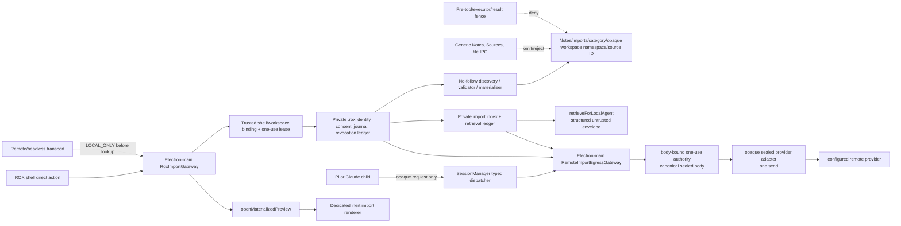

# ROX Notes: canonical root, consented Imports, and engine boundary — Implementation Plan

> **Status:** Planning complete. **Do not implement yet.** (Reaffirmed 2026-08-20.) The product owner approved the design for planning only on 2026-08-10. Code changes remain blocked until the security reviewer accepts the local-only consent/identity/indexing boundary and the legal/release owner separately resolves G1/G2 and the managed-engine release authorization prerequisites.
>
> **Task 11 preview is not an independent first task.** Do not implement `OPEN_MATERIALIZED_PREVIEW` or a dedicated import renderer ahead of Tasks 1–10 and the §0.1 gates. Do not extend `KnowledgeSettingsPage` `migrateNotes` as a preview fallback.
>
> **Unsatisfied §0.1 gates:** (1) product-owner approval of this plan and the §0.2 root-policy decisions; (2) security-reviewer acceptance of the local-only/trusted-shell/opaque-token/no-follow/private-ledger/import-exposure/agent-egress/tool-fence design; (3) legal/release-owner engine decision. `g1-metrics.md` thresholds remain TBD and `g2-decision-record.md` remains OPEN.
>
> **Source design:** [`docs/specs/2026-08-10-rox-notes-root-imports-design.md`](../../specs/2026-08-10-rox-notes-root-imports-design.md)
>
> **Execution rule:** Work task-by-task. Run only the scoped checks listed for the task while work is parallelized; run the integration gate only after all tasks land. Do not create, vendor, download, package, update, or start a managed engine under this plan.

**Goal:** Move ROX-owned state to `~/ROX/.rox`, make `~/ROX/Notes` the canonical visible Notes hierarchy, add a local-only consented Imports boundary, and remove every legacy raw-path migration and upstream SiYuan/Craft user-facing escape path.

**Architecture:** A root policy initializes the owned hierarchy before any config path is captured. Electron main alone owns source locators, trusted shell identity, direct-action leases, consent/revocation records, and import journals. It exposes only opaque, workspace-bound IDs and safe summaries over explicit local-only IPC. Imported data can enter the product only through a no-follow materializer, a dedicated inert renderer, a private import index, or the sealed local/remote agent retrieval paths. Generic Notes, Sources, file IPC, tools, and legacy engine routes never become fallback paths.

**Technology and conventions:** TypeScript, Bun, Electron main/preload/renderer IPC, existing same-directory atomic-write helpers in `packages/shared/src/utils/files.ts`, existing protocol/routing exhaustiveness tests, and `t()` with dynamic locale-parity coverage. Existing `docs/superpowers/plans/2026-08-08-entity-mindmap-views-plan.md` is the task-granularity/template convention.

---

## 0. Preconditions, decisions, and non-goals

### 0.1 Required approvals before implementation

Implementation begins only when all of the following are recorded against the source design:

1. Product-owner approval of the implementation plan and the two root-policy decisions below.
2. Security-review acceptance of the local-only, trusted-shell, opaque-token, no-follow, private-ledger, import-exposure, agent-egress, and tool-fence design.
3. Legal/release-owner decision that either:
   - keeps the managed engine permanently disabled for this release, or
   - revises G1/G2 through their independent approval process and supplies the immutable FR-9 evidence required for a separate engine-release implementation plan.

The current `g1-metrics.md` thresholds are TBD and `g2-decision-record.md` is OPEN. This plan **does not** satisfy, amend, or bypass either record.

### 0.2 Decisions to record before Task 1

| Decision | Recommended decision | Why this must be explicit |
|---|---|---|
| Production `CRAFT_CONFIG_DIR` behavior | Production ROX-owned paths ignore it; it remains only an input to legacy-Craft discovery exclusion. Tests receive an explicit injected root policy, not an environment-controlled production fallback. | `packages/shared/src/config/paths.ts` captures `CRAFT_CONFIG_DIR || ~/.craft-agent` at module evaluation. Retaining that as a production root violates FR-1; removing it without a test seam breaks current fixtures. |
| Private workspace/session layout | Define one ROX-owned private record/layout under `.rox/` for the existing workspace registry, session, source, and skills lifecycle before moving `createAndActivateLocalWorkspace`. It must not create user-visible Notes content or an undeclared second root. | The design fixes `Notes/` and the named `.rox/` roots, while current workspaces assume per-workspace `config.json`, `sessions`, `sources`, and `skills` beneath `~/.craft-agent/workspaces`. Inventing a location during code review would violate FR-1/FR-2. |
| Imported content in generic local Notes | Omit import-provenanced content from **all** generic Notes list/read/search/watch/index/render paths, not only remote paths. Only ROX Imports plus a capability-bound preview may expose it. | This is the smallest fail-closed reading of FR-6/FR-7 and prevents a local generic file/render fallback. |
| Trusted local workspace binding | Electron main derives `(webContents/frame, window, active workspace)` from a registered ROX shell and rejects any caller-provided workspace or client identity. | Existing `RequestContext.workspaceId` originates in handshake state, while current client routing can rewrite caller workspace arguments. That is insufficient for NFR-1. |

### 0.3 Global invariants

- `~/ROX/Notes` is visible content; `~/ROX/.rox` is private application state. No alternate ROX-owned root or legacy fallback may be created.
- Explicit `Workspace.rootPath` and `WorkspaceConfig.notesPath` remain external user choices. They are never migrated, scanned, or rewritten automatically.
- No raw source/destination path, source identity, credential, token, cookie, file body, inventory path, or prompt excerpt crosses renderer/preload/remote transport/telemetry/log boundaries.
- Every ROX Imports operation is local-only and derives trusted workspace/sender identity in Electron main. A remote/headless request fails before handler lookup, argument deserialization, ledger access, or filesystem work.
- Every source, grant, cursor, index row, journal, record, revocation, and tombstone is physically and logically keyed by `(workspaceId, sourceId)`.
- No symlink, Finder alias, junction, reparse-point, stale descriptor, mutable replacement, or arbitrary `realpath` fallback may authorize a source or destination operation.
- Imports never use generic Sources indexing, generic prompt formatting, generic Notes rendering, generic file IPC, tool filesystem capabilities, or a legacy migration channel as a fallback.
- The managed engine remains disabled unless the separate FR-9 release gate is formally accepted. Normal desktop update code is not an engine updater.

### 0.4 Explicit non-goals for this implementation plan

- No managed `rox-notes-engine` fork, source archive, vendor tree, binary, updater, installer, download, release verifier, publication, extraction, activation, recovery, or spawn.
- No network discovery, upstream CYN/SiYuan connection, token inspection, marketplace/Bazaar, cloud account, sync service, plugin surface, or engine auto-start.
- No migration of an external workspace or legacy Craft state without a new direct local user action and the opaque `legacy-craft-markdown` flow.
- No compatibility aliases for `knowledge:MIGRATE_NOTES`, legacy SiYuan/Craft visible identities, raw paths, or legacy map records.

---

## 1. Repository-grounded change graph

| Current edge | Required cutover | Evidence |
|---|---|---|
| `CONFIG_DIR` → `getDefaultWorkspacesDir()` → workspace creation/source seeding/Notes fallback | Replace as one root-policy and Notes-resolution change; do not modify a single fallback in isolation. | `packages/shared/src/config/paths.ts`, `packages/shared/src/workspaces/storage.ts`, `packages/server-core/src/handlers/rpc/notes.ts`, `packages/server-core/src/handlers/rpc/sources.ts` |
| Electron first run/onboarding/headless server create default workspace paths | Move every default creator and slug/default-location string together; preserve explicit custom folder flow. | `apps/electron/src/main/index.ts`, `AddWorkspaceStep_CreateNew.tsx`, `handlers/rpc/server.ts`, `handlers/rpc/workspace.ts` |
| Renderer raw migration UI → generic folder chooser → `knowledge:MIGRATE_NOTES` → core/headless handler → `.craft/notes-migration-map.json` | Remove atomically; reuse only bounded no-follow/hash/checkpoint mechanics behind a new private opaque source record. | `KnowledgeHome.tsx`, `KnowledgeSettingsPage.tsx`, `channel-map.ts`, `knowledge.ts`, `notes-migration.ts` |
| protocol routing → `RoutedClient`/thin client → `WsRpcServer` | Add explicit `roxImports.*` local-only channels and an inbound local-only rejection before lookup; do not rely on client routing. | `channels.ts`, `routing.ts`, `routed-client.ts`, `transport/server.ts` |
| generic Notes/Sources/file IPC → generic Markdown renderer → session prompt formatter | Filter imports before generic enumeration/read/index/serialization; introduce only capability-bound ROX preview and retrieval paths. | `handlers/rpc/notes.ts`, `sources.ts`, `source-index.ts`, `SessionManager.ts`, `Markdown*.tsx`, `files.ts` |
| Claude/Pi/OMP/session-MCP/script executors → permissions/result sinks | Place an owner-backed import fence before permission decisions, input transforms, execution, and result serialization; sandbox script/shell reads. | `pre-tool-use.ts`, `claude-agent.ts`, `pi-agent.ts`, `omp-agent.ts`, `llm-tool.ts`, `session-mcp-server`, `script-sandbox.ts` |
| Pi/Claude child provider request → `unified-network-interceptor` adapter transforms → mutable `JSON.stringify` body → `originalFetch` | Treat every child-side provider route as an unconditional ROX-import denial before serialization. Add one Electron-main opaque-reference → body-bound authority → terminal sealed-adapter path; do not try to authorize by filtering a completed request or response. | `pi-agent.ts`, `pi-agent-server/src/index.ts`, `claude-agent.ts`, `unified-network-interceptor.ts`, `SessionManager.ts`, `apps/electron/src/main/index.ts` |
| legacy external-local SiYuan discovery/bootstrap/plugin/surface | Remove or hard-disable all callers, protocol/preload/types/renderer paths and implementation modules as one cutover. | `siyuan-binary.ts`, `siyuan-detect.ts`, `siyuan-bootstrap.ts`, `connections-store.ts`, `plugin-bridge.ts`, `handlers/siyuan.ts`, `KnowledgeSurfacePage.tsx` |

### Hotspots

1. **Root-policy import ordering:** `CONFIG_DIR` is currently module-evaluated; creating a correct root later is too late for code that already captured the old path.
2. **External-root preservation:** `createWorkspaceAtPath` currently seeds Notes at the global default-workspace location even when a caller supplies an external workspace path.
3. **Transport authority:** `RoutedClient` is a convenience router, not an authorization boundary; `WsRpcServer` must independently reject local-only channels before lookup.
4. **Import exposure:** current Notes DTOs and generic renderer/file routes carry absolute paths and can read/render arbitrary local content.
5. **Agent egress:** current `SessionManager` uses generic source-index retrieval and prompt formatting; imported bytes must never traverse that path.
6. **Legacy engine:** existing external-local integration actively detects/probes/reads tokens/starts/embeds upstream SiYuan, so hiding a UI button is insufficient.

---

## 2. Target component boundaries

### New module ownership

The exact filenames below are planned boundaries, not existing code. Prefer small modules with injected filesystem/clock/identity dependencies for deterministic tests.

| Boundary | Planned owner | Responsibilities |
|---|---|---|
| `RoxRootPolicy` | shared configuration/root layer | Resolve and validate owned root before config consumers; create exact hierarchy atomically; expose canonical Notes/state roots without treating an external workspace as owned. |
| `RoxImportGateway` | Electron main GUI-only handler | Validate registered shell/local context, mint/consume direct-action leases, invoke local-only operations, return safe DTOs. Never register in headless/core RPC registry. |
| private import ledger | Electron main under `.rox/` | Hold canonical locators, stable identities, records, grants, revocations, cursors, journals, and private index ownership; all lookup keys are `(workspaceId, sourceId)`. |
| `LegacyCraftMarkdownValidator` | Electron main | Sole metadata-only recognizer for `legacy-craft-markdown-v1`; never accepts a renderer `format` claim. |
| materializer + sensitive policy | Electron main/private service | No-follow bounded traversal, immutable category map, canonical destination checks, sensitive-object rejection, checkpoint/recovery, provenance. |
| `RoxImportRenderPolicy` | Electron main + renderer component | Return inert render model only via a source-scoped capability; never path/file handle/generic file reader. |
| private import index + local retrieval | server-core domain with Electron-main trusted context | Keep private source/workspace/generation index; return structured untrusted excerpts only to a verified local backend; never enter generic source/prompt paths. |
| `RoxRemoteImportEgressGateway` + authority journal | Electron main | Sole owner of opaque-ref resolution, final consent/fingerprint/generation checks, canonical body serialization, body-bound one-use authority consumption, terminal rehash, fixed-destination sealed adapter send, and non-sensitive audit. `SessionManager` receives only a narrow injected dispatcher; no server/headless/child/renderer process owns or invokes this boundary. |
| `RoxImportToolFence` | shared pre-tool policy plus executor adapters | Deny direct and broad import filesystem operations before permissions/execution; enforce trusted provenance at result/egress boundaries. |

---

## 3. Dependency-ordered implementation tasks

### Task 1 — Establish the authoritative ROX root policy

**Requirements:** FR-1, FR-2; AC-1; EC-1, EC-2; NFR-2, NFR-3.

**Files:**
- Modify: `packages/shared/src/config/paths.ts`, `packages/shared/src/config/storage.ts`, `packages/shared/src/utils/files.ts` only if a needed no-follow/atomic primitive is missing.
- Modify startup ordering: `apps/electron/src/main/index.ts`, `packages/server-core/src/bootstrap/headless-start.ts`.
- Modify: `packages/shared/src/agent/mode-manager.ts` and add/extend focused safe-mode path-hint coverage.
- Create focused root-policy module/tests in the existing shared config test convention.

**Steps:**
1. Make root-policy selection available before any module captures a config path. Do not mutate `CONFIG_DIR` after import as a compatibility trick.
2. Resolve production-owned state to `~/ROX/.rox` and content to `~/ROX/Notes`; record only the permitted private `root.json` on a fresh root.
3. Create the exact visible PARA/Inbox/Daily Notes/Imports-category directories and exact private `.rox` directories with owner-only state permissions on POSIX.
4. Use canonical, no-follow, stable-identity validation before creation and again immediately before committing `root.json`; fail closed on a symlink, file, inaccessible root, or replacement race.
5. Keep test/dev root injection explicit and non-production; retain `CRAFT_CONFIG_DIR` only for the legacy discovery exclusion decision from §0.2.
6. Migrate `mode-manager.ts#getPathHint` with the root policy so ROX-owned private session paths are recognized as owned while explicitly external workspace/session paths retain their existing non-owned guidance. Do not retain `/.craft-agent/` as the sole root test.

**Focused checks:** fresh-root hierarchy; no old root; root file/symlink/inaccessible/replacement failures; no user-visible note/import/source/release content; permission/ownership mismatch fails closed; ROX-owned versus external safe-mode path-hint regressions.

**Command after implementation:** `bun test packages/shared/src/config` plus the new focused root-policy and mode-manager path-hint test files.

### Task 2 — Centralize default Notes resolution and preserve external workspaces

**Requirements:** FR-1, FR-2, FR-10; AC-2, AC-3; EC-10.

**Files:**
- Modify: `packages/shared/src/workspaces/storage.ts`, `packages/shared/src/workspaces/types.ts`.
- Modify: `packages/server-core/src/handlers/rpc/notes.ts`, `packages/server-core/src/handlers/rpc/sources.ts`, `packages/server-core/src/handlers/rpc/projects.ts`.
- The raw migration fallback and `notes-migration.ts` public API are retired in Task 4; Task 10 may use only newly private opaque-record primitives, never this legacy module or fallback.
- Update focused tests: `packages/server-core/src/handlers/rpc/__tests__/sources.test.ts`, `packages/shared/src/workspaces/__tests__/teamspace-lifecycle.test.ts`.

**Steps:**
1. Introduce one resolver whose precedence is: explicit external `notesPath`, explicit external workspace choice, then canonical owned `~/ROX/Notes` for a newly created owned personal workspace.
2. Change `createWorkspaceAtPath` and `ensureLocalNotesSource` together so a caller-provided external root cannot seed Notes in the global default workspace location.
3. Update generic projects code only after deciding the intentional relationship between legacy lowercase `projects` and canonical `Notes/Projects`; never silently create both directories.
4. Preserve existing durable workspace lifecycle semantics: atomic config transitions, registry/folder binding, and no deletion of a pre-existing user folder during rollback.

**Focused checks:** a new owned workspace writes under `~/ROX/Notes`; explicit `rootPath`/`notesPath` remain untouched across startup/upgrade; source seeding, generic Notes resolution, and project resolution use the same resolver.

**Command after implementation:** `bun test packages/shared/src/workspaces packages/server-core/src/handlers/rpc/__tests__/sources.test.ts`.

### Task 3 — Move every owned-default workspace creator and default-location surface

**Requirements:** FR-1, FR-2, FR-11; AC-1, AC-2, AC-3, AC-16.

**Files:**
- Modify: `apps/electron/src/main/index.ts` first-run creation.
- Modify: `packages/server-core/src/handlers/rpc/server.ts`, `packages/server-core/src/handlers/rpc/workspace.ts`.
- Modify: `apps/electron/src/renderer/components/workspace/AddWorkspaceStep_CreateNew.tsx` and its localized strings.

**Steps:**
1. Make Electron first launch, server/headless creation, slug checks, and onboarding derive the same owned-root default policy.
2. Keep the generic custom directory picker and explicit external workspace binding; do not convert a selected external folder into a ROX-owned root.
3. Remove user-visible `~/.craft-agent/workspaces` default-location text and update all current locales in one owned batch.

**Focused checks:** Electron first-run/default onboarding/headless creator parity; explicit folder remains exactly the selected external root; no legacy location string or directory creation.

**Command after implementation:** scoped Electron workspace/onboarding tests; `bun test packages/shared/src/i18n` if a locale key changes.

### Task 4 — Retire the raw-path migration protocol before adding its replacement

**Requirements:** FR-10, FR-11; AC-24; EC-19; NFR-1.

**Files:**
- Remove/modify: `packages/shared/src/protocol/channels.ts`, `packages/shared/src/protocol/routing.ts`, `packages/server-core/src/handlers/rpc/knowledge.ts`, `packages/server-core/src/handlers/rpc/index.ts`.
- Remove raw migration module/export: `packages/server-core/src/knowledge/notes-migration.ts`, its export from `packages/server-core/src/knowledge/index.ts`, and raw migration-only tests/types.
- Remove/modify Electron surfaces: `apps/electron/src/transport/channel-map.ts`, `apps/electron/src/shared/types.ts`, preload mapping, `KnowledgeHome.tsx`, `KnowledgeSettingsPage.tsx`, `apps/electron/src/renderer/lib/notes-migration-map.ts`.
- Retire raw `MigrateNotesArgs`, `MigrateNotesResult`, map persistence, map reader/writer, and renderer parser tests. Transfer only independently tested bounded no-follow/hash/checkpoint mechanics into a new private opaque-record primitive owned by Task 10; do not re-export or import the legacy module.
- Update: `packages/shared/src/protocol/__tests__/routing.test.ts`, `packages/server-core/src/handlers/rpc/__tests__/knowledge.test.ts`, `apps/electron/src/transport/__tests__/channel-map-parity.test.ts`.

**Steps:**
1. Remove `RPC_CHANNELS.knowledge.MIGRATE_NOTES`, remote eligibility, handler registration, preload/API/type exposure, UI callers, raw `notes-migration.ts` exports, and `.craft/notes-migration-map.json` read/write behavior as one atomic cutover.
2. Delete rather than alias, redirect, deprecate, or silently adapt raw `sourceRoot`, `destinationRoot`, `mapPath`, workspace, or `format` inputs.
3. Transfer only low-level traversal/hash/checkpoint behavior into Task 10's private opaque-record implementation after the public module is gone; its API MUST accept trusted ledger records, never raw source/destination locators.
4. Retain generic `openFolderDialog` only where independently used by workspace/project selection; remove only migration’s caller path.

**Focused checks:** no raw migration declaration/map/API/renderer/registered handler/barrel export remains; local/remote/thin legacy invocation fails before connection and filesystem work; no legacy map reader/writer remains; Task 10's primitive cannot compile with raw migration args/results.

**Command after implementation:** `bun test packages/shared/src/protocol/__tests__/routing.test.ts packages/server-core/src/handlers/rpc/__tests__/knowledge.test.ts apps/electron/src/transport/__tests__/channel-map-parity.test.ts`.

### Task 5 — Create the explicit local-only ROX Imports transport boundary

**Requirements:** FR-4, FR-10; AC-8, AC-19, AC-25; EC-5, EC-20; NFR-1.

**Files:**
- Modify: `packages/shared/src/protocol/channels.ts`, `packages/shared/src/protocol/routing.ts`, protocol DTO/type files, `apps/electron/src/transport/channel-map.ts`, `apps/electron/src/shared/types.ts`, preload/bootstrap mappings.
- Modify: `packages/server-core/src/transport/server.ts`, `apps/electron/src/transport/routed-client.ts` and thin-client/preload route setup.
- Create: Electron-main GUI-only handler/registration next to `apps/electron/src/main/handlers/siyuan.ts` conventions; register it from `apps/electron/src/main/handlers/index.ts`, never `registerCoreRpcHandlers`.

**Steps:**
1. Register exactly these renderer-local channels and no others: `DISCOVER`, `BEGIN_MANUAL_SOURCE_SELECTION`, `BEGIN_LEGACY_CRAFT_MIGRATION_SELECTION`, `REQUEST_USER_AUTHORIZATION`, `ENROLL_MANUAL_SOURCE`, `LIST_SOURCES`, `INSPECT_DISCOVERY`, `GRANT_CONSENT`, `REVOKE_CONSENT`, `OPEN_EXTERNAL`, `OPEN_MATERIALIZED_PREVIEW`, `MATERIALIZE`, and `INDEX`. Each request carries only opaque identifiers and declared scopes, never an arbitrary path or caller authority.
2. Keep `retrieveForLocalAgent` and `dispatchRemoteImportedExcerpts` out of `roxImports` renderer IPC and every remote/headless route. `retrieveForLocalAgent` accepts only a main-derived `RoxTrustedLocalAgentContext`; remote egress is reachable only through Task 12’s internal session request carrying opaque `RoxRemoteImportDispatchRequest`, after which `SessionManager` derives `RoxTrustedRemoteAgentContext` and Electron main alone constructs the intent. No renderer, preload, routed client, thin client, child process, or caller-supplied context can invoke either service directly.
3. Put every listed `roxImports.*` operation in `LOCAL_ONLY_CHANNELS`; omit it from all remote/headless registration/advertisement and route tables.
4. Make `WsRpcServer` reject any local-only channel before lookup, payload deserialization, workspace derivation, logging, or handler invocation. Make routed/thin clients reject/omit them before a remote invoke.
5. Register a local Electron-main handler only after it has an authenticated registered-shell request context; no core/headless fallback exists.

**Focused checks:** exact 13-channel protocol/channel-map/preload parity; no renderer retrieval/egress channel; raw remote or headless channel requests reject before handler lookup; unregistered local sender/client/frame and caller-selected workspace fail before ledger/filesystem work; legacy migration remains absent.

**Command after implementation:** scoped protocol/routing, transport/server, routed-client, Electron channel parity tests.

### Task 6 — Bind local shell identity and direct user actions in Electron main

**Requirements:** FR-4, FR-10; AC-8, AC-19; EC-5; NFR-1, NFR-3.

**Files:**
- Create Electron-main `rox-imports` context/lease/authorization modules and focused tests.
- Modify registered local handler/IPC bootstrap and the workspace/window lifecycle path that supplies active workspace identity.

**Steps:**
1. Build a trusted `LocalWorkspaceContext` only from a registered ROX shell `webContents`/frame/window plus its active workspace; reject client-supplied workspace IDs and renderer gesture claims.
2. Mint `RoxDirectUserActionLease` only from a directly observed Electron-main native/menu/UI action. Bind it to sender, workspace, surface, action, nonce, identity generation, and a hard maximum 60-second expiry.
3. Make lease, selection, authorization, and discovery cursor consume atomically and one time only. Bind continuation cursors to the fixed private inventory sequence; never accept a path claim in any opaque token.
4. For every main-owned confirmation, persist an immutable canonical `RoxAuthorizationRequest`: exact source, action, source identity generation, and either exact ordered grant-request list (including main-derived egress binding) or exact nonempty revoke scope set/full-source-revoke intent.
5. Before a grant or revoke reaches Task 8 persistence, compare the requested canonical list/set exactly with the consumed authorization. Reject added, removed, reordered, or substituted scope; require `egress` only for `agent-egress` and derive its entire binding from the trusted selected backend, never renderer input. Return only safe summaries and opaque tokens.

**Focused checks:** forged/replayed/expired/wrong-sender/wrong-workspace/wrong-category/wrong-generation tokens; unregistered frame; action substitution; cross-workspace token; grant/revoke added-removed-reordered-substituted scope tests; egress binding substitution; no private locator/metadata disclosure before a valid one-use authorization.

**Command after implementation:** new Electron-main ROX Imports context/lease/authorization tests.

### Task 7 — Implement bounded metadata-only discovery and private identity ledger

**Requirements:** FR-3, FR-4; AC-4, AC-5; EC-3, EC-8, EC-18; NFR-2, NFR-3, NFR-4.

**Files:**
- Create Electron-main discovery connector/identity-ledger modules and tests under the new ROX Imports boundary.
- Reuse only an approved shared no-follow filesystem primitive; if one is missing, add the smallest private discovery helper without importing the raw module removed in Task 4. Transfer any bounded copy/hash/checkpoint mechanics only into Task 10's private opaque-record service.

**Steps:**
1. The initial one-time inventory MAY run only after the shell renders and a registered local ROX shell requests it; it is not activation and does not need `metadata` consent. Enumerate only supported connector classes and only bounded metadata: safe label, entry name, kind, bytes, modified time, aggregate counts. Do not read source bytes, call network, touch credentials, invoke external apps, write generic indexes, or send telemetry.
2. Before enumeration, reject configured legacy Craft root (`CRAFT_CONFIG_DIR` or `~/.craft-agent`), descendants, aliases, hidden entries, `.env`, SSH/key material, cookies, password/token stores, and unsupported types using no-follow metadata only.
3. Cap each root at 10,000 entries and depth 64; discard partial candidates and return `BOUND_EXCEEDED`.
4. Persist canonical locator/stable platform identity only in owner-only private ledger records below `.rox/discovery`; return an opaque source ID and safe `RoxImportSummary` projection only.
5. After that initial inventory, require an active per-source `metadata` grant before any re-observation or refresh; absence, expiry, or metadata-scope revocation stops before any further enumeration or metadata write.
6. Page only the fixed private inventory to the ROX Imports UI with a one-use cursor; the first page consumes inspection authorization. Validate each requested page `limit` to `1..200`, use a default no greater than 200, and never return more than 200 entries.

**Focused checks:** initial inventory performs no activation and needs no metadata grant; no byte reads/network/credential access; known Craft roots/descendants/aliases rejected before enumeration; sensitive paths never enter candidate/ledger safe projection/log; bounds return no partial candidate; absent/expired/revoked `metadata` blocks re-observation before enumeration; first-page authorization and cursor are sender/workspace/source/generation/sequence-bound; oversized/default limits cannot return more than 200 entries.

**Command after implementation:** new discovery/identity-ledger tests plus targeted no-follow filesystem fixtures.

### Task 8 — Add consent, provenance, revocation, and crash-safe private records

**Requirements:** FR-4, FR-5, FR-7; AC-6, AC-7, AC-22; EC-4, EC-5, EC-13, EC-17; NFR-3, NFR-5.

**Files:**
- Create private record/ledger/transaction modules for `RoxImportRecord`, `RoxConsentGrant`, revocation event, tombstone, and source-authority generation.
- Integrate with the Task 6 context and Task 7 identity ledger.

**Steps:**
1. Persist only schema-versioned, owner-only, atomic records under `.rox/` with a compound `(workspaceId, sourceId)` key and opaque portable workspace import namespace.
2. Treat `metadata`, `open-external`, `snapshot`, `index`, `agent-retrieval`, and `agent-egress` as independent grants. Persist a grant only after the Task 6 authorization comparison proves the exact canonical ordered request list, category, source identity/generation, trusted actor/origin, authorization generation, and a fully main-derived egress fingerprint where applicable; `egress` is present exactly for `agent-egress` and absent otherwise.
3. Persist a partial revoke only after exact equality with the main-confirmed nonempty scope set; permit a full revoke only from separately confirmed full-source-revoke intent.
4. On any scope revocation, atomically advance only that scope’s authorization generation, cancel active work, and recheck at each operation’s final pre-read/pre-commit/pre-dispatch point. On full revoke, purge locator/inventory/cursor/index and retain only a non-sensitive tombstone.
5. Revalidate trusted workspace plus source identity before every ledger disclosure, external operation, cache/index use, preview, retrieval, materialization, or remote dispatch.

**Focused checks:** two source isolation; exact grant/revoke list equality including added/removed/reordered/substituted scope and egress cases; scope-specific revoke preserves unrelated grants; revocation races stop a page/read/copy/cache/index/retrieval/egress before output; cross-workspace same source ID cannot collide, inspect, revoke, or delete; crashes leave recoverable atomic state only.

**Command after implementation:** new consent/revocation transaction tests, including repeated deterministic race fixtures.

### Task 9 — Enroll manual and legacy Craft Markdown sources without raw paths

**Requirements:** FR-4, FR-10; AC-19, AC-24; EC-5, EC-19; NFR-1, NFR-2, NFR-3, NFR-4.

**Files:**
- Create `LegacyCraftMarkdownValidator` and main-owned native chooser/enrollment modules under Electron-main ROX Imports.
- Replace removed migration UI with ROX Imports direct-action flows; do not restore legacy settings/home controls.

**Steps:**
1. `BEGIN_MANUAL_SOURCE_SELECTION` consumes a direct-action lease, opens the native chooser in Electron main, fixes the requested category, and returns only one-use selection/enrollment tokens.
2. `BEGIN_LEGACY_CRAFT_MIGRATION_SELECTION` consumes a separate lease; it fixes category `agents` and private kind `legacy-craft-markdown`. It never accepts a caller-provided format.
3. The sole validator performs a bounded no-follow metadata scan: regular root under chooser-verified identity, eligible non-hidden regular `.md`, documented `assets/`/`templates/` roles, no unsafe/sensitive/reparse object. It proves portable layout, not Craft provenance.
4. Enrollment consumes its tokens, validates category/canonical root/identity/bounds/sensitive exclusions, creates a private opaque candidate, then requires ordinary consent before any source-byte read.

**Focused checks:** renderer format/path/workspace claims ignored; canceled/expired/replayed selection fails; no valid Markdown/unsafe layout/sensitive object/identity swap fails before byte read; valid source is manual-only and cannot become an unprovenanced direct Notes write.

**Command after implementation:** new main-chooser/legacy-validator tests with no-follow fixtures.

### Task 10 — Materialize only consented sources into isolated Import destinations

**Requirements:** FR-5, FR-6, FR-10; AC-9, AC-10, AC-10a, AC-23, AC-24; EC-4, EC-6, EC-7, EC-17, EC-19; NFR-2, NFR-3, NFR-4, NFR-5.

**Files:**
- Create private materializer, category map, sensitive-content policy, provenance, and journal modules under Electron-main ROX Imports.
- Transfer bounded no-follow traversal/hash/checkpoint/atomic-write mechanics only into this private opaque-record service after Task 4 deletes the raw migration API.
- **Activation dependency:** develop against synthetic controlled fixtures only; the live `MATERIALIZE` handler MUST remain unregistered or return `CAPABILITY_DISABLED` until Tasks 11 and 13 have passed their generic-exposure and executor-fence checks.

**Steps:**
1. Build the materializer behind the denied activation gate above. It may not create an import destination through a live channel until Tasks 11 and 13 have closed every generic Notes/file/render/tool fallback.
2. Make `ROX_IMPORT_CATEGORY_FOLDERS` an exhaustive immutable main-process map and reject unmapped categories before any path/link/destination/provenance action.
3. Construct destinations only as `Notes/Imports/<mapped-category-folder>/<opaque-workspace-import-namespace>/<opaque-source-id>/`; verify both opaque components and canonical containment before every write.
4. Require active `snapshot` consent and current source identity at source open, each copy boundary, and commit. Preserve source files exactly.
5. Use no-follow traversal, portable relative paths, directory/file/asset/byte bounds, content hashes, atomic destination creation, and hash-verified resumable checkpoints. Never overwrite a user-edited destination.
6. Before every destination write, pass complete eligible bytes through a deterministic versioned sensitive-content policy. Reject the entire object as `SENSITIVE_CONTENT` without redaction, partial copy, matched value, or leakage to state/log/error/index/preview/retrieval/egress.
7. Persist safe provenance sufficient for category ID/folder, source ID, snapshot time, grant ID, and hashes; no external absolute locator reaches Notes content.
8. Enable and register `MATERIALIZE` only after Tasks 11 and 13's required tests pass in the same branch and the activation test proves no pre-fence materialization was possible.

**Focused checks:** denied live `MATERIALIZE` before Tasks 11/13; source/root/parent/child alias substitution; destination traversal/collision/namespace mismatch; all limits; interruption/resume; same source ID in separate workspaces; sensitive corpus fixtures; malformed legacy UTF-8 Markdown; source remains unmodified; enabled handler only after fence proof.

**Command after implementation:** new materializer/sensitive-policy/journal tests with filesystem race fixtures; run its live-handler enablement test only after Tasks 11 and 13 scoped suites pass.

### Task 11 — Fence Imports from generic Notes, generic file IPC, and generic rendering

**Requirements:** FR-6, FR-7, FR-10; AC-20, AC-25; EC-9, EC-14, EC-20; NFR-1, NFR-2, NFR-3.

**Activation dependency:** This task is a prerequisite for enabling Task 10's `MATERIALIZE` handler. Its generic Notes/file/render exposure tests MUST pass before any source may materialize outside synthetic fixtures.

**Files:**
- Modify: `packages/server-core/src/handlers/rpc/notes.ts`, Notes DTO/protocol types, Notes indexing/watch paths, generic source/index admission checks.
- Modify/guard: `packages/server-core/src/handlers/rpc/files.ts`, `packages/server-core/src/handlers/utils.ts`, channel maps/types where generic file capabilities can receive imports.
- Create: `RoxImportRenderPolicy` and a dedicated renderer component; wire ROX Imports UI, not `Markdown.tsx`/`MarkdownDocBlock.tsx`/HTML/image/datatable preview components.
- Review caller paths: `apps/electron/src/renderer/pages/NotesPage.tsx`, `apps/electron/src/renderer/App.tsx`, `packages/ui/src/components/markdown/Markdown*.tsx`.

**Steps:**
1. Classify a path/document as import-provenanced using a main-owned paired record and no-follow canonical resolver, not a renderer/path assertion.
2. Omit/reject it before generic Notes list/read/search/watch/index/serialization. Remote/headless calls fail `LOCAL_ONLY` before content/index/path load; local generic paths omit it as decided in §0.2.
3. Implement `OPEN_MATERIALIZED_PREVIEW` as an Electron-main direct-action lease flow. Resolve only a portable relative path inside the same verified source destination and return an inert render model plus exact source-scoped capability—never a path, URI, file handle, generic reader, or shell/network permission.
4. The dedicated renderer renders HTML, markdown/file/image/PDF/table directives, absolute paths, `file:`, traversal, symlink, and HTTP(S) text inertly. It never calls `onReadFile*`, generic platform file IPC, shell open, network APIs, or agent-context hooks.

**Focused checks:** generic local/remote Notes and generic file routes omit/reject before load; provenance does not serialize; malicious previews cause zero generic callbacks/network/shell activity; cross-import/normal Notes/.rox/home/URI/traversal targets fail before a read.

**Command after implementation:** scoped Notes/file handler tests and dedicated renderer unit tests with callback/network spies.

### Task 12 — Build the private import index and Electron-main sealed remote-egress gateway

**Requirements:** FR-4, FR-7; AC-11, AC-12, AC-21, AC-22; EC-13, EC-15; NFR-1, NFR-3, NFR-5.

**Activation dependency:** No remote backend may receive ROX-import content until this task and Task 13’s independent pre-child/result fences pass. Before that point every remote ROX-import request fails closed as `EGRESS_FORBIDDEN`; ordinary non-import remote agent behavior remains unchanged.

**Files:**
- Create: private import-index and retrieval-ledger services in `packages/server-core/src/knowledge/`; shared opaque egress request/intent/authority/audit DTOs in the existing shared ROX-import protocol surface; `apps/electron/src/main/rox-import-egress-gateway.ts`; `apps/electron/src/main/__tests__/rox-import-egress-gateway.test.ts`; and `packages/server-core/src/sessions/__tests__/rox-remote-import-egress.test.ts`.
- Modify: `packages/server-core/src/handlers/rpc/sources.ts`, `packages/server-core/src/sources/source-index.ts`, `packages/server-core/src/sources/__tests__/source-index.test.ts`, `packages/server-core/src/sessions/SessionManager.ts`, its existing `SessionRuntimeHooks` injection seam, and `apps/electron/src/main/index.ts` so only Electron main installs the gateway. Server/headless construction leaves the gateway absent and fails closed.
- Modify: `packages/shared/src/agent/backend/factory.ts`, `packages/shared/src/agent/pi-agent.ts`, `packages/shared/src/agent/claude-agent.ts`, `packages/pi-agent-server/src/index.ts`, `packages/shared/src/unified-network-interceptor.ts`, `packages/shared/src/agent/__tests__/pi-query-llm.test.ts`, and `packages/shared/src/__tests__/unified-network-interceptor.validation.test.ts` so Pi/Claude children can request only an opaque dispatch request and cannot serialize, invoke, retry, or receive an imported provider body.
- Modify: `packages/shared/src/prompts/system.ts` and `packages/shared/src/agent/__tests__/prompt-builder-context-split.test.ts` to remove every imported-content `retrieveSourcesForPrompt` → `formatSourceRetrieveForPrompt` path. Do not reuse a generic source index, generic `call_llm`, callback, queue, session-history, retry, or provider-client serialization route.

**Steps:**
1. Ensure generic local Source registration/reindex/search cannot admit `Notes/Imports` or an import-provenanced record. Do not convert the existing generic SQLite index into a mixed-authority ROX index.
2. Index only materialized owned files after independent `index` consent; key private rows by workspace/source/identity/authorization generation and exclude hidden, sensitive, revoked, and unapproved content.
3. Replace imported content’s generic `retrieveSourcesForPrompt` → `formatSourceRetrieveForPrompt` flow. `retrieveForLocalAgent` revalidates local backend/session/workspace/source grants and returns only bounded provenance-labelled `RoxUntrustedExcerpt` structures.
4. Register a single internal session-tool/request route that accepts only `RoxRemoteImportDispatchRequest { sessionTurnRef, retrievalRef }`; `retrievalRef` is a main-minted one-use selection bound to the session turn, workspace, source/retrieval generations, and bounds. The Pi/Claude child is not an intent constructor: it receives no excerpt, prompt snapshot, body, endpoint, header, credential, provider client, authority, or retry capability. `SessionManager` derives the trusted session/workspace/backend context and asks the injected Electron-main gateway to atomically claim the opaque pair before any source read; headless/server mode returns `EGRESS_FORBIDDEN`.
5. In Electron main, resolve the current canonical provider/origin, endpoint identity, transport, selected model, configuration generation, source/retrieval/egress generations, and bounded opaque excerpt/provenance references immediately before sealing. Recompute and exactly compare the no-raw-URL backend fingerprint and the versioned policy/provenance commitments. Any absent, stale, substituted, cross-workspace, or unsupported value returns `EGRESS_FORBIDDEN` before source byte read or body construction.
6. After atomically claiming the one-use canonical `(sessionTurnRef, retrievalRef)` selection, serialize the exact provider request once from the immutable main-owned turn snapshot and bounded excerpt references. Canonicalize it to an immutable string, calculate SHA-256 `bodyDigest`, create the random `operationId` at claim time, and durably write its body-bound terminal `consumed` authority record with exclusive-create semantics keyed by that canonical selection before network I/O. Existing/missing/expired/foreign claim, failed durable write, or crash leaves the selection/operation terminally consumed; concurrent duplicate requests for the same opaque pair yield at most one send. Persist only opaque IDs, private digests, timestamps, and an audit result code—never body, excerpt, prompt, endpoint, header, credential, or provider response.
7. Construct `RoxRemoteImportDispatchIntent` and `RoxSealedProviderRequest` only in a non-exported Electron-main factory backed by private fields or a module-private `WeakMap`; reject every unminted structural lookalike at the gateway and terminal serializer. Give a matching provider adapter only that opaque sealed request. Immediately before one `fetch`, without an intervening `await`, callback, or mutable caller object, its closure-owned terminal serializer revalidates provider/origin/endpoint/transport/model/configuration/source/retrieval/egress generations, fingerprint, policy/provenance commitments, nonce/expiry/consumption state, and recomputed body digest; it snapshots provider endpoint/protocol/method/headers/credentials from main-owned configuration and rejects redirects. It accepts no caller URL/header/body/callback/queue input and cannot choose another provider/model or mutate the sealed request. It returns only the control-plane typed receipt, which never becomes a tool result, managed message, renderer event, history/retry payload, or provider-completion container. There is no fallback, automatic retry, redirect follow, replay, or recovery dispatch; any network ambiguity consumes the authority and requires a new direct egress consent transaction.
8. Delete or make unconditional-deny every legacy imported-content handoff into Pi/Claude direct provider calls, generic system/prompt formatters, tool-result/history/retry serialization, queues, callbacks, `unified-network-interceptor` child transport, and generic provider clients. `unified-network-interceptor` is a defense-in-depth pre-child denial only; it is not the terminal serializer and cannot authorize a ROX import.
9. Emit only `RoxRemoteEgressAuditResultCode` metadata (`DISPATCHED`, authority/body/destination/expiry/adapter/transport denial, or consumed-without-dispatch) through diagnostics. Do not make audit status an egress capability or a source/provenance disclosure channel.

**Focused checks:** generic index never persists import path/body; local structured untrusted retrieval; no index/retrieval grant path; Pi/Claude child intent schema rejects arbitrary fields and exposes no excerpt/body; forged cross-workspace request, unminted intent, and unminted sealed-request lookalike fail before source read/body serialization; remote zero-byte denial without exact egress; exact positive Electron-main transaction; body mutation after authority issuance; provider/origin/endpoint/transport/model/configuration/source/egress/provenance/policy substitution; replay/expiry/cross-workspace/forged opaque references; concurrent duplicate requests for one `(sessionTurnRef, retrievalRef)` claim produce at most one send; fixed header/redirect injection; zero fallback/retry; crash-after-selection-claim or crash-after-authority-consumption behavior; no request bytes or dispatch receipt in tool results, managed messages, renderer events, history, retry, callback, queue, logs, audit, or generic provider client; ordinary non-import local and remote agents retain behavior.

**Command after implementation:** `bun test apps/electron/src/main/__tests__/rox-import-egress-gateway.test.ts packages/server-core/src/sessions/__tests__/rox-remote-import-egress.test.ts packages/server-core/src/sources/__tests__/source-index.test.ts packages/shared/src/agent/__tests__/pi-query-llm.test.ts packages/shared/src/agent/__tests__/prompt-builder-context-split.test.ts packages/shared/src/__tests__/unified-network-interceptor.validation.test.ts`, then `bun run typecheck:all`.

### Task 13 — Add the ROX Import tool, attachment, sandbox, and result fence

**Requirements:** FR-7, FR-10; AC-12, AC-21; EC-9, EC-20; NFR-1, NFR-3.

**Activation dependency:** This task is a prerequisite for enabling Task 10's `MATERIALIZE` handler. Its pre-tool/executor/result and script-sandbox fence tests MUST pass before any source may materialize outside synthetic fixtures.

**Files:**
- Modify: `packages/shared/src/agent/core/pre-tool-use.ts`, `claude-agent.ts`, `pi-agent.ts`, `omp-agent.ts`, `llm-tool.ts`, `packages/pi-agent-server/src/index.ts`, `packages/shared/src/unified-network-interceptor.ts`.
- Modify: `packages/session-mcp-server/src/index.ts`, `packages/session-tools-core/src/handlers/script-sandbox.ts`, `packages/session-tools-core/src/runtime/filesystem-isolation.ts`.
- Add focused fence tests beside existing pre-tool and filesystem-isolation tests, including `packages/shared/src/__tests__/unified-network-interceptor.validation.test.ts`.

**Steps:**
1. Build an owner-backed `RoxImportToolFence` that runs before `shouldAllowToolInMode`, approval bypass, input transform, attachment read, tool registry/handler dispatch, or prompt construction.
2. Cover all declared operands for `Read`, `Glob`, `Grep`, `Find`, `Ls`, write/edit, archive/image/document inputs, `call_llm`/session LLM attachments, native Pi, Claude, OMP host tools, session-MCP, nested calls, and future registry routes.
3. A direct import target fails `LOCAL_ONLY`; broad enumeration/search/watch omits imports before byte read, execution, result construction, history, mini-model, host result, renderer event, callback, queue, or remote transport.
4. Apply a filesystem sandbox to shell/script execution that makes every `Notes/Imports` subtree unavailable. Never parse shell command text to infer safety.
5. Carry trusted executor provenance/capability state to result/egress enforcement. Do not scan arbitrary result text as a substitute for a pre-execution decision.
6. `unified-network-interceptor.ts` and every Pi/Claude child-side serializer must categorically reject ROX-import-provenanced history/result/attachment state before `JSON.stringify` or `fetch`; they receive neither Task 12 authority nor sealed bytes and therefore can never dispatch it. The sole final provider-body serializer is Task 12’s Electron-main `RoxRemoteImportEgressGateway`; it rehashes its closure-owned body and consumes the matching authority immediately before its one send. This task’s rejection is defense in depth, never an alternate egress route.

**Focused checks:** parameterized operand matrix across permission modes and executors; direct/broad/symlink/archive/converter/script/attachment cases; no secret/import metadata in errors/results/host-tool payloads; subprocess sandbox denial is real rather than a parser heuristic; Pi/Claude/interceptor child-side provider serializations reject import provenance with zero serialized bytes and no fetch while ordinary non-import histories retain current behavior; terminal sealed egress remains covered only by Task 12’s Electron-main tests.

**Command after implementation:** `bun test packages/shared/src/agent/core packages/session-tools-core/src/runtime` plus scoped agent/server/MCP tests.

### Task 14 — Eliminate the legacy upstream SiYuan/Craft engine, plugin, and embedded-surface path

**Requirements:** FR-8, FR-11; AC-13, AC-16; NFR-1, NFR-3.

**Files:**
- Remove/hard-disable lifecycle/detection: `packages/shared/src/knowledge/siyuan-binary.ts`, `packages/server-core/src/knowledge/siyuan-detect.ts`, `siyuan-bootstrap.ts`, `siyuan-plugins-fs.ts`, `connections-store.ts` external-local path.
- Remove/hard-disable provider/client/mutation/deep links: `packages/core/src/knowledge/providers/siyuan/*`, associated `refs.ts` legacy grammar where user-visible.
- Remove registrations/types/routes: `packages/server-core/src/handlers/rpc/knowledge.ts`, `plugin-bridge.ts`, `extensions.ts`, `handlers/rpc/index.ts`, `packages/shared/src/protocol/channels.ts`, routing, Electron channel/preload/shared types.
- Remove GUI surface: `apps/electron/src/main/handlers/siyuan.ts`, handler registration, `KnowledgeSurfacePage.tsx`, `siyuan-engine.ts`, `siyuan-url.ts`, legacy sections of `KnowledgeSettingsPage.tsx`, omnibox plugin bridge callers, Bazaar catalog/extension bridge modules.

**Steps:**
1. Remove or hard-disable all upstream installation/data/config/token/probe/open/spawn/embed/HTTP/plugin/Bazaar paths in caller order. A feature flag or a managed-only denial is not sufficient while `external-local` remains reachable.
2. Update protocol, transport, preload, Electron API, renderer, server core, and tests as one clean cutover so no headless or remote registration survives after UI removal.
3. Retain only abstractions with separately verified non-SiYuan callers; do not retain a SiYuan-named adapter/alias as a future-engine placeholder.
4. Preserve normal desktop updates as unrelated behavior but assert they never become an engine updater, downloader, or upstream fallback.

**Focused checks:** fake upstream app/data/config/token/port availability produces zero detection/read/open/spawn/BrowserView/provider/plugin calls; every removed legacy channel rejects before handler lookup; no external-local connection survives; CYN discovery remains metadata-only and physically separate from engine code.

**Command after implementation:** scoped knowledge/provider/handler/Electron lifecycle tests, then package-local typechecks.

### Task 15 — Complete ROX/Notes terminology, identity, localization, and unsupported-platform presentation

**Requirements:** FR-11, FR-8; AC-16, AC-17, AC-18; NFR-6.

**Files:**
- Modify coordinated identity surfaces: `apps/electron/electron-builder.yml`, `apps/electron/package.json`, app IDs/icons/resources, installer/updater metadata, deep-link/stable-surface keys, navigation/settings/empty/error copy.
- Modify all current locale JSON files under `packages/shared/src/i18n/locales/` in one batch and update locale tests only for actual contract changes.
- Modify Notes/Brain settings to show a localized neutral manual-folder/unsupported state on Linux/Windows while the engine gate remains closed.

**Steps:**
1. Replace visible Craft/SiYuan/Bazaar terminology, route/deep-link forms, package/app identity, installer and updater copy in one product cutover. Legal attribution/provenance is the sole allowed legacy naming location.
2. Do not leave a disabled visible alias, stale stable key, legacy error, icon, or updater metadata that exposes the old product identity.
3. Make category, consent, identity, and error states textual as well as color-coded, use `t()`, and keep current locale parity/sort/variable contracts.
4. On Linux/Windows before their independent engine/release approval, present only neutral localized manual-folder/unsupported state; perform no engine detection/download/start.

**Focused checks:** locale parity; localized state semantics without color; package/builder/deep-link/route metadata inventory; Linux/Windows simulated opening causes no engine action and shows neutral state.

**Command after implementation:** `bun test packages/shared/src/i18n` plus scoped renderer/Electron package metadata and platform-state tests.

### Task 16 — Preserve the FR-9 managed-engine denial and prepare a separately gated future plan

**Requirements:** FR-9; AC-14, AC-15; EC-11, EC-12, EC-16; NFR-5.

**Files:**
- Verify/update only the current denial and decision-record references as authorized: `g1-metrics.md`, `g2-decision-record.md`, `08-licensing.md`, `11-roadmap.md`, desktop update/package tests.
- **Do not create** an engine artifact/verifier/downloader/update/spawn implementation in this task.

**Steps:**
1. Confirm normal app update/package code contains no engine payload and has no Craft/SiYuan/upstream artifact fallback.
2. Retain an explicit `CAPABILITY_DISABLED`/disabled state wherever an engine action could otherwise be reached after Task 14.
3. Record that a future engine plan cannot begin until the release owner supplies immutable source/legal/artifact/provenance/rollback evidence and approved G1/G2 decision digest, and the security reviewer accepts a pinned-key release verifier design.
4. If those prerequisites are later met, write and approve a new dedicated plan before implementing `RoxEngineReleaseAuthorization`, a macOS-first hidden engine, update, rollback, or start logic.

**Focused checks:** every attempted managed action is denied without source/binary/vendor/downloader/update/extraction/spawn; generic updater is not an engine route; current G1/G2 documents remain binding.

**Command after implementation:** focused existing G1/G2/managed-denial tests and documentation/link checks; no release or network action.

---

## 4. Coverage matrix

The primary owner below is the task accountable for acceptance. A later fence task may supply defense in depth but does not replace the primary owner.

### Functional and non-functional requirements

| Requirement | Primary task(s) |
|---|---|
| FR-1 Canonical owned root | 1–3 |
| FR-2 Visible Notes hierarchy | 1–3 |
| FR-3 First-run discovery boundary | 7 |
| FR-4 Per-source consent and provenance | 5–9, 12 |
| FR-5 Linked-source behavior | 8, 10 |
| FR-6 Materialized imports | 10–11 |
| FR-7 Indexing and agent retrieval | 11–13 |
| FR-8 Local ROX Notes engine boundary | 14–15 |
| FR-9 AGPL-compatible release/update gate | 16; future authorized plan only |
| FR-10 Legacy migration | 4–11, 13 |
| FR-11 Product terminology/platform boundary | 3, 14–15 |
| NFR-1 Authorization/locality | 5–6, 11–13 |
| NFR-2 Filesystem integrity | 1, 7, 10–11 |
| NFR-3 Privacy | 1, 5–13 |
| NFR-4 Bounded operation | 7, 9–10 |
| NFR-5 Resilience | 8, 10, 12, 16 |
| NFR-6 Accessibility/localization | 15 |

### Acceptance criteria

| Criterion | Primary task | Proof artifact |
|---|---:|---|
| AC-1 Fresh owned hierarchy | 1 | root-policy fresh-root + replacement-race tests |
| AC-2 Default Notes root | 2 | resolver/save integration test |
| AC-3 External-root preservation | 2 | external root/notesPath regression test |
| AC-4 Metadata-only automatic discovery | 7 | discovery operation spies + paged inventory test |
| AC-5 Sensitive-path exclusion | 7 | hidden/credential fixture and projection/log assertions |
| AC-6 Per-source consent isolation | 8 | two-source grant/revoke test |
| AC-7 Revocation | 8 | scope/full revoke transaction-race tests |
| AC-8 Local-only import authority | 5 | remote/headless/local-forgery transport tests |
| AC-9 Link substitution defense | 10 | no-follow identity-replacement test |
| AC-10 Safe materialization | 10 | bounded copied destination/provenance test |
| AC-10a Sensitive-content exclusion | 10 | deterministic sensitive-object fixture test |
| AC-11 Index/prompt separation | 12 | no-grant/private-index/prompt absence test |
| AC-12 Untrusted source behavior | 12–13 | local envelope/child-denial/Electron-main sealed-adapter tests |
| AC-13 No legacy engine escape | 14 | upstream seam probe/read/start/UI negative test |
| AC-14 Release fail-closed | 16 | disabled-state test now; future verifier plan is required |
| AC-15 Update rollback | 16 | disabled-state test now; future rollback verifier plan is required |
| AC-16 Full terminology cutover | 15 | visible surface/metadata/localization inventory |
| AC-17 Accessible consent state | 15 | localized text-plus-color renderer tests |
| AC-18 macOS-first engine boundary | 15 | Linux/Windows neutral-state/no-engine-action test |
| AC-19 Manual source enrollment/authority | 9 | one-use chooser/lease/enrollment tests |
| AC-20 Untrusted import rendering | 11 | inert renderer/no generic callback test |
| AC-21 Agent retrieval/egress fence | 12–13 | authority/body-digest/at-most-once remote transaction matrix |
| AC-22 Scope-specific revocation fence | 8 | generation recheck matrix |
| AC-23 Workspace materialization isolation | 10 | opaque namespace collision/isolation tests |
| AC-24 Manual legacy Craft Markdown migration | 9 | validator + opaque-enrollment/materialization test |
| AC-25 Import-provenanced Notes exposure fence | 11 | generic Notes/index/file/remote omission tests |

### Edge-case owners

| Edge cases | Primary task |
|---|---:|
| EC-1, EC-2, EC-10 | 1–2 |
| EC-3, EC-8, EC-18 | 7 |
| EC-4, EC-6, EC-7, EC-17, EC-19 | 8–10 |
| EC-5, EC-13 | 6, 8 |
| EC-9, EC-14, EC-20 | 11, 13 |
| EC-11, EC-12, EC-16 | 16 |
| EC-15 | 12 |

---

## 5. Verification sequence

### Per-task evidence

1. Write a focused test first for each observable behavior listed in the task; fixtures must use temporary owned roots and deterministic no-follow/race harnesses.
2. Run only the task’s scoped `bun test` command and the affected package’s `bun run tsc --noEmit` when its public boundary closes.
3. For a channel/type/preload change, run protocol-routing and Electron channel-map parity tests in the same task.
4. For a locale change, run `bun test packages/shared/src/i18n` in that task; update every currently discovered locale file in one owner-controlled batch.
5. Do not run a full monorepo suite from parallel task workers.

### Final integration gate after all tasks

Run only after Tasks 1–16 have landed on one owned branch:

1. Fresh-macOS-root end-to-end: inspect exact created hierarchy, absence of legacy owned roots, and external-workspace preservation.
2. Local Electron Imports end-to-end: direct action → opaque enrollment → independent consent → materialization → inert preview → revocation; inspect that no raw locator or credential reaches UI/log/state projections.
3. Remote/headless/thin-client negative matrix: every `roxImports.*`, legacy migration, import-provenanced Notes, generic source/index/file, and legacy engine route fails before handler/filesystem/provider work.
4. Tool/executor matrix: all named filesystem, attachment, nested, script, MCP, OMP, Pi, Claude, and result paths deny direct Imports traversal and omit broad candidates.
5. Sealed remote egress end-to-end: inject a consented imported fixture and a mock configured provider; prove the exact Electron-main gateway is the sole source-to-sink route, its terminal body digest matches once, and no Pi/Claude child, generic formatter/client, tool result, managed message, renderer event, history/retry, callback, queue, audit, fallback, redirect, or crash-recovery path obtains or re-sends imported request bytes. Mutate every body/destination/authority input and verify zero-byte `EGRESS_FORBIDDEN`; smoke ordinary non-import remote and local sessions unchanged.
6. Fake upstream environment matrix: legacy app/data/config/token/port availability does not produce probe/read/open/start/embed/plugin behavior.
7. Linux/Windows simulated UI state: neutral localized manual-folder/unsupported experience; no engine/download/start.
8. Run relevant package tests/typechecks, then the repository’s final agreed integration suite once. Record exact commands and output rather than claiming broad validation from a subset.

### Completion definition

The implementation is complete only when every AC/EC row above has a passing observable test or the explicitly disabled FR-9 state is evidenced; no raw migration or external-local engine alias survives; no import byte/path/identity reaches generic, remote, tool, or prompt paths; and all required approval artifacts are present. A future managed-engine implementation is **not** part of this completion definition.

---

## 6. Risks and stop conditions

| Risk | Required response |
|---|---|
| Any plan step requires a raw path in renderer/preload/remote payload or a caller-supplied workspace/client/format claim | Stop. Redesign through Electron-main trusted context and opaque token; do not add a fallback. |
| A generic Notes/Source/file/tool/render route can still reach an import | Stop. Close the exposure before enabling materialization or agent retrieval. |
| A change uses `realpath`/path text alone as identity authorization | Stop. Use no-follow canonical/stable-identity validation and recheck immediately before the operation. |
| A release/engine task asks for source, binary, vendor, downloader, updater, or spawn work | Stop. Require the separate G1/G2/legal/security authorization and a new approved plan. |
| Existing workspace semantics require a private state layout not decided in §0.2 | Stop. Obtain owner decision; do not silently put private state under Notes or recreate `~/.craft-agent`. |
| A test can prove only a client router omitted a call, not that the remote server rejects it pre-lookup | Stop. Add inbound `WsRpcServer` evidence. |
| Localization inventory differs from repository assumptions | Trust the current locale directory and dynamic parity test; update the actual set, not a stale count. |
| A child process, generic formatter/client, queue, callback, history/retry serializer, or non-Electron runtime can obtain an imported request body or a dispatch authority | Stop. Remove the path; preserve only Electron-main opaque-reference resolution, body-bound authority consumption, and sealed adapter send. |

---

## 7. Handoff

**Ready for:** product-owner review of §0.2 decisions and formal security/release gate review.

**Not ready for:** implementation, engine distribution, engine start, external release/update action, or migration of user data.
