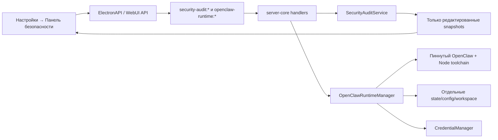

# Craft Agents + OpenClaw — хост runtime и панель аудита безопасности

**Дата:** 2026-08-09  
**Статус:** Черновик для ревью  
**Автор:** Craft Agents team  
**Целевая ветка:** основной checkout `craft-agents`  
**Решение пользователя:** Craft становится хостом OpenClaw; реализуется вариант A — единый аудит Craft и OpenClaw; интерфейс и тексты — на русском языке.

## 1. Контекст

Craft Agents уже управляет правами сессий, расширениями, credential health, WebUI/server-mode и локальными runtime. Но у пользователя нет единого среза безопасности: трудно увидеть, где одновременно открытый входящий канал, широкие tool-права, небезопасная сеть, доступ к секретам или отсутствие изоляции.

OpenClaw даёт зрелую модель анализа через `openclaw security audit --json`: структурированные finding'и с `checkId`, severity, описанием и remediation. Его модель доверия принципиальна: один Gateway — один доверенный оператор; `sessionKey` не является авторизацией. Многопользовательские/враждебные границы требуют отдельного Gateway и, при необходимости, отдельного OS/container/VM boundary.

Проверены текущие факты:

- Craft использует общий Electron/WebUI renderer и типизированный RPC; настройки расширяются через `apps/electron/src/shared/settings-registry.ts`, компоненты — через `renderer/pages/settings/settings-pages.ts`, handlers — через `packages/server-core/src/handlers/rpc/`.
- В Craft есть зашифрованный `CredentialManager`, `PermissionsSettingsPage`, `ExtensionsSettingsPage`, `ServerSettingsPage`, `RuntimeSettingsPage` и toolchain с pinned артефактами, SHA-256, embedded lockfile и `npm ci --ignore-scripts` по умолчанию.
- Локальный OpenClaw `2026.7.1-2` поддерживает named profiles, foreground Gateway и `security audit --json`, но **не** поддерживает документированный Fleet и не показывает `dashboard --json` в CLI help. Поэтому v1 не зависит от Fleet и не использует произвольный системный бинарник из `PATH`.

## 2. Цели

1. Craft **MUST** стать владельцем изолированного OpenClaw runtime для каждого Craft workspace.
2. Пользователь **MUST** по явному запросу получать единый безопасный срез Craft + OpenClaw.
3. Панель **MUST** визуально объяснять перекосы между входящей экспозицией и избыточными возможностями, а не показывать бессмысленный «общий процент безопасности».
4. Для каждого finding'а пользователь **MUST** видеть: что обнаружено, почему это важно, что оставить как есть, как принять риск и как исправить.
5. Ни один raw secret, Gateway token, пароль, credential value, URL с токеном, сырая конфигурация или необработанный stdout **MUST NOT** попасть в renderer, LLM-контекст, telemetry, audit snapshot или обычные логи.
6. Поддерживаемая v1 граница — один доверенный локальный оператор. Craft **MUST NOT** заявлять multi-tenant/hostile-user isolation там, где её нет.

## 3. Нецели

- Не создаётся общий OpenClaw Gateway для нескольких взаимно недоверенных пользователей.
- Не выполняются автоматические `openclaw security audit --fix`, изменение прав, конфигураций, каналов или tool policy без явного point-of-risk подтверждения пользователя.
- Не реализуется полный UI для всех channel/provider конфигураций OpenClaw. Нативная Control UI OpenClaw остаётся источником настройки каналов и провайдеров.
- Не устанавливается/не обновляется глобальный пользовательский OpenClaw и не меняются `~/.openclaw` или существующие profile/service.
- Не поддерживается Fleet как контракт v1: актуальная документация и опубликованный npm runtime расходятся по этому API.
- Не добавляется постоянный фоновый аудит, cloud telemetry finding'ов или сбор raw logs.

## 4. Утверждённая архитектура



### 4.1. Runtime boundary

Для каждой Craft workspace создаётся один `OpenClawRuntime` с устойчивым opaque `runtimeId` и owner=`local-operator`.

```
<CRAFT_CONFIG_DIR>/openclaw/<runtimeId>/
  config/openclaw.json        # 0600
  state/                      # 0700
  workspace/                  # 0700
  audit/snapshots.jsonl        # 0600, только redacted данные
  audit/acceptances.json       # 0600
```

`runtimeId` не строится из пользовательского label или пути. Все пути проходят `realpath`/containment-check и не принимаются из renderer.

`OpenClawRuntimeManager` запускает OpenClaw только shell-free `spawn(absoluteExecutable, fixedArgv, { shell: false })`:

- foreground `gateway run`, без `--force`, `daemon install`, launchd/systemd/schtasks;
- отдельный зарезервированный port block: base-port плюс весь диапазон производных browser/CDP портов;
- Gateway слушает только loopback;
- процесс принадлежит Craft, не detached; при нормальном закрытии Craft получает graceful stop, затем bounded termination;
- параллельные start/stop/audit для одного `runtimeId` сериализуются lock-ом и явной state machine.

Состояния: `unavailable → installing → provisioned → starting → running → degraded | stopped | failed`. Переходы `start`, `stop`, `openControlUi`, `install`, `repair` возможны только по allowlisted RPC-командам; renderer не передаёт shell, путь, порт, environment, image или CLI flags.

### 4.2. Runtime distribution и supply chain

OpenClaw добавляется в существующий Craft toolchain как **opt-in managed runtime**, а не берётся из `PATH`:

- версия, tarball URL, размер, SHA-256 и embedded `package-lock.json` фиксируются в репозитории;
- installer сначала запускает `npm ci --omit=dev --no-audit --no-fund --ignore-scripts`;
- retry с lifecycle scripts запрещён: OpenClaw не добавляется в allowlist без отдельного security review;
- Node `22.23.2` из текущего Craft toolchain удовлетворяет опубликованному требованию OpenClaw `>=22.22.3 <23`;
- runtime capability probe обязан подтвердить `gateway run`, `gateway health`, `security audit --json`, `config validate` и ожидаемую JSON-схему audit. Несовместимый runtime получает состояние `unsupported`, а не best-effort fallback;
- обновление runtime — отдельная явная пользовательская операция; текущая работающий Gateway не заменяется автоматически.
- До появления native Windows Job Object supervisor v1 не запускает `security audit` на Windows: collector возвращает controlled `UNSUPPORTED`/`unavailable` до launcher или child-process spawn. Это намеренная fail-closed граница, а не fallback к `taskkill`, `PATH` или неполной очистке дерева процессов.

Для `openclaw@2026.7.1-2` npm registry публикует integrity signature и tarball; перед добавлением в manifest выполняются provenance review, lockfile review, scripts review и отдельный security test. Это не разрешение на автоматическое обновление до `latest`.

### 4.3. Начальная безопасная конфигурация

При подтверждённом пользователем provision Craft создаёт только минимальную конфигурацию, эквивалентную hardened baseline OpenClaw:

- `gateway.mode = local`, `gateway.bind = loopback`, token authentication;
- `session.dmScope = per-channel-peer`;
- tools profile `messaging`, workspace-only filesystem, disabled elevated tools;
- `exec.security = deny`, `exec.ask = always`;
- deny для automation/runtime/filesystem/control-plane групп, пока пользователь не расширит policy в OpenClaw Control UI;
- никаких каналов, публичных bind, Tailscale Serve/Funnel, remote CDP или plugin allowlist bypass по умолчанию.

Gateway token генерируется криптографически случайно, хранится отдельной credential записью `openclaw-gateway-token:<runtimeId>` и передаётся дочернему процессу только через минимальный environment allowlist. Он не попадает в config, argv, URL, stdout или renderer; clipboard получает его только после отдельного подтверждённого пользователем действия.

### 4.4. Control UI OpenClaw

Пользователь может нажать **«Открыть настройку OpenClaw»** только в Electron на хосте runtime. Это direct Electron preload → main IPC capability, намеренно отсутствующая из `RPC_CHANNELS`, `CHANNEL_MAP`, server-core WebSocket RPC и WebUI API. Main проверяет controlled local renderer sender и отдельное point-of-risk confirmation, затем открывает exact loopback origin данного запущенного runtime в изолированном браузерном контексте. Remote WebUI не получает ни capability, ни origin, URL или bootstrap/token data; вместо этого показывает «Откройте Craft на хосте runtime». Craft не проксирует Gateway наружу и не внедряет token в URL.

Если нативная Control UI просит shared token, тот же direct Electron IPC предлагает отдельное явное действие **«Скопировать токен для настройки»** с предупреждением о чувствительности. Успешный IPC возвращает только `void`: clipboard-effect остаётся в main и token не возвращается renderer. Сам audit dashboard token никогда не показывает. Открытие Control UI, копирование token и включение channel/tool capabilities — отдельные user-initiated действия, каждое с собственным подтверждением в UI.

### 4.5. Single-user / tenant boundary

Craft v1 поддерживает только `local-operator` ownership. Remote WebUI и server-mode Craft не создают новую OpenClaw tenant identity: они остаются доступом в доверенную локальную operator boundary, но не получают Control UI или token material.

Если Craft в будущем предоставит независимые учётные записи или организации, для каждой потребуется отдельная OpenClaw cell с отдельными state, credentials, workspace, token, port range и сильной OS/container/VM границей. До этого runtime UI обязан показывать: **«Многопользовательская изоляция не поддерживается; не добавляйте взаимно недоверенных пользователей»**.

## 5. Панель «Безопасность»

### 5.1. Навигация

Добавляется `security` в существующий `SETTINGS_PAGES`. Это самостоятельная полностраничная панель, а не modal, и доступна одинаково из Electron и WebUI через общий renderer. Название в русской локали: **«Безопасность»**; описание: **«Срез рисков, прав и изоляции Craft и OpenClaw»**.

### 5.2. Текущий срез

Верх страницы показывает:

- время последнего audit и его freshness;
- покрытие источников: Craft, OpenClaw standard, OpenClaw deep;
- количество `critical`, `warn`, `info`, `accepted`, `unavailable`;
- точный статус runtime: не установлен / остановлен / запущен / degraded / unsupported;
- кнопки `Проверить сейчас` и `Глубокая проверка`.

Если источник не проверен или недоступен, UI показывает `Не проверено`/`Недоступно`, а не зелёный статус и не нулевой риск.

### 5.3. «Змейка» безопасности

Главный визуальный элемент — доступная serpentine-линия из семи сегментов:

1. **Вход** — DM/group policies, pairing, allowlists, открытые HTTP/WebUI endpoints.
2. **Сессии** — DM scope, shared context, requester boundary.
3. **Инструменты** — exec, filesystem, elevated, browser, runtime/control-plane capabilities.
4. **Секреты и данные** — credential health, permissions, state/config file exposure, secret reuse.
5. **Сеть** — bind, TLS, auth, trusted proxies, Tailscale, CDP, server exposure.
6. **Расширения** — plugin allowlist, extension grants, `secrets.use:*`, network capability, code-safety findings.
7. **Изоляция** — sandbox, dangerous mounts/network, workspace scope, multi-user heuristic.

Визуальная семантика:

- отклонение **влево** — открытый входящий контур / неаутентифицированное внешнее воздействие;
- отклонение **вправо** — избыточная capability / высокий blast radius;
- центр — проверенный balanced posture;
- пунктир — недостаточное покрытие или недоступный источник;
- цвет дублируется текстом, severity icon, счётчиком и `aria-label`; цвет не является единственным носителем смысла.

Сегмент не вычисляет фальшивый абсолютный «security score». Он отображает worst severity, coverage и количество finding'ов. Нажатие открывает отфильтрованный список.

### 5.4. Карточка finding'а

Каждый finding показывает:

- безопасный `checkId` и источник (`Craft` / `OpenClaw`);
- severity, домен и время обнаружения;
- «Что обнаружено»;
- «Почему это важно» — конкретный blast radius;
- «Как исправить» — remediation из нормализованного allowlist поля или Craft remediation plan;
- статус: `Открыто`, `Принято до <дата>`, `Просрочено`, `Недоступно`.

Не показываются raw error stack, config file content, absolute secrets paths, secret diagnostics или неконтролируемый plugin output.

### 5.5. Выбор пользователя

Для каждого finding'а есть три действия:

| Действие | Поведение |
|---|---|
| **Оставить как есть** | Ничего не сохраняет и не скрывает finding. |
| **Принять риск** | Требует rationale 10–500 символов и дату истечения 1–365 дней. Сохраняет только local Craft acceptance; OpenClaw suppression не изменяется. По истечении finding снова открыт. |
| **Исправить** | Показывает конкретный безопасный план: ключ/политику, ожидаемый эффект и способ повторной проверки. Для v1 OpenClaw исправления не применяются автоматически; ведут в точную Control UI / Settings surface. |

Mutating Craft actions, start/stop runtime, копирование token и будущие safe-fix операции требуют отдельного point-of-risk подтверждения с exact target, scope и действием. `openclaw security audit --fix` не вызывается из v1.

## 6. Сборщики и нормализация

### 6.1. Craft collector

`CraftSecurityCollector` читает только metadata-safe источники:

- session/default/workspace permission posture;
- extension manifests, status и grants, включая high-risk capability classes;
- credential backend availability и health без `StoredCredential.value`;
- server bind/TLS/insecure state без `ServerStatus.token`;
- toolchain/runtime readiness;
- наличие sandbox/изоляционных ограничений там, где они применимы.

### 6.2. OpenClaw collector

`OpenClawSecurityCollector` выполняется только после явного `Проверить сейчас`:

```text
<managed-node> <managed-openclaw>/openclaw.mjs security audit --json
```

Ему передаются только runtime-scoped config/state/workspace environment values. Он не получает `--deep`, `--fix`, `--token`, `--password`, пользовательскую строку команды, URL или путь.

Коллектор:

1. лимитирует время 30 секундами и stdout/stderr 1 MiB;
2. парсит JSON строго по schema; допустимы только summary, `ts`, finding fields `checkId`, `severity`, `title`, `detail`, `remediation`, `suppressedFindings`;
3. игнорирует `secretDiagnostics`, `fix`, unknown top-level fields и raw stderr;
4. применяет secret/path redactor до persistence/transport;
5. нормализует known `checkId` в семь сегментов; unknown finding сохраняет как `Другое` без потери checkId;
6. возвращает controlled error codes вместо строк stderr.

`Глубокая проверка` — отдельный user-initiated запуск `--deep` с пояснением, что он запускает live Gateway probe и plugin/skill scans. Если runtime stopped, permission denied или JSON malformed, результат маркируется `unavailable`/`failed`, не `safe`.

## 7. Функциональные требования

- **FR-1:** Craft MUST регистрировать `security` как Settings subpage и предоставлять русские строки для всех состояний и действий.
- **FR-2:** Craft MUST управлять OpenClaw runtime только через runtime-scoped state/config/workspace и credential handle; renderer MUST NOT получить raw Gateway token.
- **FR-3:** Provision MUST создавать hardened baseline, уникальный runtimeId и проверять config до запуска.
- **FR-4:** Runtime manager MUST использовать абсолютный managed executable, `shell:false`, allowlisted argv/env и не должен использовать пользовательский `PATH` или shell string.
- **FR-5:** Runtime manager MUST предотвратить concurrent start/stop/audit и не должен убивать process, который не доказанно принадлежит runtimeId.
- **FR-6:** Standard audit MUST быть явным read-only действием, без `--deep`, `--fix` и credential argument.
- **FR-7:** Deep audit MUST быть отдельным явным действием и обозначать coverage/failure truthfully.
- **FR-8:** Audit service MUST вернуть только schema-validated и redacted findings.
- **FR-9:** Панель MUST отображать «змейку» с семью доменами, text equivalents и partial-coverage состояниями.
- **FR-10:** Карточка finding'а MUST давать leave/accept/fix варианты; acceptance MUST иметь rationale и expiry.
- **FR-11:** Local risk acceptance MUST NOT изменять `security.audit.suppressions` OpenClaw.
- **FR-12:** Audit snapshots MUST содержать только redacted normalised data и храниться не более 90 дней или 30 последних запусков на runtime.
- **FR-13:** Runtime/Control UI URL MUST оставаться loopback-only; Craft MUST NOT создавать reverse proxy, Tailscale Serve/Funnel или public endpoint.
- **FR-14:** Любое mutating действие MUST получать explicit point-of-risk confirmation в UI.
- **FR-15:** Несовместимый/отсутствующий runtime MUST показываться как unsupported/unavailable с безопасной инструкцией, без fallback к существующему `~/.openclaw`.

## 8. Нефункциональные требования

- **NFR-1 Security:** Все child process invocations MUST be shell-free; raw output MUST be bounded, redacted и не логироваться.
- **NFR-2 Security:** Config/state/workspace/audit directories MUST иметь restrictive permissions: Unix dirs 0700, files 0600; Windows использует эквивалентный owner-only ACL contract.
- **NFR-3 Security:** Любой внешне полученный JSON, plugin detail и remediation MUST считаться untrusted data и проходить schema/length/escaping validation.
- **NFR-4 Privacy:** Audit snapshots, acceptance rationale и health metadata MUST NOT отправляться в Sentry, analytics или LLM prompt.
- **NFR-5 Performance:** Standard audit P95 MUST завершаться за 35 секунд, deep audit — за 90 секунд; UI MUST сохранять последнюю успешную snapshot во время нового запуска.
- **NFR-6 Reliability:** Crash/timeout runtime не должен ломать Craft RPC; состояние возвращается как controlled error и может быть повторно проверено.
- **NFR-7 Accessibility:** «Змейка» должна иметь keyboard navigation, summary text и non-color severity labels; весь интерфейс — русскоязычный.
- **NFR-8 Compatibility:** Managed runtime запускается только если capability probe проходит; runtime version и probe result сохраняются в snapshot.

## 9. API-контракты

```ts
type AuditSeverity = 'critical' | 'warn' | 'info' | 'pass' | 'unavailable'
type AuditMode = 'standard' | 'deep'
type RuntimeState =
  | 'unavailable'
  | 'installing'
  | 'provisioned'
  | 'starting'
  | 'running'
  | 'stopped'
  | 'degraded'
  | 'failed'
  | 'unsupported'

type SecurityDomain =
  | 'ingress'
  | 'sessions'
  | 'tools'
  | 'secrets'
  | 'network'
  | 'extensions'
  | 'isolation'
  | 'other'

interface OpenClawRuntimeStatus {
  runtimeId: string
  workspaceId: string
  state: RuntimeState
  version?: string
  managed: true
  lastHealthAt?: number
  safeError?: 'RUNTIME_MISSING' | 'UNSUPPORTED' | 'PORT_CONFLICT' | 'START_FAILED' | 'HEALTH_TIMEOUT'
}

interface SecurityFinding {
  fingerprint: string
  source: 'craft' | 'openclaw'
  checkId: string
  domain: SecurityDomain
  severity: AuditSeverity
  title: string
  detail: string
  remediation: string | null
  detectedAt: number
  acceptance?: { rationale: string; expiresAt: number; expired: boolean }
}

interface SecurityAuditSnapshot {
  id: string
  runtimeId: string
  workspaceId: string
  mode: AuditMode
  startedAt: number
  completedAt: number
  coverage: {
    craft: 'checked' | 'unavailable'
    openclaw: 'checked' | 'not-provisioned' | 'unavailable' | 'failed'
    deep?: 'checked' | 'not-requested' | 'unavailable' | 'failed'
  }
  runtime: OpenClawRuntimeStatus
  summary: Record<AuditSeverity, number>
  domains: Array<{ domain: SecurityDomain; severity: AuditSeverity; findingCount: number; coverage: 'complete' | 'partial' | 'none' }>
  findings: SecurityFinding[]
}

interface AcceptSecurityRiskRequest {
  workspaceId: string
  fingerprint: string
  rationale: string
  expiresAt: number
}

interface SecurityAuditApi {
  getRuntimeStatus(input: { workspaceId: string }): Promise<OpenClawRuntimeStatus>
  installRuntime(input: { workspaceId: string }): Promise<OpenClawRuntimeStatus>
  provisionRuntime(input: { workspaceId: string }): Promise<OpenClawRuntimeStatus>
  startRuntime(input: { workspaceId: string }): Promise<OpenClawRuntimeStatus>
  stopRuntime(input: { workspaceId: string }): Promise<OpenClawRuntimeStatus>
  runAudit(input: { workspaceId: string; mode: AuditMode }): Promise<SecurityAuditSnapshot>
  getLatestAudit(input: { workspaceId: string }): Promise<SecurityAuditSnapshot | null>
  acceptRisk(input: AcceptSecurityRiskRequest): Promise<void>
  revokeRiskAcceptance(input: { workspaceId: string; fingerprint: string }): Promise<void>
}

/** Direct Electron preload → main IPC only. Not an RPC channel or WebUI API. */
interface OpenClawHostControlApi {
  openControlUi(input: { workspaceId: string }): Promise<void>
  copyGatewayTokenForSetup(input: { workspaceId: string }): Promise<void>
}
```

Все запросы `SecurityAuditApi` валидируются на transport boundary. `workspaceId` авторизуется существующим Craft workspace routing; никакой RPC не принимает argv, binary path, port, config patch, URL или token. `OpenClawHostControlApi` — отдельная локальная Electron IPC capability, а не RPC: он доступен только controlled Electron renderer, не регистрируется в `RPC_CHANNELS`/`CHANNEL_MAP`/WebSocket handler и требует локальный point-of-risk confirmation. Remote WebUI не может вызвать эффект и получает только presentation-state `HOST_ONLY`; никакой его response не содержит URL, port или token.

## 10. Модели данных

| Сущность | Поля | Ограничения |
|---|---|---|
| `OpenClawRuntimeRecord` | runtimeId, workspaceId, state, portBlock, installedVersion, createdAt, updatedAt | opaque ID; port block уникален; token отсутствует |
| `OpenClawGatewayCredential` | credentialId, runtimeId, value | только CredentialManager; renderer/persistence snapshot не видят value |
| `SecurityAuditSnapshot` | контракт выше | redacted; max 30/90 дней; immutable после записи |
| `SecurityFinding` | контракт выше | detail/remediation length-capped и sanitized |
| `SecurityRiskAcceptance` | workspaceId, fingerprint, rationale, acceptedAt, expiresAt | rationale 10–500 chars; expiry 1–365 дней |
| `RuntimeCapabilityProbe` | runtime version, supported commands/schema, checkedAt | не хранит stdout/stderr/token |

## 11. Edge cases

- **EC-1:** managed OpenClaw отсутствует → `unavailable`, install CTA; audit не пытается вызвать PATH binary.
- **EC-2:** runtime version есть, но capability probe не проходит → `unsupported`; запуск и audit запрещены.
- **EC-3:** порт или производный CDP range занят неизвестным process → `PORT_CONFLICT`; Craft не посылает kill и не использует `--force`.
- **EC-4:** Gateway не отвечает health timeout → `degraded`; stdout/stderr не отображается, доступен только safe error.
- **EC-5:** OpenClaw возвращает malformed/oversized JSON → finding'и не сохраняются, snapshot `openclaw: failed`.
- **EC-6:** OpenClaw finding detail содержит token-like строку/absolute path → redactor заменяет фрагмент, исходник не persist/log.
- **EC-7:** deep audit недоступен без running Gateway → отдельный coverage `unavailable`, standard snapshot остаётся корректной.
- **EC-8:** acceptance истёк → finding снова `Открыто`, без удаления audit history.
- **EC-9:** Craft закрывается во время audit/start → child bounded shutdown; незавершённый run не считается успешным.
- **EC-10:** пользователь открывает remote Craft WebUI → runtime принадлежит local operator; UI явно предупреждает, что это не tenant boundary.
- **EC-11:** Control UI пытается выйти с loopback origin → внешний navigation не наследует Gateway credential; действие остаётся в isolated context.
- **EC-12:** symlink в runtime directory → provisioning/audit отказываются до доступа к target.
- **EC-13:** audit запрошен на Windows → controlled `openclaw: unavailable` и `UNSUPPORTED`; ни launcher, ни audit child process не запускаются.

## 12. Приёмочные критерии

- **AC-1 (FR-1):** Given русская локаль Craft, When пользователь открывает Settings, Then видит «Безопасность» и полный русский UI без fallback английских ключей.
- **AC-2 (FR-2, FR-4):** Given provisioned runtime, When Craft запускает Gateway, Then child получает fixed argv/env, `shell:false`, отдельные paths и token отсутствует в renderer/RPC payload/logger spy.
- **AC-3 (FR-3, FR-13):** Given новая workspace, When пользователь подтверждает provision, Then config валиден, Gateway bind loopback, auth token mode активен, elevated/exec/automation/filesystem baseline ограничен.
- **AC-4 (FR-5):** Given два конкурентных `startRuntime`, When они приходят одновременно, Then создаётся ровно один owned child process и второй запрос получает тот же transition result.
- **AC-5 (FR-6, FR-8):** Given fixture OpenClaw audit JSON с known findings, When пользователь запускает standard audit, Then UI получает только normalized/redacted fields без `secretDiagnostics` и без raw stderr.
- **AC-6 (FR-7):** Given runtime stopped, When пользователь выбирает deep audit, Then snapshot показывает `deep: unavailable`, а не безопасный/пустой результат.
- **AC-7 (FR-9):** Given findings во входе и exec, When отображается «змейка», Then соответствующие сегменты отклонены влево/вправо, имеют text label и keyboard-accessible filter.
- **AC-8 (FR-10, FR-11):** Given открытый finding, When пользователь принимает риск с валидным rationale и датой, Then он получает local acceptance; OpenClaw config/suppressions не меняются.
- **AC-9 (FR-12):** Given 31 snapshot или snapshot старше 90 дней, When сохраняется новый audit, Then old redacted records удаляются по retention; секретов нет в файле.
- **AC-10 (FR-14):** Given пользователь нажимает stop, open-control-UI token-copy или future mutation, When confirmation не дано, Then side effect не происходит.
- **AC-11 (FR-15):** Given локальный системный OpenClaw есть, но managed runtime отсутствует, When открывается панель, Then Craft не сканирует `~/.openclaw` и не запускает системный binary.
- **AC-12 (NFR-5):** Given fixture Gateway/audit, When standard/deep audit завершён, Then completion укладывается в 35/90 секунд или возвращает controlled timeout.
- **AC-13 (FR-13):** Given remote Craft WebUI, When открывается панель безопасности, Then Control UI/token-copy capability отсутствует, показывается `HOST_ONLY`, а ни WebUI API, ни любой serialized response не содержат URL, port или token material.

## 13. Проверка и тестирование

1. Unit-тесты `OpenClawRuntimeManager`: path containment, state transitions, start lock, port block collision, owned PID verification, graceful stop, no `--force`.
2. Unit-тесты distribution: manifest hash/lock presence, `--ignore-scripts`, capability probe, no fallback to PATH.
3. Unit-тесты audit: JSON schema, size limit, secret/path redactor, checkId domain mapping, unknown checkId, timeout, malformed output.
4. RPC и host-control tests: request validation, ElectronAPI/CHANNEL_MAP parity для data API, remote routing, rejected raw argv/path/token fields; отдельно — direct Electron IPC sender/confirmation tests, отсутствующий host-control channel в WebUI и no-secret serialized responses.
5. UI tests: Russian strings, partial coverage, seven-segment «змейка», keyboard/ARIA semantics, acceptance expiry, confirmation dialog.
6. Security tests: output/telemetry logger spies assert token-like fixture never escapes; symlink, traversal, malicious plugin detail and untrusted remediation fixtures fail closed.
7. Integration smoke: temporary Craft config + fake OpenClaw executable demonstrates provision → start → health → standard audit → accepted-risk → graceful stop; a separate real managed runtime smoke runs only after explicit local setup and never touches existing `~/.openclaw`.

## 14. Риски и решения

| Риск | Решение |
|---|---|
| Документация OpenClaw опережает npm runtime | Pin по capability, не по тексту документации; Fleet исключён из v1. |
| npm supply-chain / lifecycle scripts | SHA-256 + embedded lock + scripts disabled + provenance review; no latest. |
| Gateway token утечёт через argv/log/UI | CredentialManager, env-only injection, output redaction, token-free RPC/UI. |
| Локальный runtime ошибочно назван tenant isolation | UI и API явно single-operator; no shared/untrusted users. |
| Prompt injection получает широкий host access | Hardened tools baseline, no channels by default, sandbox/tool policy finding'и prominently shown. |
| Audit создаёт ложную безопасность | Coverage/unavailable states, no global score, separate deep audit. |
| Generic `--fix` меняет больше ожидаемого | V1 не вызывает `--fix`; только plan + confirmed targeted future actions. |

## 15. Источники

- OpenClaw Security: <https://docs.openclaw.ai/gateway/security>
- OpenClaw Security audit checks: <https://docs.openclaw.ai/gateway/security/audit-checks>
- OpenClaw Multiple gateways: <https://docs.openclaw.ai/gateway/multiple-gateways>
- OpenClaw Multi-tenant hosting: <https://docs.openclaw.ai/gateway/multi-tenant-hosting>
- OpenClaw Dashboard CLI: <https://docs.openclaw.ai/cli/dashboard>
- Локально проверенный OpenClaw `2026.7.1-2`: `openclaw --version`, `openclaw --help`, `openclaw gateway --help`, `openclaw security audit --help`.
- Craft settings registry: `apps/electron/src/shared/settings-registry.ts`.
- Craft settings component registry: `apps/electron/src/renderer/pages/settings/settings-pages.ts`.
- Craft server RPC composition: `packages/server-core/src/handlers/rpc/index.ts`.
- Craft process-supervision precedent: `packages/server-core/src/knowledge/siyuan-bootstrap.ts`.
- Craft encrypted credential boundary: `packages/shared/src/credentials/manager.ts`.
- Craft toolchain hardening: `packages/shared/src/toolchain/{manifest-data.ts,installer.ts,npm-locks.ts}`.
