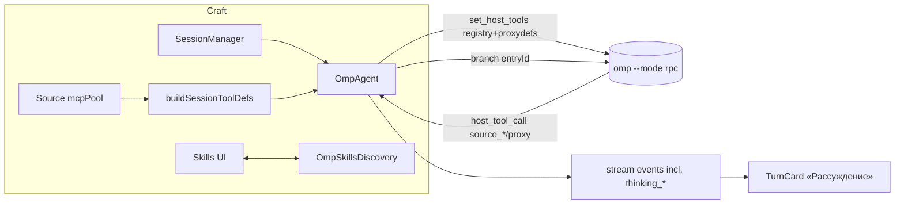

# PRD: закрытие остаточных гэпов интеграции OMP ⇄ Craft Agents (v2)

Статус: ✅ ЗАВЕРШЕНО (2026-08-06) — все G1–G4 реализованы и проверены live
Статус был: draft → ready for implementation
Владелец: команда форка `agisota/craft-agents-oss`
Дата: 2026-08-06
Связанные документы: [omp-rpc-notes.md](omp-rpc-notes.md) (протокол v1/v2), [omp-integration-gap.md](omp-integration-gap.md) (матрица), [AGENTS.md](../AGENTS.md).

## 1. Резюме

Интеграция v1 (зашита, коммиты `d87fb59e6`…`a4d643188`) дала работающий OMP-бэкенд: turn-стрим, host-tools мост (28 craft-инструментов), зеркалирование транскриптов, yolo-профиль, пресет в онбординге. Этот PRD покрывает четыре оставшихся гэпа до «полного варианта» (вариант B из начального дизайна): максимум возможностей Craft × максимум возможностей OMP.

**Цели:**
- G1. MCP source-proxy инструменты craft (источники/API-skills UI) доступны внутри OMP-сессий.
- G2. Thinking-стрим OMP виден в chat UI TurnCard как у Pi/Claude backends.
- G3. Ветвление сессий (branch) для OMP-бэкенда наравне с pi/anthropic.
- G4. OMP skills сихнронизированы с craft skills UI (обнаружение, включение, использование в сессии).

**Не-цели (из явного оскопа):**
- Замена Pi-бэкенда повсеместно (pi/anthropic остаются, конкурентность по providerType).
- Resume из OMP session store (craft остаётся владельцем сессионной истории).
- MCP-хостинг craft-источников внутри OMP как MCP-сервер (только proxy-инструменты уровня session registry).
- Любые правки в `~/.omp` настроек пользователя (только чтение + disjoint session-dir).

## 2. Фон и точка отсчёта

| Факт | Источник |
|---|---|
| OmpAgent: stdio NDJSON к `omp --mode rpc`, команды/события из omp-rpc-notes.md | packages/shared/src/agent/omp-agent.ts |
| Host tools v1: `BASE_SESSION_TOOL_PROXY_DEFS` + browser/call_llm, loadMode 'essential' | OmpToolsBridge, коммит a4d643188 |
| Source proxies в pi-bекенде: defs строятся из mcpPool (`register_tools` proxyDefs) | pi-agent.ts:615-625 |
| OMP branch rpc: `{id?, type:"branch", entryId: string}` → `{command:"branch", data:{text, cancelled}}` | rpc-types.ts:81,309 |
| OMP skills: 45+ штук в ~/.omp/agent/skills (lark-*, browser-tools, transcribe…) виден spawn-log | extractSkillPaths log |
| usage/cost приходят message_end/agent_end | smoke-логи |

## 3. Требования

### G1 — MCP source proxies в OMP
1.1. После спавна OMP-процесса OmpAgent ДОЛЖЕН регистрировать через `set_host_tools` дополнительно proxy-инструменты источников, активированных в UI воркспейса (тот же набор, что pi получает через proxyDefs).
1.2. Активация/деактивация источника в UI во время сессии ДОЛЖНА вызывать повторный `set_host_tools` с полным дифф-обновлённым списком (OMP заменяет набор целиком — выяснено из кода RpcHostToolBridge: ре-регистрация по именам).
1.3. Вызов proxy-инструмента ДОЛЖЕН исполняться тем же кодом, что и pi-backend (mcpPool call), с теми же permission-проверками (ask/safe → craft dialog).
1.4. Ошибки соединения с MCP-сервером ДОЛЖНЫ возвращаться host_tool_result с isError и осмысленным сообщением, без падения сессии.
1.5. Источником правды о наборах tool-defs считается общий генератор: выделить `buildSessionToolDefs()` из pi-agent.ts (union: registry defs + pool proxy defs) и использовать ОБОИМИ бэкендами (pi и omp), чтобы наборы не расходились.

### G2 — Thinking-стрим
2.1. В stream-юнион событий бэкенда добавить `thinking_delta {text, turnId}` и `thinking_complete {text, turnId}` (зеркало text_* по форме). Правки: `packages/shared/src/agent/backend/types` (юнион) + рендер.
2.2. OMP: `message_update.assistantMessageEvent` типов `thinking_start/delta/end` → новые события (у Pi — skip по дизайну, mapping в omp-agent.ts).
2.3. UI: TurnCard показывает сворачиваемый блок «Рассуждение» над текстом ответа: потоковый набор, затем свёрнутое состояние по завершении.
2.4. Системное поведение бэкендов anthropic/pi не изменяется (тип опционален; только OMP эмитит).
2.5. Заголовок сессии и саммaри-генерация НЕ должны включать thinking-контент в prompt (как сейчас — только text).

### G3 — Branching
3.1. `supportsBranching = true` для omp при выполнении pre-conditions: текущая OMP-сессия существует и есть assistant message — target entry для `branch {entryId}`.
3.2. Реализаця `ensureBranchReady()`/`createBranch`-пути: на создание ветки OmpAgent спавнит НОВЫЙ omp-процесс в режиме `--mode rpc --session-dir <branch session>/omp`, затем шлёт `branch {entryId}` с id нужного assistant-message из родительского OMP-транскрипта (entryId хранить в craft-сессии параллельно с turnId: в момент turn_end/agent_end захватывать из `get_state`/message ids OMP — формат зафиксировать в omp-rpc-notes.md при реализации).
3.3. Если `branch` вернул `cancelled:true` или entryId не найден в OMP-транскрипте — падать в задокументированную fallback-стратегию seeded-fresh-session (роль branchContextStrategy уже есть в SessionManager).
3.4. UI BranchMenu для omp-провайдера: критерий доступности — наличие ≥1 завершённого turn.

### G4 — Синк OMP skills в craft skills UI
4.1. Read-only discovery: craft сканирует skills, доступные OMP (`~/.omp/agent/skills` + project `.omp/skills`), нормализует в craft Skill-модель (имя, описание, источник 'omp', путь) и показывает под группой/бейджем «OMP» в skills-панели.
4.2. Активация в сессии: упоминание скилла по имени в `@`-mention/чекбоксе ДОЛЖНО конвертироваться в prompt-инъекцию пути скилла для OMP (тот же механизм, что сейчас у extractSkillPaths/[omp] лога — расширить его на OMP-навыки).
4.3. БЕЗ редактирования OMP-навыков из craft (read-only в v2); конфликт одинаковых имён craft/omp — craft wins + визуальный маркер.
4.4. Панель обновляется при изменении файлов скиллов (watcher) либо по таймауту 60с — выбрать дешевле по коду (см. существующий skills watcher, если есть).

## 4. Архитурные решения

Решённые спорные пункты:
- **Общий генератор tool-defs** (1.5) вместо копипасты pi↔omp реестров. Pi на этапе миграции остаётся на параллельном дереве один раунд — потом dedupe (отдельный чистый PR).
- **Thinking как отдельный тип события**, а не шов в `text_delta` с флагом — UI получает чистое разделение, десериализация старых сохранённых событий не ломается (типы новые, optional).
- **Branch через новый OMP-процесс** на ветку (процессная изоляция сессий уже дизайн-правило). `switch_session` не используем — он перезаписывает cwd-ключ сессии.
- **Skills read-only в v2.**

## 5. План работ

Фазы с DOD (definition of done) на каждую, порядок по снижению риска.

### Фаза 1 — G4 Skills discovery (1–2 дня)
1. `packages/shared/src/skills/omp-discovery.ts`: сканер `~/.omp/agent/skills` + `<cwd>/.omp/skills`, парсинг SKILL.md (name/description из frontmatter), кэш с mtime-инвалидацией.
2. UI skills panel: merge по slug (`omp:<slug>`), бейдж «OMP», read-only карточки.
3. Активация: extractSkillPaths в OmpAgent мэтчит упомянутые имена по объединённому реестру (сейчас только craft).
   DOD: панель показывает 45+ навыков из ~/.omp; `@youtube-transcript` в OMP-сессии даёт инъекцию пути в prompt (пробник в логах).

### Фаза 2 — G2 Thinking (1 день)
1. Типы: `thinking_delta/ thinking_complete` в stream-юнион + SessionManager passthrough (persist в `long_responses`? — нет; только runtime stream, не сохранять в историю принятых сообщений).
2. OmpAgent mapping `thinking_*` событий OMP.
3. TurnCard render + aria; collapse при complete.
   DOD: сессия с reasoning-моделью (kimi-k3 модель reasoning:true) показывает блок «Рассуждение»; скриншот-доказательство, регресс text-потока отсутствует.

### Фаза 3 — G1 MCP source proxies (2–3 дня)
1. `buildSessionToolDefs()` в packages/shared/src/agent (общий код; pi-использование — совместимый рефактор без смены поведения pi).
2. OmpAgent: при каждом (re)спавне + при событии sources-changed (есть ли существующее событие — иначе poll при следующем chat()) → полный set_host_tools (registry + proxies).
3. Вызов proxy → mcpPool.invoke (тот же путь, что PiAgent tool_execute для proxies).
   DOD: активировать тестовый источник (lark-wiki/Google) в UI → модель вызывает `source_*` tool и получает данные; отключение источника убирает его из `toolNames` следующего set_host_tools (лог).

### Фаза 4 — G3 Branching (2–3 дня)
1. Persist `ompEntryId` per assistant-message (OMP message id в transcript craft при turn_end, либо line-index в omp-jsonl → entryId mapping — зафиксировать формат в notes).
2. `ensureBranchReady()`: проверить существование целевого entry; `createBranch`: спавн OMP-процесс в new session-dir, `branch {entryId}`, validation по ответу.
3. supportsBranching=true; UI критерий.
   DOD: ветка от OMP-сессии содержит историю до точки ветвления и продолжается независимо; родитель не мутирует.

## 6. Критерии приёмки (сводные)

| # | Тест | Критерий |
|---|---|---|
| A | tsc во всех пакетах | 0 ошибок |
| B | bun test shared/config + agent | 0 регрессий (3 предсуществующих mode-manager — ignoring) |
| C | Live: skills discovery | ≥45 OMP-навыков в панели; активация → инъекция |
| D | Live: thinking | блок «Рассуждение» на kimi-k3 reasoning turn |
| E | Live: proxies | source-инструмент вызывается и возвращает данные; off-источник → нет в toolNames |
| F | Live: branch | ветка от OMP-сессии с независимым продолжением |
| G | E2E в приложении | всё выше через реальное окно Electron (AX-драйв) |

## 7. Риски

- **Схемы host_tool сторон OMP**: ре-регистрация set_host_tools при live turn (риск гонки) — решение: пере-регистрировать только между turn (idle-state guard), иначе отложить до agent_end.
- **entryId стабильность OMP**: не задокументирован — empirical probe обязателен до кодинга G3 (фаза 4 шаг 0).
- **Thinking-события и card render**: перф при очень длинных рассуждениях — буфер/сэмплинг (max N дельт/сек).
- **Skills name collision craft vs omp**: правило craft-wins зафиксировано; при массовом конфликте показать предупреждение в панели.
- **Legacy сессии без ompEntryId**: branching недоступен (UI-критерий скрывает действие, seeded-fresh-session фолбэк).

## 8. Метрики успеха
- 0 дополнительных шагов у пользователя для использования любого из G1–G4.
- Паритет поведенческий OMP↔Pi на уровне UI-фич (skills/branch/proxy/thinking покрытие ≥90% по чек-листу §5).

## 9. Открытые вопросы (РЕШЕНО 2026-08-06)
1. Thinking-блок в UI: **отдельная карточка** (паттерн существующего thinking у Claude-бэкенда), не встроенный collapse в TurnCard.
2. Синк OMP-skills: **read-only + кнопка «Экспорт в craft skills»** (материализует выбранный навык как полноценный craft skill, дальше им управляет craft).
3. Прокси-неймспейс `mcp__<source>__*` как у pi — **сохраняем.**
